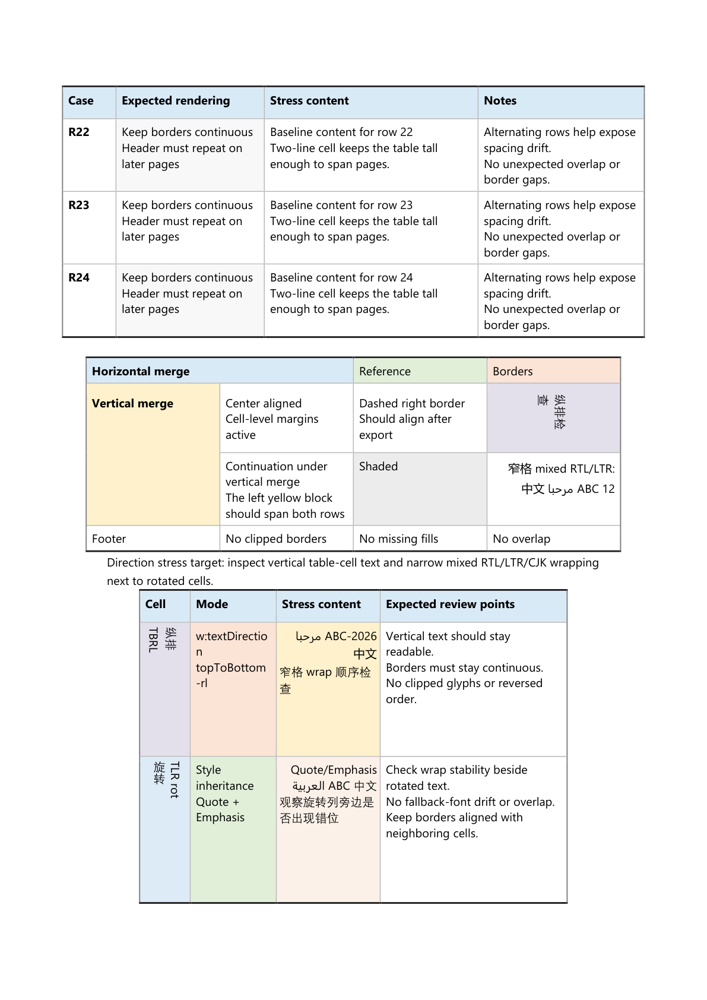

# FeatherDoc

FeatherDoc is a modernized C++ library for reading and writing Microsoft Word
`.docx` files.

## Highlights

- CMake 3.20+
- C++20
- MSVC-friendly build setup
- Lightweight document editing APIs for paragraphs, runs, tables, images,
  lists, and style references
- MSVC-safe XML parsing on `open()`
- Streamed ZIP rewrite path on `save()`

## Build

```bash
cmake -S . -B build
cmake --build build
```

Top-level builds enable `BUILD_CLI` by default, so the `featherdoc_cli`
utility is built alongside the library unless you pass `-DBUILD_CLI=OFF`.

## Build With MSVC

Open an `x64` Visual Studio Developer Command Prompt first, or initialize the
environment with `VsDevCmd.bat -arch=x64 -host_arch=x64`, then run:

```bat
cmake -S . -B build-msvc-nmake -G "NMake Makefiles" -DBUILD_TESTING=ON -DBUILD_SAMPLES=ON -DBUILD_CLI=ON
cmake --build build-msvc-nmake
ctest --test-dir build-msvc-nmake --output-on-failure --timeout 60
```

## Word Visual Smoke Check

On Windows hosts with Microsoft Word installed you can run a visual smoke check
that:

- builds a dedicated sample document covering table layout features
- exports the generated `.docx` through Word's rendering engine as PDF
- renders each PDF page to PNG for manual or AI-assisted review

```powershell
powershell -ExecutionPolicy Bypass -File .\scripts\run_word_visual_smoke.ps1
```

Artifacts are written under `output/word-visual-smoke/`, including the source
`.docx` and exported `.pdf`, plus an `evidence/` directory for per-page `.png`
renders and contact sheets, a `report/` directory for the generated checklist
and summary data, generated `review_result.json` and `final_review.md`
skeletons, and a reserved `repair/` directory for iterative fix candidates.
The script now also validates two things before you trust the result:

- generated smoke samples must contain the expected core DOCX ZIP entries
- exported PDF page count must match both `summary.json` and the rendered PNG count

Pass `-InputDocx <path>` when you want to run the same render-and-capture flow
against an existing document instead of the bundled smoke sample. The
recommended review-and-repair workflow is documented in
`docs/automation/word_visual_workflow_zh.rst`.

Use `-SkipBuild` only when the executable under `-BuildDir` is known to be
current. If the smoke sample generator is stale, rerun without `-SkipBuild` or
rebuild that directory first.

When you want to hand the task to an AI agent consistently, generate a review
task package first:

```powershell
powershell -ExecutionPolicy Bypass -File .\scripts\prepare_word_review_task.ps1 `
    -DocxPath C:\path\to\target.docx `
    -Mode review-only
```

Use `-Mode review-and-repair` when the agent is allowed to fix generation
logic and rerun the visual review loop. The script generates a task directory
with `task_prompt.md`, `task_manifest.json`, and dedicated `evidence/`,
`report/`, and `repair/` directories, so the AI no longer has to guess paths
or output structure. The intended handoff flow is:

1. Run `prepare_word_review_task.ps1`.
2. Open the generated `task_prompt.md`.
3. Send the full prompt to the AI agent and require it to first run
   `scripts/run_word_visual_smoke.ps1 -InputDocx ... -OutputDir <task dir>`.
4. Require the agent to review the generated PDF/PNG evidence and write its
   conclusion back into `report/review_result.json` and `report/final_review.md`.
5. If the mode is `review-and-repair`, allow the agent to iterate under
   `repair/fix-XX/` and rerun the full visual review loop after each fix.

## Rendered Examples

The screenshots below come from actual Word-rendered output saved in the
repository so README readers can see the current layout quality directly.

<p align="center">
  
  
  
</p>
<p align="center">
  <sub>Left: <code>featherdoc_sample_chinese</code>. Center: <code>featherdoc_sample_chinese_template</code>. Right: the table/text-direction visual smoke sample. All three are actual Word-rendered outputs saved in the repository.</sub>
</p>

## CLI

`featherdoc_cli` is a small command-line wrapper around the current
section-aware header/footer APIs.

```bash
featherdoc_cli inspect-sections input.docx
featherdoc_cli inspect-sections input.docx --json
featherdoc_cli inspect-header-parts input.docx --json
featherdoc_cli inspect-footer-parts input.docx
featherdoc_cli insert-section input.docx 1 --no-inherit --output inserted.docx --json
featherdoc_cli copy-section-layout input.docx 0 2 --output copied.docx
featherdoc_cli move-section input.docx 2 0 --output reordered.docx
featherdoc_cli remove-section input.docx 3 --output trimmed.docx
featherdoc_cli assign-section-header input.docx 2 0 --kind even --output shared-header.docx --json
featherdoc_cli assign-section-footer input.docx 2 1 --output shared-footer.docx --json
featherdoc_cli remove-section-header input.docx 2 --kind even --output detached-header.docx
featherdoc_cli remove-section-footer input.docx 1 --kind first --output detached-footer.docx
featherdoc_cli remove-header-part input.docx 1 --output headers-pruned.docx
featherdoc_cli remove-footer-part input.docx 0 --output footers-pruned.docx --json
featherdoc_cli show-section-header input.docx 1 --kind even
featherdoc_cli show-section-footer input.docx 2 --json
featherdoc_cli set-section-footer input.docx 0 --text "Page 1" --output footer.docx --json
featherdoc_cli set-section-header input.docx 2 --kind even --text-file header.txt --json
```

`inspect-sections` prints the current section count together with per-section
header/footer attachment flags for `default`, `first`, and `even` references.
The mutating commands save in place by default; pass `--output <path>` to write
to a separate `.docx`. Pass `--json` to `inspect-sections` when you need the
same section layout information in a machine-readable object. The mutating
commands also accept `--json` and emit `command`, `ok`, `in_place`, `sections`,
`headers`, and `footers`, plus command-specific fields such as `section`,
`source`, `target`, `part`, and `kind`.

`inspect-header-parts` / `inspect-footer-parts` list loaded part indexes in the
same order consumed by `assign-section-*` and `remove-*-part`. Their output
includes each part's relationship id, package entry path, section references,
and paragraph text. Pass `--json` when you need the same information as a
machine-readable object.

`assign-section-header` / `assign-section-footer` make a section reuse an
already loaded header/footer part by index. `remove-section-header` /
`remove-section-footer` detach one section-level reference kind without
removing the underlying part if it is still used elsewhere. `remove-header-part`
/ `remove-footer-part` drop one loaded part entirely and detach every section
reference that points at it.

`show-section-header` / `show-section-footer` print the referenced paragraphs
one line per paragraph. `set-section-header` / `set-section-footer` rewrite the
target part as plain paragraphs from `--text` or `--text-file`, and create the
requested section reference automatically when it does not exist yet.
`show-section-header` / `show-section-footer` also accept `--json`, which emits
`part`, `section`, `kind`, `present`, and `paragraphs` fields for scriptable
inspection.

## Install

```bash
cmake --install build --prefix install
```

The installed package now also carries repository-facing metadata and legal
files under `share/FeatherDoc`, including `CHANGELOG.md`, `README.md`,
`LICENSE`, `LICENSE.upstream-mit`, `NOTICE`, and `LEGAL.md`.

## Use From CMake

```cmake
list(APPEND CMAKE_PREFIX_PATH "/path/to/FeatherDoc/install")
find_package(FeatherDoc CONFIG REQUIRED)

add_executable(my_app main.cpp)
target_link_libraries(my_app PRIVATE FeatherDoc::FeatherDoc)
```

The generated package config also exposes:

- `FeatherDoc_VERSION`
- `FeatherDoc_DESCRIPTION`
- `FeatherDoc_PACKAGE_DATA_DIR`

## Quick Start

```cpp
#include <featherdoc.hpp>
#include <iostream>

int main() {
    featherdoc::Document doc("file.docx");
    if (const auto error = doc.open()) {
        const auto& error_info = doc.last_error();
        std::cerr << error.message();
        if (!error_info.detail.empty()) {
            std::cerr << ": " << error_info.detail;
        }
        if (!error_info.entry_name.empty()) {
            std::cerr << " [entry=" << error_info.entry_name << ']';
        }
        if (error_info.xml_offset.has_value()) {
            std::cerr << " [xml_offset=" << *error_info.xml_offset << ']';
        }
        std::cerr << '\n';
        return 1;
    }

    for (auto paragraph : doc.paragraphs()) {
        std::string text;
        for (auto run : paragraph.runs()) {
            text += run.get_text();
        }
        std::cout << text << '\n';
    }

    for (auto table : doc.tables()) {
        for (auto row : table.rows()) {
            for (auto cell : row.cells()) {
                for (auto paragraph : cell.paragraphs()) {
                    std::string text;
                    for (auto run : paragraph.runs()) {
                        text += run.get_text();
                    }
                    std::cout << text << '\n';
                }
            }
        }
    }

    return 0;
}
```

`Run` represents WordprocessingML text runs, not whole lines. If one logical line
is split into multiple runs, concatenate `run.get_text()` values inside a
paragraph before printing. Text inside tables is traversed through
`doc.tables() -> rows() -> cells() -> paragraphs()`.

Use `append_table(row_count, column_count)` when you need to create a new body
table programmatically. The returned `Table` can be extended with
`append_row()`, and each `TableRow` can be widened with `append_cell()`.

```cpp
auto table = doc.append_table(2, 2);

auto first_row = table.rows();
auto first_cell = first_row.cells();
first_cell.paragraphs().add_run("r0c0");
first_cell.next();
first_cell.paragraphs().add_run("r0c1");

auto extra_row = table.append_row();
auto extra_cell = extra_row.cells();
extra_cell.paragraphs().add_run("tail");
extra_row.append_cell().paragraphs().add_run("tail-2");
```

Use `Table::set_width_twips(...)`, `set_style_id(...)`, `set_border(...)`,
`set_layout_mode(...)`, `set_alignment(...)`, `set_indent_twips(...)`, and
`set_cell_margin_twips(...)`
alongside `TableCell::set_width_twips(...)`,
`merge_right(...)`, `merge_down(...)`, `set_vertical_alignment(...)`,
`set_border(...)`,
`set_fill_color(...)`, and `set_margin_twips(...)` when you need lightweight
table layout editing without dropping down to raw WordprocessingML.
`width_twips()` reports an explicit `dxa` width when present, `style_id()`
reports the current table style reference, `layout_mode()` reports the current
auto-fit mode, `alignment()` / `indent_twips()` report table placement,
`cell_margin_twips()` reports per-edge default cell margins,
`height_twips()` / `height_rule()` report the current row height override,
`cant_split()` reports whether Word keeps the row on one page,
`repeats_header()` reports whether a row repeats as a table header, and
`column_span()` reports the current horizontal span.

```cpp
auto table = doc.append_table(1, 3);
table.set_width_twips(7200);
table.set_style_id("TableGrid");
table.set_layout_mode(featherdoc::table_layout_mode::fixed);
table.set_alignment(featherdoc::table_alignment::center);
table.set_indent_twips(240);
table.set_cell_margin_twips(featherdoc::cell_margin_edge::left, 96);
table.set_cell_margin_twips(featherdoc::cell_margin_edge::right, 96);
table.set_border(featherdoc::table_border_edge::inside_vertical,
                 {featherdoc::border_style::single, 8, "808080", 0});

auto row = table.rows();
row.set_height_twips(360, featherdoc::row_height_rule::exact);
row.set_cant_split();
row.set_repeats_header();
auto cell = row.cells();

cell.set_width_twips(2400);
cell.set_vertical_alignment(featherdoc::cell_vertical_alignment::center);
cell.set_fill_color("D9EAF7");
cell.set_margin_twips(featherdoc::cell_margin_edge::left, 120);
cell.set_margin_twips(featherdoc::cell_margin_edge::right, 120);
cell.paragraphs().add_run("Merged title");
cell.merge_right(1);
cell.set_border(featherdoc::cell_border_edge::bottom,
                {featherdoc::border_style::thick, 12, "000000", 0});

auto next_row = table.append_row(3);
auto merged_column = next_row.cells();
merged_column.paragraphs().add_run("Below");
cell = row.cells();
cell.merge_down(1);

std::cout << cell.column_span() << '\n'; // 2
```

Use `append_image(path)` to append an inline body image at its intrinsic pixel
size, or `append_image(path, width_px, height_px)` when you want explicit
scaling. The first image API only supports `.png`, `.jpg`, `.jpeg`, `.gif`,
and `.bmp` for now.

```cpp
doc.append_image("logo.png");
doc.append_image("badge.png", 96, 48);
```

Use `set_paragraph_list(paragraph, kind, level)` to attach managed bullet or
decimal numbering to a paragraph. Call `clear_paragraph_list(paragraph)` when
you want to remove the list marker from that paragraph again.

```cpp
auto item = doc.paragraphs();
doc.set_paragraph_list(item, featherdoc::list_kind::bullet);
item.add_run("first item");

auto nested = item.insert_paragraph_after("");
doc.set_paragraph_list(nested, featherdoc::list_kind::decimal, 1);
nested.add_run("nested item");
```

Use `set_paragraph_style(paragraph, style_id)` and `set_run_style(run,
style_id)` to attach paragraph/run style references. When the source document
does not already contain `word/styles.xml`, FeatherDoc creates a minimal styles
part automatically. The generated catalog currently includes `Normal`,
`Heading1`, `Heading2`, `Quote`, `Emphasis`, and `Strong`.

```cpp
auto paragraph = doc.paragraphs();
doc.set_paragraph_style(paragraph, "Heading1");

auto styled_run = paragraph.add_run("Styled heading");
doc.set_run_style(styled_run, "Strong");

doc.clear_run_style(styled_run);
doc.clear_paragraph_style(paragraph);
```

## Formatting Flags

```cpp
paragraph.add_run("bold text", featherdoc::formatting_flag::bold);
paragraph.add_run(
    "mixed style",
    featherdoc::formatting_flag::bold |
        featherdoc::formatting_flag::italic |
        featherdoc::formatting_flag::underline
);
```

`Document` now uses `std::filesystem::path`, and both `open()` and `save()`
return `std::error_code` so callers can inspect the failure reason directly.

```cpp
if (const auto error = doc.save()) {
    const auto& error_info = doc.last_error();
    std::cerr << error.message() << '\n';
    std::cerr << error_info.detail << '\n';
    return 1;
}
```

`last_error()` exposes structured context for the most recent failure:

- `code`: the same `std::error_code` returned by `open()` / `save()`
- `detail`: richer human-readable explanation
- `entry_name`: failing ZIP entry when relevant
- `xml_offset`: parse offset for malformed XML

Use `save_as(path)` when you want to keep the current source document path
unchanged and write the modified document to a different output file.

```cpp
if (const auto error = doc.save_as("copy.docx")) {
    std::cerr << error.message() << '\n';
    return 1;
}
```

Use `replace_bookmark_text(name, replacement)` when you want to rewrite the
content enclosed by a named bookmark range. The method returns the number of
bookmark ranges replaced.

```cpp
if (doc.replace_bookmark_text("customer_name", "FeatherDoc User") == 0) {
    std::cerr << "bookmark not found\n";
    return 1;
}
```

Use `fill_bookmarks(...)` when you want a first high-level template API for
batch text filling. It accepts bookmark bindings, rewrites every matching
bookmark range, and reports which requested fields were missing.

```cpp
const auto result = doc.fill_bookmarks({
    {"customer_name", "FeatherDoc User"},
    {"invoice_no", "INV-2026-0001"},
    {"due_date", "2026-04-30"},
});

if (!result) {
    for (const auto& missing : result.missing_bookmarks) {
        std::cerr << "missing bookmark: " << missing << '\n';
    }
}
```

Use `replace_bookmark_with_paragraphs(...)` when a bookmark occupies its own
paragraph and should expand into zero or more plain-text paragraphs. Passing an
empty list removes the placeholder paragraph entirely.

```cpp
doc.replace_bookmark_with_paragraphs(
    "line_items",
    {
        "Apple",
        "Pear",
        "Orange",
    });
```

Use `replace_bookmark_with_table_rows(...)` when a bookmark occupies its own
paragraph inside a template table row and that row should expand into zero or
more cloned rows. The template row's row/cell properties are preserved, while
each generated cell body is rewritten to a single plain-text paragraph. Passing
an empty list removes the template row entirely.

```cpp
doc.replace_bookmark_with_table_rows(
    "line_item_row",
    {
        {"Apple", "2"},
        {"Pear", "5"},
        {"Orange", "1"},
    });
```

For a runnable Chinese business example, build
`featherdoc_sample_chinese_template` from
`samples/sample_chinese_template.cpp`. It opens
`samples/chinese_invoice_template.docx`, fills Chinese customer fields,
expands a bookmarked table row into a three-column quote table, and writes a
finished output document.

Use `replace_bookmark_with_table(...)` when a bookmark occupies its own
paragraph and should be replaced by a generated table block.

```cpp
doc.replace_bookmark_with_table(
    "line_items",
    {
        {"Name", "Qty"},
        {"Apple", "2"},
        {"Pear", "5"},
    });
```

Use `replace_bookmark_with_image(...)` when a bookmark occupies its own
paragraph and should become an inline image paragraph. The overload without
dimensions uses the source image size; the second overload lets you scale it.

```cpp
doc.replace_bookmark_with_image("company_logo", "logo.png");
doc.replace_bookmark_with_image("stamp", "stamp.png", 96, 48);
```

Use `body_template()`, `header_template(index)`, `footer_template(index)`,
`section_header_template(section_index, kind)`, and
`section_footer_template(section_index, kind)` when you want the same
bookmark-based template APIs on an already loaded body/header/footer part.
Each method returns a lightweight `TemplatePart` handle. A valid handle
supports `entry_name()`, `replace_bookmark_text(...)`, `fill_bookmarks(...)`,
`replace_bookmark_with_paragraphs(...)`,
`replace_bookmark_with_table_rows(...)`, and
`replace_bookmark_with_table(...)`, `replace_bookmark_with_image(...)`,
`set_bookmark_block_visibility(...)`, and
`apply_bookmark_block_visibility(...)`.
Missing section-specific references return an empty handle instead of creating
 a new part implicitly.

```cpp
auto header_template = doc.section_header_template(0);
if (header_template) {
    header_template.replace_bookmark_with_image("header_logo", "logo.png");
    header_template.replace_bookmark_with_table_rows(
        "line_item_row",
        {
            {"Apple", "2"},
            {"Pear", "5"},
        });
}

auto footer_template = doc.section_footer_template(0);
if (footer_template) {
    footer_template.fill_bookmarks({
        {"company_name", "Acme Corp"},
    });
    footer_template.replace_bookmark_with_paragraphs(
        "footer_lines",
        {
            "First line",
            "Second line",
        });
}
```

Use `set_bookmark_block_visibility(name, visible)` or
`apply_bookmark_block_visibility(...)` when a bookmark pair should guard an
optional block of sibling content such as paragraphs or tables. The template
must place `w:bookmarkStart` in its own paragraph, `w:bookmarkEnd` in a later
paragraph, and both marker paragraphs must share the same parent container.
When `visible` is `true`, FeatherDoc keeps the content between them and removes
only the marker paragraphs. When `visible` is `false`, FeatherDoc removes the
whole block including both marker paragraphs.

```cpp
const auto visibility = doc.apply_bookmark_block_visibility({
    {"promo_block", false},
    {"legal_block", true},
});

if (!visibility) {
    for (const auto& missing : visibility.missing_bookmarks) {
        std::cerr << "missing block bookmark: " << missing << '\n';
    }
}
```

Use `header_count()`, `footer_count()`, `header_paragraphs(index)`, and
`footer_paragraphs(index)` when you need to read or edit paragraphs stored in
existing header/footer parts.

```cpp
for (std::size_t i = 0; i < doc.header_count(); ++i) {
    for (auto paragraph = doc.header_paragraphs(i); paragraph.has_next();
         paragraph.next()) {
        for (auto run = paragraph.runs(); run.has_next(); run.next()) {
            std::cout << run.get_text() << '\n';
        }
    }
}
```

Use `ensure_header_paragraphs()` and `ensure_footer_paragraphs()` when you need
to create and attach a default header/footer to the document's body-level
section properties before editing it.

```cpp
auto header = doc.ensure_header_paragraphs();
header.add_run("Generated header");

auto footer = doc.ensure_footer_paragraphs();
footer.add_run("Page 1");
```

Use `section_count()`, `section_header_paragraphs(section_index, kind)`, and
`section_footer_paragraphs(section_index, kind)` when you need to resolve the
existing header/footer reference attached to a specific section.

```cpp
for (std::size_t i = 0; i < doc.section_count(); ++i) {
    auto header = doc.section_header_paragraphs(i);
    if (header.has_next()) {
        std::cout << header.runs().get_text() << '\n';
    }
}
```

Use `ensure_section_header_paragraphs(section_index, kind)` and
`ensure_section_footer_paragraphs(section_index, kind)` when you need to create
and attach a missing section-specific header/footer reference before editing it.
When `kind` is `first_page` or `even_page`, FeatherDoc also enables the
required WordprocessingML switches (`w:titlePg` or
`word/settings.xml` -> `w:evenAndOddHeaders`) automatically.

```cpp
auto even_header = doc.ensure_section_header_paragraphs(
    1, featherdoc::section_reference_kind::even_page);
even_header.add_run("Even page header");

auto first_footer = doc.ensure_section_footer_paragraphs(
    1, featherdoc::section_reference_kind::first_page);
first_footer.add_run("First page footer");
```

Use `assign_section_header_paragraphs(section_index, header_index, kind)` and
`assign_section_footer_paragraphs(section_index, footer_index, kind)` when you
need multiple sections to reuse an existing header/footer part instead of
creating a new one. Each call only rebinds the requested `kind`, so reuse
across multiple kinds on the same section needs one call per kind.

```cpp
auto shared_header = doc.assign_section_header_paragraphs(1, 0);
shared_header.runs().set_text("Shared header");

auto shared_footer = doc.assign_section_footer_paragraphs(1, 0);
shared_footer.runs().set_text("Shared footer");

auto shared_first_footer = doc.assign_section_footer_paragraphs(
    1, 0, featherdoc::section_reference_kind::first_page);
shared_first_footer.runs().set_text("Shared footer");
```

Use `remove_section_header_reference(section_index, kind)` and
`remove_section_footer_reference(section_index, kind)` to detach a specific
section-level reference without touching other kinds already attached to the
same section.

```cpp
doc.remove_section_header_reference(1);
doc.remove_section_footer_reference(
    1, featherdoc::section_reference_kind::first_page);
```

When a header/footer part is no longer referenced from `document.xml`,
`save()` / `save_as()` automatically omit the orphaned part together with the
matching `document.xml.rels` relationship and `[Content_Types].xml` override.
Removing the last first-page or even-page reference also drops `w:titlePg` or
`w:evenAndOddHeaders` when that flag is no longer needed.

Use `remove_header_part(index)` and `remove_footer_part(index)` when you want to
drop one loaded header/footer part entirely. The matching section references are
detached in memory, `header_count()` / `footer_count()` shrink immediately, and
the orphaned ZIP entries are omitted on the next save.

```cpp
doc.remove_header_part(1);
doc.remove_footer_part(1);
```

Use `copy_section_header_references(source_section, target_section)` and
`copy_section_footer_references(source_section, target_section)` when one
section should adopt another section's current header/footer reference layout.
The target side is replaced for that reference family, so stale `first` / `even`
references are removed automatically.

```cpp
doc.copy_section_header_references(0, 1);
doc.copy_section_footer_references(0, 1);
```

Use `replace_section_header_text(section_index, replacement, kind)` and
`replace_section_footer_text(section_index, replacement, kind)` when you want
to rewrite a section-specific header/footer as plain paragraph text in one step.
The replacement text is split on newlines, and the requested reference is
created automatically when it is missing.

```cpp
doc.replace_section_header_text(0, "Title line\nSubtitle line");
doc.replace_section_footer_text(
    0, "First page footer", featherdoc::section_reference_kind::first_page);
```

Use `append_section(inherit_header_footer)` to append a new final section at the
end of the document. By default it inherits the previous final section's
header/footer reference layout; passing `false` appends the new section without
copying those references.

```cpp
doc.append_section();
doc.append_section(false);
```

Use `insert_section(section_index, inherit_header_footer)` to insert a new
section after an existing section. By default the inserted section inherits the
referenced section's current header/footer reference layout; passing `false`
creates the new section break without copying those references.

```cpp
doc.insert_section(0);
doc.insert_section(1, false);
```

Use `remove_section(section_index)` to remove one section while preserving the
document content around it. Removing a non-final section collapses its break so
that content flows into the following section; removing the final section makes
the previous section become the new final section.

```cpp
doc.remove_section(1);
```

Use `move_section(source_section_index, target_section_index)` to reorder whole
sections. The section content and its header/footer reference layout move
together, and `target_section_index` is the final index of the moved section
after reordering.

```cpp
doc.move_section(2, 0);
```

Use `create_empty()` when you want to build a new `.docx` document from scratch
without relying on an existing template archive.

```cpp
featherdoc::Document doc("new-file.docx");
if (const auto error = doc.create_empty()) {
    std::cerr << error.message() << '\n';
    return 1;
}

doc.paragraphs().add_run("Hello FeatherDoc");
if (const auto error = doc.save()) {
    std::cerr << error.message() << '\n';
    return 1;
}
```

Use the default run font/language APIs when you want Chinese/CJK text to carry
explicit `w:rFonts` and `w:lang` metadata instead of relying on Word's fallback
heuristics.

```cpp
featherdoc::Document doc("zh-demo.docx");
if (const auto error = doc.create_empty()) {
    std::cerr << error.message() << '\n';
    return 1;
}

if (!doc.set_default_run_font_family("Segoe UI") ||
    !doc.set_default_run_east_asia_font_family("Microsoft YaHei") ||
    !doc.set_default_run_language("en-US") ||
    !doc.set_default_run_east_asia_language("zh-CN")) {
    std::cerr << "failed to configure default run fonts/languages\n";
    return 1;
}

auto run = doc.paragraphs().add_run("你好，FeatherDoc。这里是一段中文/CJK 文本。");
if (!run.has_next()) {
    std::cerr << "failed to append Chinese/CJK paragraph\n";
    return 1;
}

if (const auto error = doc.save()) {
    std::cerr << error.message() << '\n';
    return 1;
}
```

When one paragraph needs its own override, call `run.set_font_family(...)`,
`run.set_east_asia_font_family(...)`, `run.set_language(...)`, and
`run.set_east_asia_language(...)` on the returned `Run`.
For a runnable end-to-end version, build `featherdoc_sample_chinese` from
`samples/sample_chinese.cpp` with `-DBUILD_SAMPLES=ON`.

## Performance Notes

- `open()` now keeps XML buffer ownership on the FeatherDoc side before parsing,
  which avoids cross-library allocator mismatches in shared-library builds.
- `save()` now streams `document.xml` directly into the output archive instead
  of materializing one large intermediate string.
- `save()` also copies non-XML ZIP entries chunk-by-chunk, which avoids loading
  each entry into heap memory before writing it back.

## Current Limitations

- Password-protected or encrypted `.docx` files are not supported yet.
- Section-specific header/footer references can now be created and rebound
  through `ensure_section_header_paragraphs()` /
  `ensure_section_footer_paragraphs()` and
  `assign_section_header_paragraphs()` / `assign_section_footer_paragraphs()`,
  and removed through `remove_section_header_reference()` /
  `remove_section_footer_reference()`. Whole parts can also be dropped through
  `remove_header_part()` / `remove_footer_part()`, and section reference
  layouts can be copied through `copy_section_header_references()` /
  `copy_section_footer_references()`. New sections can now be appended or
  inserted after an existing section through `append_section()` /
  `insert_section()`, removed through `remove_section()`, and reordered through
  `move_section()`, but there is still no high-level API for part reordering.
- Word equations (`OMML`) are not surfaced through a typed equation API.
- Tables can now be appended, extended structurally, given explicit cell and
  table widths, merged horizontally and vertically, assigned table/cell
  borders, switched between fixed and autofit layout, aligned/indented within
  the page, pointed at existing table style ids, given basic table-level
  default cell margins and cell shading/margins, assigned row heights,
  controlled for page splitting, assigned cell vertical alignment, and marked
  to repeat header rows, but there is still no high-level API for custom
  table style definitions or richer table layout editing.
- Paragraphs can now be attached to managed bullet and decimal lists, but there
  is still no high-level API for custom numbering definitions, list restarts,
  or paragraph style-based numbering.
- Paragraph and run style references can now be attached and cleared, and a
  minimal `word/styles.xml` is created automatically when needed, but there is
  still no high-level API for custom style definition editing, style catalog
  inspection, or inheritance-aware style management.
- Bookmark-based template filling now works across body, header, and footer
  parts through `fill_bookmarks(...)`, the standalone replacement helpers, and
  `TemplatePart` handles returned by `body_template()`, `header_template()`,
  `footer_template()`, `section_header_template()`, and
  `section_footer_template()`. Conditional block visibility is now supported
  through `set_bookmark_block_visibility(...)` and
  `apply_bookmark_block_visibility(...)`, but there is still no high-level API
  for structured template schema validation.
- Images can now be appended as inline body drawings, and bookmark-based image
  replacement now also works across body, header, and footer template parts,
  but there is still no high-level API for reading existing images,
  floating/anchored placement, wrapping, or cropping.

## Source Layout

The core implementation is now split into focused translation units instead of
living in a single large `.cpp` file:

- `src/document.cpp`: `Document` open/save flow, archive handling, and error reporting
- `src/document_image.cpp`: inline body image insertion, media part allocation, and drawing relationship updates
- `src/document_numbering.cpp`: managed paragraph list numbering, numbering part attachment, and numbering definition generation
- `src/document_styles.cpp`: paragraph/run style references and `word/styles.xml` attachment/persistence
- `src/document_template.cpp`: bookmark-based template filling and batch replacement APIs
- `src/paragraph.cpp`: paragraph traversal, run creation, and paragraph insertion
- `src/image_helpers.cpp` / `src/image_helpers.hpp`: image binary loading plus file format and size detection helpers
- `src/run.cpp`: run traversal and text read/write behavior
- `src/table.cpp`: table creation plus row/cell traversal and editing helpers
- `src/xml_helpers.cpp` / `src/xml_helpers.hpp`: internal XML helper utilities shared by the modules
- `src/constants.cpp`: exported constants and error-category plumbing
- `cli/featherdoc_cli.cpp`: minimal section-layout inspection and editing utility

This layout keeps archive I/O, XML navigation, and public API objects easier to
reason about and extend independently.

## Bundled Dependencies

- `pugixml` `1.15`
- `kuba--/zip` `0.3.8`
- `doctest` `2.5.1`

## Documentation

- Changelog: `CHANGELOG.md`
- Sphinx docs entry: `docs/index.rst`
- Project identity guide: `docs/project_identity_zh.rst`
- Initial audit notes: `docs/project_audit_zh.rst`
- Upstream issue triage: `docs/upstream_issue_triage_zh.rst`
- Release policy guide: `docs/release_policy_zh.rst`
- Chinese license guide: `docs/licensing_zh.rst`
- Repository legal notes: `LEGAL.md`
- Distribution notice summary: `NOTICE`

## Project Direction

FeatherDoc should be treated as its own actively-shaped fork rather than a
passive mirror of the historical upstream project.

- Modern C++ and clearer API semantics take priority over preserving obsolete
  compatibility patterns.
- MSVC buildability is a real support target, not a best-effort afterthought.
- Error diagnostics, save/open behavior, and core-path performance are first
  class concerns.
- Project positioning, licensing, documentation, and repository metadata follow
  the current FeatherDoc direction.

## Sponsor

If this project helps your work, you can support ongoing maintenance via the
following support QR codes.

<p align="center">
  
  
</p>
<p align="center">
  <sub>Left: Alipay. Right: WeChat Appreciation.</sub>
</p>

## License

This fork should be described as source-available rather than open source for
its fork-specific modifications.

- Fork-specific FeatherDoc modifications are distributed under the
  non-commercial source-available terms in `LICENSE`.
- Upstream DuckX-derived portions still keep the original MIT text preserved in
  `LICENSE.upstream-mit`.
- Bundled third-party dependencies keep their own original licenses.
- Practical Chinese reading guide: `docs/licensing_zh.rst`
- Short repository legal guide: `LEGAL.md`
- Distribution notice file: `NOTICE`
