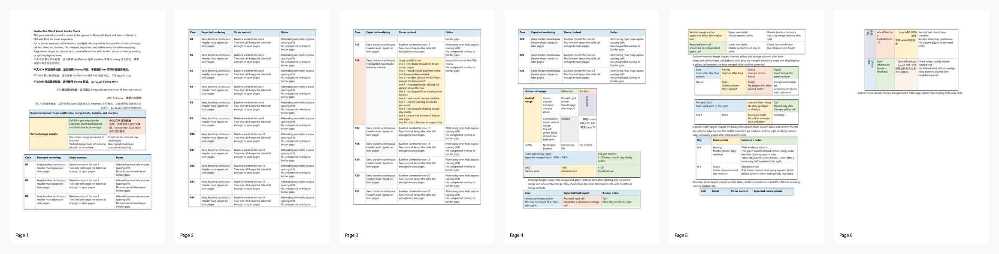
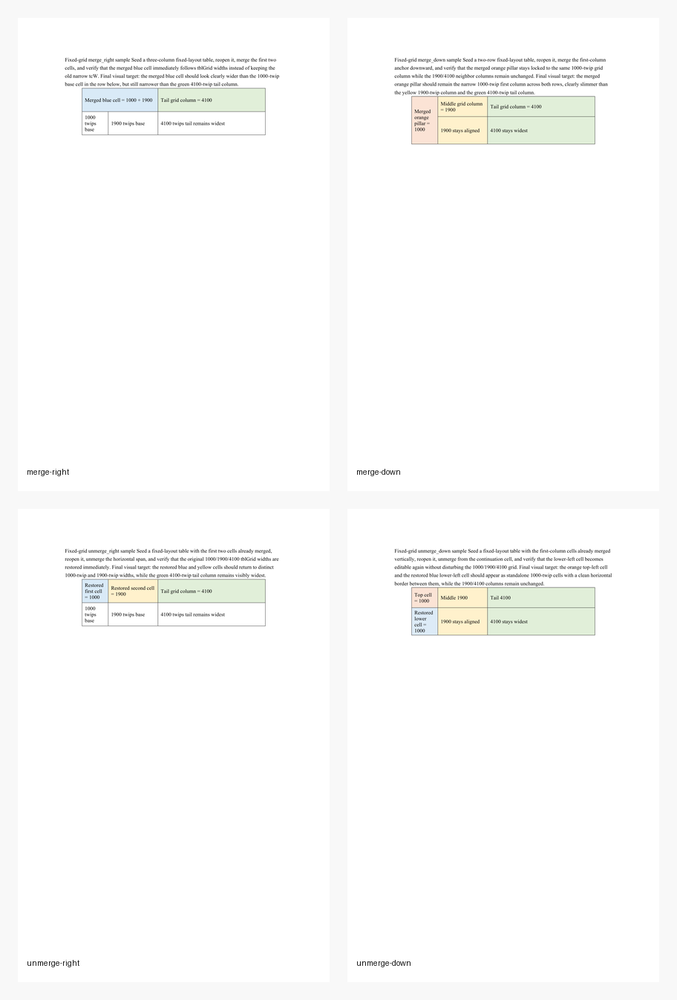
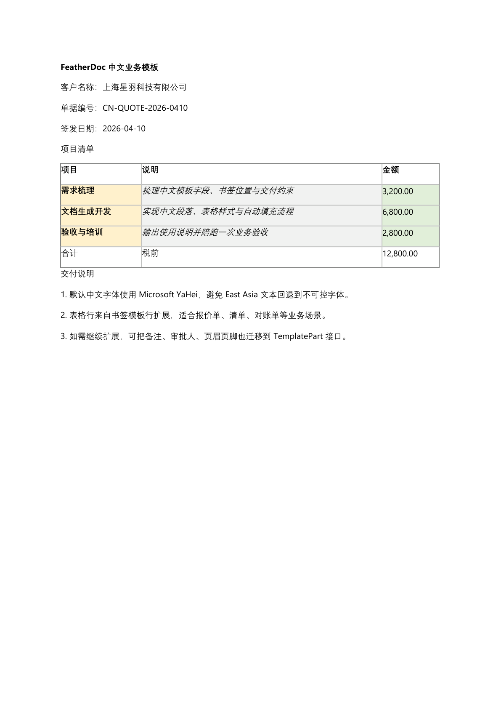

# FeatherDoc

[](https://github.com/wuxianggujun/FeatherDoc/actions/workflows/windows-msvc.yml)
[](https://github.com/wuxianggujun/FeatherDoc/actions/workflows/linux-cmake.yml)
[](https://github.com/wuxianggujun/FeatherDoc/actions/workflows/macos-cmake.yml)

[Simplified Chinese](README.zh-CN.md) | English

FeatherDoc is a modernized C++ library for reading and writing Microsoft Word
`.docx` files.

## Highlights

- CMake 3.20+ and C++20
- MSVC-friendly build, test, install, and package-export setup
- Lightweight document editing APIs for paragraphs, runs, tables, images,
  lists, styles, numbering, sections, headers/footers, and template parts
- Scriptable `featherdoc_cli` workflows for inspection, one-shot rewrites,
  numbering catalog governance, style refactor plans, and visual validation
- Template schema validation, bookmark filling, content-control inspection,
  form-state mutation, and content-control text / paragraph / table / image
  replacement by tag or alias
- Lightweight typed APIs and CLI workflows for fields, hyperlinks, review notes,
  revisions, and OMML formulas
- MSVC-safe XML parsing on `open()` and streamed ZIP rewrite on `save()`

## Build

```bash
cmake -S . -B build
cmake --build build
```

Top-level builds enable `BUILD_CLI` by default, so the `featherdoc_cli`
utility is built alongside the library unless you pass `-DBUILD_CLI=OFF`.

The experimental PDF byte writer module is off by default. Enable it only when
you want to work on the in-process DOCX-to-PDF path:

```bash
cmake -S . -B build-pdf -DFEATHERDOC_BUILD_PDF=ON -DBUILD_SAMPLES=ON
cmake --build build-pdf --target featherdoc_pdfio_probe
```

This builds `FeatherDoc::Pdf`, fetches or uses PDFio, and keeps the main
`FeatherDoc::FeatherDoc` target independent from PDFio.

Default builds do not fetch PDFio or PDFium, do not install experimental PDF
headers, and do not treat PDF support as part of the stable API.

The current experimental PDF scope is narrower than a production export path
but broader than a plain text proof of concept: it already covers basic
paragraphs, tables, baseline styling, CJK fallback, font metrics, Unicode /
ToUnicode roundtrip checks, and a small regression sample set. It is still
explicitly experimental, and richer pagination and image handling remain in
progress.

The experimental PDF import path is also opt-in. It builds against a PDFium
source checkout by default and does not download PDFium automatically:

```bash
gclient config --unmanaged https://pdfium.googlesource.com/pdfium.git
gclient sync --no-history --jobs 8

cmake -S . -B build-pdf-import \
  -DFEATHERDOC_BUILD_PDF_IMPORT=ON \
  -DFEATHERDOC_PDFIUM_SOURCE_DIR=/path/to/pdfium
```

The source provider prefers the `gn` / `ninja` binaries inside the PDFium
checkout. When linking source-built `pdfium.lib` on Windows, use MSVC `/MT`:

```bash
-DCMAKE_MSVC_RUNTIME_LIBRARY=MultiThreaded
```

If PDFium cannot detect Visual Studio, pass `FEATHERDOC_PDFIUM_VS_YEAR` and
`FEATHERDOC_PDFIUM_VS_INSTALL`. See `BUILDING_PDF.md` for the build runbook
and `design/dependencies/pdfium.md` for design context. Prebuilt packages are
still supported with
`-DFEATHERDOC_PDFIUM_PROVIDER=package -DPDFium_DIR=/path/to/pdfium`.

When PDF import is enabled, `featherdoc_cli` also exposes:

```bash
featherdoc_cli import-pdf input.pdf --output output.docx \
  [--import-table-candidates-as-tables] \
  [--min-table-continuation-confidence <score>] [--json]
```

By default, table candidates are rejected. Pass
`--import-table-candidates-as-tables` to promote them into DOCX tables.
When `--json` is present, successful imports include
`table_continuation_diagnostics_count` and `table_continuation_diagnostics`.
Those diagnostics explain cross-page table decisions such as
`merged_with_previous_table`, `column_count_mismatch`,
`column_anchors_mismatch`, `repeated_header_mismatch`, and
`continuation_confidence_below_threshold`. See `docs/pdf_import.rst` for the
overview, `docs/pdf_import_json_diagnostics.rst` for the field-level schema,
and `docs/pdf_import_scope.rst` for supported scope and limits.

## Build With MSVC

Open an `x64` Visual Studio Developer Command Prompt first, or initialize the
environment with `VsDevCmd.bat -arch=x64 -host_arch=x64`, then run:

```bat
cmake -S . -B build-msvc-nmake -G "NMake Makefiles" -DCMAKE_BUILD_TYPE=Release -DBUILD_TESTING=ON -DBUILD_SAMPLES=ON -DBUILD_CLI=ON
cmake --build build-msvc-nmake
ctest --test-dir build-msvc-nmake --output-on-failure --timeout 60
```

## Word Visual Smoke Check

This is a local validation tool, not a FeatherDoc library feature. On Windows
hosts with Microsoft Word installed you can run a visual smoke check that:

- builds a dedicated sample document covering table layout features
- exports the generated `.docx` through a local Microsoft Word COM session as
  PDF
- renders each PDF page to PNG for manual or AI-assisted review

The implementation lives in `scripts/`, so the core library stays free of
Word COM dependencies.

```powershell
powershell -ExecutionPolicy Bypass -File .\scripts\run_word_visual_smoke.ps1
```

For the fixed-grid merge/unmerge sample quartet specifically, use:

```powershell
powershell -ExecutionPolicy Bypass -File .\scripts\run_fixed_grid_merge_unmerge_regression.ps1
```

For a before/after Word-rendered check of the new template-table CLI row/cell
commands, use:

```powershell
powershell -ExecutionPolicy Bypass -File .\scripts\run_template_table_cli_visual_regression.ps1
```

That regression now generates a dedicated baseline document covering `body`,
`section-header`, and `section-footer` template tables, applies
`set-template-table-cell-text`, `append-template-table-row`,
`insert-template-table-row-after`, `insert-template-table-row-before`, and
`remove-template-table-row` to each target table in turn, then captures
Word-rendered baseline/mutated evidence plus per-case and aggregate
before/after contact sheets under
`output/template-table-cli-visual-regression/`.

For a dedicated before/after Word-rendered check of the bookmark-targeted
table workflow, use:

```powershell
powershell -ExecutionPolicy Bypass -File .\scripts\run_template_table_cli_bookmark_visual_regression.ps1
```

That regression generates a body-only baseline document with one retained
table plus one target table addressed by both a bookmark paragraph immediately
before it and a bookmark inside its first data cell. It applies
`set-template-table-row-texts` and
`set-template-table-cell-block-texts` through `--bookmark`, then writes
Word-rendered baseline/mutated evidence plus per-case and aggregate
before/after contact sheets under
`output/template-table-cli-bookmark-visual-regression/`.

For a dedicated Word-rendered overlap check of floating-image anchor z-order,
use:

```powershell
powershell -ExecutionPolicy Bypass -File .\scripts\run_floating_image_z_order_visual_regression.ps1
```

That regression builds the dedicated `sample_floating_image_z_order_visual`
fixture, verifies both anchored images through CLI inspection and extraction,
then captures the rendered first page so you can confirm the orange floating
image overlaps and appears above the blue one under
`output/floating-image-z-order-visual-regression/`.

For a before/after Word-rendered check of section-scoped template-table
row/cell commands across `--kind default/even/first`, use:

```powershell
powershell -ExecutionPolicy Bypass -File .\scripts\run_template_table_cli_section_kind_visual_regression.ps1
```

That regression generates one shared baseline document covering
`section-header --kind default`, `section-header --kind even`,
`section-footer --kind first`, and `section-footer --kind default`, applies
the same row/cell mutation chain to each target table, then captures the
relevant Word-rendered `page-01` / `page-02` / `page-03` evidence instead of
only the first page so the kind-specific rendering path is visible under
`output/template-table-cli-section-kind-visual-regression/`.

For a dedicated before/after Word-rendered check of template-table row
commands across section-scoped `--kind default/even/first`, use:

```powershell
powershell -ExecutionPolicy Bypass -File .\scripts\run_template_table_cli_section_kind_row_visual_regression.ps1
```

That regression generates four dedicated baseline documents covering
`section-header --kind default` insert-row-before,
`section-header --kind even` append-row,
`section-footer --kind first` remove-row, and
`section-footer --kind default` insert-row-after, applies the matching
row mutation plus `set-template-table-cell-text` where needed, then captures
the relevant Word-rendered `page-01` / `page-02` / `page-03` evidence under
`output/template-table-cli-section-kind-row-visual-regression/`.

For a before/after Word-rendered check of template-table column commands across
section-scoped `--kind default/even/first`, use:

```powershell
powershell -ExecutionPolicy Bypass -File .\scripts\run_template_table_cli_section_kind_column_visual_regression.ps1
```

That regression generates four dedicated baseline documents covering
`section-header --kind default` insert-before,
`section-header --kind even` remove-column,
`section-footer --kind first` insert-after, and
`section-footer --kind default` remove-column, applies the matching
column mutation chain plus `set-template-table-cell-text` where needed, then
captures the relevant Word-rendered `page-01` / `page-02` / `page-03`
evidence under
`output/template-table-cli-section-kind-column-visual-regression/`.

For a before/after Word-rendered check of template-table merge/unmerge
commands across section-scoped `--kind default/even/first`, use:

```powershell
powershell -ExecutionPolicy Bypass -File .\scripts\run_template_table_cli_section_kind_merge_unmerge_visual_regression.ps1
```

That regression generates four dedicated baseline documents covering
`section-header --kind default` merge-right,
`section-header --kind even` unmerge-right,
`section-footer --kind first` merge-down, and
`section-footer --kind default` unmerge-down, applies the matching
merge/unmerge CLI mutation, verifies the underlying XML merge markers, then
captures the relevant Word-rendered `page-01` / `page-02` / `page-03`
evidence under
`output/template-table-cli-section-kind-merge-unmerge-visual-regression/`.

For a before/after Word-rendered check of the new template-table CLI
merge/unmerge commands, use:

```powershell
powershell -ExecutionPolicy Bypass -File .\scripts\run_template_table_cli_merge_unmerge_visual_regression.ps1
```

That regression generates four dedicated baseline documents covering
`section-header` horizontal merge, `section-footer` vertical merge, and
`body` horizontal/vertical unmerge scenarios, applies
`merge-template-table-cells` or `unmerge-template-table-cells`, then captures
Word-rendered baseline/mutated evidence plus per-case and aggregate
before/after contact sheets under
`output/template-table-cli-merge-unmerge-visual-regression/`.

For a before/after Word-rendered check of the template-table CLI row/cell
commands on direct `header` / `footer` parts, use:

```powershell
powershell -ExecutionPolicy Bypass -File .\scripts\run_template_table_cli_direct_visual_regression.ps1
```

That regression generates one shared baseline document covering direct
`header`, direct `footer`, and `body` target tables, applies
`set-template-table-cell-text`, `append-template-table-row`,
`insert-template-table-row-after`, `insert-template-table-row-before`, and
`remove-template-table-row` through the direct-part selector model, then
captures Word-rendered baseline/mutated evidence plus per-case and aggregate
before/after contact sheets under
`output/template-table-cli-direct-visual-regression/`.

For a before/after Word-rendered check of the new template-table CLI column
commands, use:

```powershell
powershell -ExecutionPolicy Bypass -File .\scripts\run_template_table_cli_column_visual_regression.ps1
```

That regression generates three dedicated baseline documents covering
`section-header` insert-before, `section-footer` insert-after, and `body`
remove-column scenarios, applies `insert-template-table-column-before`,
`insert-template-table-column-after`, `remove-template-table-column`, and
`set-template-table-cell-text` where needed, then captures Word-rendered
baseline/mutated evidence plus per-case and aggregate before/after contact
sheets under `output/template-table-cli-column-visual-regression/`.

For a before/after Word-rendered check of the same template-table column
commands on direct `header` / `footer` parts, use:

```powershell
powershell -ExecutionPolicy Bypass -File .\scripts\run_template_table_cli_direct_column_visual_regression.ps1
```

That regression generates three dedicated baseline documents covering direct
`header` insert-before, direct `footer` insert-after, and `body`
remove-column scenarios, applies the same CLI column mutations, then captures
Word-rendered baseline/mutated evidence plus per-case and aggregate
before/after contact sheets under
`output/template-table-cli-direct-column-visual-regression/`.

For a before/after Word-rendered check of template-table merge/unmerge commands
on direct `header` / `footer` parts, use:

```powershell
powershell -ExecutionPolicy Bypass -File .\scripts\run_template_table_cli_direct_merge_unmerge_visual_regression.ps1
```

That regression generates three dedicated baseline documents covering direct
`header` merge-right, direct `footer` unmerge-down, and `body` merge-down
scenarios, applies `merge-template-table-cells` or
`unmerge-template-table-cells`, then captures Word-rendered baseline/mutated
evidence plus per-case and aggregate before/after contact sheets under
`output/template-table-cli-direct-merge-unmerge-visual-regression/`.

If you want the quartet regression to immediately emit an AI review task
package after the Word screenshot bundle is ready, run:

```powershell
powershell -ExecutionPolicy Bypass -File .\scripts\run_fixed_grid_merge_unmerge_regression.ps1 `
    -PrepareReviewTask `
    -ReviewMode review-only
```

That script builds the four dedicated sample targets, generates one `.docx`
per case under `output/fixed-grid-merge-unmerge-regression/`, and, unless you
pass `-SkipVisual`, also runs the existing Word PDF/PNG capture flow under each
case's `visual/` directory. It also writes a root-level aggregate contact sheet
plus `review_manifest.json`, `review_checklist.md`, and `final_review.md` so
human or AI reviewers can inspect the whole fixed-grid quartet from one place.
When `-PrepareReviewTask` is enabled, it also invokes
`prepare_word_review_task.ps1` automatically and records the generated task
metadata back into the root `summary.json` and `review_manifest.json`.

Artifacts are written under `output/word-visual-smoke/`, including the source
`.docx` and exported `.pdf`, plus an `evidence/` directory for per-page `.png`
renders and contact sheets, a `report/` directory for the generated checklist
and summary data, generated `review_result.json` and `final_review.md`
skeletons, and a reserved `repair/` directory for iterative fix candidates.
If the screenshot review is completed during the same run, pass
`-ReviewVerdict pass` (or `fail` / `undetermined`) plus `-ReviewNote` so
`review_result.json` records `status=reviewed`, `verdict`, and `reviewed_at`
for verdict-sync automation.
The script now also validates two things before you trust the result:

- generated smoke samples must contain the expected core DOCX ZIP entries
- exported PDF page count must match both `summary.json` and the rendered PNG count

Pass `-InputDocx <path>` when you want to run the same render-and-capture flow
against an existing document instead of the bundled smoke sample. The
recommended review-and-repair workflow is documented in
`docs/automation/word_visual_workflow_zh.rst`.

Use `-SkipBuild` only when the executable under `-BuildDir` is known to be
current. If the smoke sample generator is stale, rerun without `-SkipBuild` or
rebuild that directory first.

When you want to hand the task to an AI agent consistently, generate a review
task package first:

```powershell
powershell -ExecutionPolicy Bypass -File .\scripts\prepare_word_review_task.ps1 `
    -DocxPath .\path\to\target.docx `
    -Mode review-only
```

For single-document review lines that need their own stable pointer, add
`-DocumentSourceKind` and `-DocumentSourceLabel`. For example, style merge
restore audits can refresh `latest_style-merge-restore-audit_task.json`
without overwriting the ordinary `latest_document_task.json` pointer.

For the fixed-grid regression bundle generated by
`run_fixed_grid_merge_unmerge_regression.ps1`, use:

```powershell
powershell -ExecutionPolicy Bypass -File .\scripts\prepare_word_review_task.ps1 `
    -FixedGridRegressionRoot .\output\fixed-grid-merge-unmerge-regression `
    -Mode review-only
```

Use `-Mode review-and-repair` when the agent is allowed to fix generation
logic and rerun the visual review loop. The script generates a task directory
with `task_prompt.md`, `task_manifest.json`, and dedicated `evidence/`,
`report/`, and `repair/` directories, so the AI no longer has to guess paths
or output structure. The intended handoff flow is:

1. Run `prepare_word_review_task.ps1`.
2. Open the generated `task_prompt.md`.
3. Send the full prompt to the AI agent and require it to first run
   `scripts/run_word_visual_smoke.ps1 -InputDocx ... -OutputDir <task dir>`.
4. Require the agent to review the generated PDF/PNG evidence and write its
   conclusion back into `report/review_result.json` and `report/final_review.md`.
5. If the mode is `review-and-repair`, allow the agent to iterate under
   `repair/fix-XX/` and rerun the full visual review loop after each fix.

Every task generation also refreshes stable pointer files under
`output/word-visual-smoke/tasks/`, including `latest_task.json` plus a
source-kind-specific file such as
`latest_fixed-grid-regression-bundle_task.json` or
`latest_template-table-cli-selector-visual-regression-bundle_task.json`, so
external automation can resolve the newest task package without guessing
timestamped directory names.

When you want to consume those pointers directly, use:

```powershell
powershell -ExecutionPolicy Bypass -File .\scripts\open_latest_word_review_task.ps1
```

Or for the newest fixed-grid bundle task specifically:

```powershell
powershell -ExecutionPolicy Bypass -File .\scripts\open_latest_word_review_task.ps1 `
    -SourceKind fixed-grid-regression-bundle `
    -PrintPrompt
```

Or for a curated visual regression bundle emitted by the release gate:

```powershell
powershell -ExecutionPolicy Bypass -File .\scripts\open_latest_word_review_task.ps1 `
    -SourceKind template-table-cli-selector-visual-regression-bundle `
    -PrintPrompt

powershell -ExecutionPolicy Bypass -File .\scripts\open_latest_word_review_task.ps1 `
    -SourceKind table-style-quality-visual-regression-bundle `
    -PrintPrompt
```

The `table-style-quality` bundle is emitted only when the release gate or
release-candidate preflight is run with `-IncludeTableStyleQuality`; its stable
pointer is `latest_table-style-quality-visual-regression-bundle_task.json`.

For automation-friendly raw outputs, use:

```powershell
powershell -ExecutionPolicy Bypass -File .\scripts\open_latest_word_review_task.ps1 `
    -SourceKind fixed-grid-regression-bundle `
    -PrintField task_dir

powershell -ExecutionPolicy Bypass -File .\scripts\open_latest_word_review_task.ps1 `
    -SourceKind fixed-grid-regression-bundle `
    -PromptOnly
```

For the fixed-grid path specifically, the shorter wrappers are:

```powershell
powershell -ExecutionPolicy Bypass -File .\scripts\open_latest_fixed_grid_review_task.ps1 `
    -PrintField task_dir

powershell -ExecutionPolicy Bypass -File .\scripts\print_latest_fixed_grid_review_prompt.ps1
```

For fixed-grid bundle tasks, the task package also copies the aggregate contact
sheet, bundle summary, bundle review manifest, aggregate first-page PNGs, plus
the source bundle's checklist/final-review markdown into the task directory, so
the reviewer can start from a single visual bundle instead of discovering each
case path manually.

## Rendered Examples

The screenshots below come from actual Word-rendered validation artifacts saved
in the repository, so README readers can see the current layout coverage,
rendering quality, and screenshot-backed review surface directly. The focused
row below intentionally mixes two standalone fixed-grid closure samples, the
aggregate quartet signoff bundle, and one Chinese business-template result so
the library's editing surface is visible at a glance.

<p align="center">
  
</p>
<p align="center">
  <sub>Top: the full 6-page Word visual smoke contact sheet generated from the current validation flow, covering tables, pagination, merges, text direction, fixed-grid width editing, and mixed RTL/LTR/CJK review content.</sub>
</p>
<p align="center">
  
  
  
  
</p>
<p align="center">
  <sub>Bottom row, left to right: a standalone <code>merge_right()</code> closure check after reopen, a standalone <code>merge_down()</code> closure check after reopen, the aggregate fixed-grid quartet signoff bundle, and a Chinese invoice template rendered through Microsoft Word. The first two screenshots come from <code>sample_merge_right_fixed_grid.cpp</code> and <code>sample_merge_down_fixed_grid.cpp</code>; they make the fixed-width closure signal obvious without needing to read XML. The fourth image comes from <code>sample_chinese_template.cpp</code> and shows CJK text plus business-table output in Word rather than synthetic mockups.</sub>
</p>

To regenerate the exact focused gallery pages, build and run the dedicated
sample targets first. Adjust the executable path if your generator places the
sample binaries somewhere other than the build root:

```powershell
cmake --build build-msvc-nmake --target `
    featherdoc_sample_merge_right_fixed_grid `
    featherdoc_sample_merge_down_fixed_grid `
    featherdoc_sample_chinese_template

.\build-msvc-nmake\featherdoc_sample_merge_right_fixed_grid.exe `
    .\output\sample-merge-right-fixed-grid\merge_right_fixed_grid.docx

.\build-msvc-nmake\featherdoc_sample_merge_down_fixed_grid.exe `
    .\output\sample-merge-down-fixed-grid\merge_down_fixed_grid.docx

.\build-msvc-nmake\featherdoc_sample_chinese_template.exe `
    .\samples\chinese_invoice_template.docx `
    .\output\sample-chinese-template\sample_chinese_invoice_output.docx

powershell -ExecutionPolicy Bypass -File .\scripts\run_word_visual_smoke.ps1 `
    -InputDocx .\output\sample-merge-right-fixed-grid\merge_right_fixed_grid.docx `
    -OutputDir .\output\word-visual-sample-merge-right-fixed-grid

powershell -ExecutionPolicy Bypass -File .\scripts\run_word_visual_smoke.ps1 `
    -InputDocx .\output\sample-merge-down-fixed-grid\merge_down_fixed_grid.docx `
    -OutputDir .\output\word-visual-sample-merge-down-fixed-grid

powershell -ExecutionPolicy Bypass -File .\scripts\run_word_visual_smoke.ps1 `
    -InputDocx .\output\sample-chinese-template\sample_chinese_invoice_output.docx `
    -OutputDir .\output\word-visual-sample-chinese-template
```

To rerun the fixed-grid quartet that feeds the aggregate contact sheet and
prepare a ready-to-review task package:

```powershell
powershell -ExecutionPolicy Bypass -File .\scripts\run_fixed_grid_merge_unmerge_regression.ps1 `
    -PrepareReviewTask `
    -ReviewMode review-only
```

To refresh the repository-side gallery PNGs after those sample renders or a new
release-gate pass, use:

```powershell
powershell -ExecutionPolicy Bypass -File .\scripts\refresh_readme_visual_assets.ps1
```

To jump from these screenshots to a review-task handoff, start with
[VISUAL_VALIDATION_QUICKSTART.md](VISUAL_VALIDATION_QUICKSTART.md) and then use
[VISUAL_VALIDATION.md](VISUAL_VALIDATION.md) or
[VISUAL_VALIDATION.zh-CN.md](VISUAL_VALIDATION.zh-CN.md) for the longer
mapping.

For a one-shot local gate that also refreshes the repository gallery, use:

```powershell
powershell -ExecutionPolicy Bypass -File .\scripts\run_word_visual_release_gate.ps1 `
    -RefreshReadmeAssets
```

If the standard smoke contact sheet is reviewed during the same gate run, add
`-SmokeReviewVerdict pass` (or `fail` / `undetermined`) and `-SmokeReviewNote`
so the smoke `review_result.json` and gate summary carry the same sign-off.
When the fixed-grid bundle is also reviewed in that run, use
`-FixedGridReviewVerdict pass` and `-FixedGridReviewNote` to seed the generated
fixed-grid review task with the same machine-readable metadata. Section page
setup and page-number field bundles support the same pattern via
`-SectionPageSetupReviewVerdict/-SectionPageSetupReviewNote` and
`-PageNumberFieldsReviewVerdict/-PageNumberFieldsReviewNote`. For curated visual
regression bundles produced by the same gate, use `-CuratedVisualReviewVerdict pass`
and `-CuratedVisualReviewNote` to seed every generated curated bundle task and
surface the verdict in the gate summary.

After the screenshot-backed review tasks you care about are signed off,
including any curated visual regression bundles emitted by the gate, sync the
final verdict back into the gate summary with:

```powershell
powershell -ExecutionPolicy Bypass -File .\scripts\sync_latest_visual_review_verdict.ps1
```

That shortest sync path now walks every `latest_*_task.json` pointer it can
resolve under the task root, so later curated visual-regression bundle tasks
from `run_word_visual_release_gate.ps1` are promoted together with the classic
document / fixed-grid / section-page-setup / page-number-fields tasks. For the
opt-in table style quality flow, that includes
`latest_table-style-quality-visual-regression-bundle_task.json` and the matching
`table-style-quality-visual-regression-bundle` source kind.

If you need to override the inferred gate/release paths manually, use:

```powershell
powershell -ExecutionPolicy Bypass -File .\scripts\sync_visual_review_verdict.ps1 `
    -GateSummaryJson .\output\word-visual-release-gate\report\gate_summary.json
```

## CLI

`featherdoc_cli` is a small command-line wrapper around the current
inspection and editing APIs for sections, styles, numbering, page setup,
bookmarks, content controls, images, and template parts.

```bash
featherdoc_cli inspect-sections input.docx
featherdoc_cli inspect-sections input.docx --json
featherdoc_cli inspect-styles input.docx --style Strong --json
featherdoc_cli inspect-runs input.docx 1 --run 0 --json
featherdoc_cli inspect-template-runs input.docx 1 --run 0 --json
featherdoc_cli inspect-numbering input.docx --definition 1 --json
featherdoc_cli inspect-style-numbering input.docx --json
featherdoc_cli audit-style-numbering input.docx --fail-on-issue --json
featherdoc_cli repair-style-numbering input.docx --plan-only --json
featherdoc_cli repair-style-numbering input.docx --apply --output repaired-style-numbering.docx --json
featherdoc_cli repair-style-numbering input.docx --catalog-file numbering-catalog.json --apply --output catalog-repaired.docx --json
featherdoc_cli export-numbering-catalog input.docx --output numbering-catalog.json --json
featherdoc_cli check-numbering-catalog input.docx --catalog-file numbering-catalog.json --output numbering-catalog.generated.json --json
pwsh -ExecutionPolicy Bypass -File .\scripts\build_document_skeleton_governance_report.ps1 -InputDocx .\input.docx -OutputDir .\output\document-skeleton-governance -BuildDir build-codex-clang-compat -SkipBuild
pwsh -ExecutionPolicy Bypass -File .\scripts\build_document_skeleton_governance_rollup_report.ps1 -InputRoot .\output\document-skeleton-governance -OutputDir .\output\document-skeleton-governance-rollup -FailOnIssue
pwsh -ExecutionPolicy Bypass -File .\scripts\check_numbering_catalog_baseline.ps1 -InputDocx .\input.docx -CatalogFile .\numbering-catalog.json -GeneratedCatalogOutput .\numbering-catalog.generated.json -BuildDir build-codex-clang-compat -SkipBuild
pwsh -ExecutionPolicy Bypass -File .\scripts\check_numbering_catalog_manifest.ps1 -ManifestPath .\baselines\numbering-catalog\manifest.json -BuildDir build-codex-clang-compat -OutputDir .\output\numbering-catalog-manifest-checks -SkipBuild
featherdoc_cli patch-numbering-catalog numbering-catalog.json --patch-file numbering-catalog.patch.json --output numbering-catalog.patched.json --json
featherdoc_cli lint-numbering-catalog numbering-catalog.patched.json --json
featherdoc_cli diff-numbering-catalog numbering-catalog.json numbering-catalog.patched.json --fail-on-diff --json
featherdoc_cli semantic-diff before.docx after.docx --fail-on-diff --json
featherdoc_cli import-numbering-catalog target.docx --catalog-file numbering-catalog.patched.json --output target-numbering.docx --json
featherdoc_cli inspect-page-setup input.docx --section 1 --json
featherdoc_cli inspect-bookmarks input.docx --part header --index 0 --bookmark header_rows --json
featherdoc_cli inspect-content-controls input.docx --tag customer_name --json
featherdoc_cli replace-content-control-text input.docx --tag customer_name --text "Ada Lovelace" --output content-control-text.docx --json
featherdoc_cli set-content-control-form-state input.docx --tag approved --checked false --clear-lock --output content-control-form.docx --json
featherdoc_cli replace-content-control-paragraphs input.docx --tag summary --paragraph "Line one" --paragraph "Line two" --output content-control-paragraphs.docx --json
featherdoc_cli replace-content-control-table-rows input.docx --tag line_items --row "SKU-1" --cell "2" --cell "$10" --output content-control-rows.docx --json
featherdoc_cli replace-content-control-image input.docx assets/logo.png --alias "Logo" --width 120 --height 40 --output content-control-image.docx --json
featherdoc_cli inspect-hyperlinks input.docx --json
featherdoc_cli inspect-review input.docx --json
featherdoc_cli inspect-omml input.docx --json
featherdoc_cli append-hyperlink input.docx --text "OpenAI" --target https://openai.com --output link.docx --json
featherdoc_cli accept-all-revisions input.docx --output accepted.docx --json
featherdoc_cli inspect-images input.docx --relationship-id rId5 --json
featherdoc_cli ensure-table-style input.docx ReportTable --name "Report Table" --based-on TableGrid --style-text-color whole_table:333333 --style-bold first_row:true --style-italic first_row:true --style-font-size first_row:14 --style-font-family "first_row:Aptos Display" --style-east-asia-font-family first_row:SimHei --style-cell-vertical-alignment first_row:bottom --style-cell-text-direction first_row:top_to_bottom_right_to_left --style-paragraph-alignment first_row:right --style-paragraph-spacing-after first_row:120 --style-paragraph-line-spacing first_row:240:at_least --style-fill second_banded_rows:F2F2F2 --output styled.docx --json
featherdoc_cli inspect-table-style input.docx ReportTable --json
featherdoc_cli audit-table-style-regions input.docx --fail-on-issue --json
featherdoc_cli audit-table-style-inheritance input.docx --fail-on-issue --json
featherdoc_cli audit-table-style-quality input.docx --fail-on-issue --json
featherdoc_cli plan-table-style-quality-fixes input.docx --json
featherdoc_cli apply-table-style-quality-fixes input.docx --look-only --output quality-fixed.docx --json
powershell -ExecutionPolicy Bypass -File .\scripts\build_table_layout_delivery_report.ps1 -InputDocx .\input.docx -BuildDir build-codex-clang-compat -OutputDir .\output\table-layout-delivery-report -SkipBuild
powershell -ExecutionPolicy Bypass -File .\scripts\build_table_layout_delivery_rollup_report.ps1 -InputRoot .\output\table-layout-delivery-report -OutputDir .\output\table-layout-delivery-rollup -FailOnBlocker
powershell -ExecutionPolicy Bypass -File .\scripts\build_table_layout_delivery_governance_report.ps1 -InputJson .\output\table-layout-delivery-rollup\summary.json -OutputDir .\output\table-layout-delivery-governance -FailOnIssue -FailOnBlocker
powershell -ExecutionPolicy Bypass -File .\scripts\run_table_style_quality_visual_regression.ps1 -BuildDir build-codex-clang-compat -OutputDir output/table-style-quality-visual-regression -SkipBuild
powershell -ExecutionPolicy Bypass -File .\scripts\run_release_candidate_checks.ps1 -SkipConfigure -SkipBuild -IncludeTableStyleQuality
featherdoc_cli check-table-style-look input.docx --fail-on-issue --json
featherdoc_cli repair-table-style-look input.docx --apply --output repaired-style-look.docx --json
featherdoc_cli inspect-header-parts input.docx --json
featherdoc_cli inspect-footer-parts input.docx
featherdoc_cli insert-section input.docx 1 --no-inherit --output inserted.docx --json
featherdoc_cli copy-section-layout input.docx 0 2 --output copied.docx
featherdoc_cli move-section input.docx 2 0 --output reordered.docx
featherdoc_cli remove-section input.docx 3 --output trimmed.docx
featherdoc_cli assign-section-header input.docx 2 0 --kind even --output shared-header.docx --json
featherdoc_cli assign-section-footer input.docx 2 1 --output shared-footer.docx --json
featherdoc_cli remove-section-header input.docx 2 --kind even --output detached-header.docx
featherdoc_cli remove-section-footer input.docx 1 --kind first --output detached-footer.docx
featherdoc_cli remove-header-part input.docx 1 --output headers-pruned.docx
featherdoc_cli move-header-part input.docx 1 0 --output headers-reordered.docx --json
featherdoc_cli remove-footer-part input.docx 0 --output footers-pruned.docx --json
featherdoc_cli move-footer-part input.docx 1 0 --output footers-reordered.docx --json
featherdoc_cli show-section-header input.docx 1 --kind even
featherdoc_cli show-section-footer input.docx 2 --json
featherdoc_cli set-section-footer input.docx 0 --text "Page 1" --output footer.docx --json
featherdoc_cli set-section-header input.docx 2 --kind even --text-file header.txt --json
featherdoc_cli append-page-number-field input.docx --part section-header --section 1 --output page-number.docx --json
featherdoc_cli append-table-of-contents-field input.docx --part body --min-outline-level 1 --max-outline-level 3 --result-text "Table of contents" --output toc.docx --json
featherdoc_cli append-field input.docx " AUTHOR " --part body --result-text "Ada Lovelace" --output author-field.docx --json
featherdoc_cli append-reference-field input.docx target_heading --part body --result-text "Referenced heading" --output ref.docx --json
featherdoc_cli append-page-reference-field input.docx target_heading --part body --relative-position --result-text "Page reference" --output page-ref.docx --json
featherdoc_cli append-style-reference-field input.docx "Heading 1" --part body --paragraph-number --result-text "Section heading" --output style-ref.docx --json
featherdoc_cli append-document-property-field input.docx Title --part body --result-text "Document title" --output doc-property.docx --json
featherdoc_cli append-date-field input.docx --part body --format "yyyy-MM-dd" --result-text "2026-05-01" --dirty --output date-field.docx --json
featherdoc_cli append-hyperlink-field input.docx https://example.com/report --part body --anchor target_heading --tooltip "Open target heading" --result-text "Open report" --locked --output hyperlink-field.docx --json
featherdoc_cli append-sequence-field input.docx Figure --part body --number-format ROMAN --restart 4 --result-text "IV" --output sequence.docx --json
featherdoc_cli replace-field input.docx 0 " SEQ Table \* ARABIC \r 1 " --part body --result-text "1" --output replaced-field.docx --json
featherdoc_cli append-caption input.docx Figure --part body --text "Architecture overview" --number-result "1" --output caption.docx --json
featherdoc_cli append-index-entry-field input.docx FeatherDoc --part body --subentry API --bookmark target_heading --cross-reference "See API" --output xe.docx --json
featherdoc_cli append-index-field input.docx --part body --columns 2 --result-text "Index placeholder" --output index.docx --json
featherdoc_cli append-complex-field input.docx --part body --instruction-before " IF " --nested-instruction " MERGEFIELD CustomerName " --nested-result-text "Ada" --instruction-after " = \"Ada\" \"Matched\" \"Other\" " --result-text "Matched" --output complex-field.docx --json
featherdoc_cli inspect-update-fields-on-open input.docx --json
featherdoc_cli set-update-fields-on-open input.docx --enable --output update-fields.docx --json
featherdoc_cli set-template-table-from-json report.docx --bookmark line_items_table --patch-file row_patch.json --output report-updated.docx --json
featherdoc_cli set-template-tables-from-json report.docx --patch-file multi_table_patch.json --output report-updated.docx --json
featherdoc_cli validate-template input.docx --part body --slot customer:text --slot line_items:table_rows --json
featherdoc_cli validate-template-schema input.docx --target section-header --section 0 --slot header_title:text --target section-footer --section 0 --slot footer_company:text --slot footer_summary:block --json
featherdoc_cli validate-template-schema input.docx --schema-file template-schema.json --json
featherdoc_cli export-template-schema input.docx --output template-schema.json --json
featherdoc_cli export-template-schema input.docx --section-targets --output section-template-schema.json --json
featherdoc_cli export-template-schema input.docx --resolved-section-targets --output resolved-section-template-schema.json --json
featherdoc_cli normalize-template-schema template-schema.json --output normalized-template-schema.json --json
featherdoc_cli lint-template-schema template-schema.json --json
featherdoc_cli repair-template-schema template-schema.json --output repaired-template-schema.json --json
featherdoc_cli merge-template-schema shared-template-schema.json invoice-template-schema.json --output merged-template-schema.json --json
featherdoc_cli patch-template-schema committed-template-schema.json --patch-file schema.patch.json --output patched-template-schema.json --json
featherdoc_cli preview-template-schema-patch committed-template-schema.json --patch-file schema.patch.json --output-patch schema.preview.patch.json --json
featherdoc_cli preview-template-schema-patch committed-template-schema.json generated-schema.json --output-patch schema.preview.patch.json --json
featherdoc_cli build-template-schema-patch committed-schema.json generated-schema.json --output schema.patch.json --json
featherdoc_cli diff-template-schema old-template-schema.json new-template-schema.json --json
featherdoc_cli diff-template-schema committed-schema.json generated-schema.json --fail-on-diff --json
featherdoc_cli check-template-schema input.docx --schema-file committed-schema.json --resolved-section-targets --output generated-schema.json --json
pwsh -ExecutionPolicy Bypass -File .\scripts\freeze_template_schema_baseline.ps1 -InputDocx .\template.docx -SchemaOutput .\template.schema.json -ResolvedSectionTargets
pwsh -ExecutionPolicy Bypass -File .\scripts\check_template_schema_baseline.ps1 -InputDocx .\template.docx -SchemaFile .\template.schema.json -ResolvedSectionTargets -GeneratedSchemaOutput .\generated-template.schema.json -RepairedSchemaOutput .\repaired-template.schema.json
pwsh -ExecutionPolicy Bypass -File .\scripts\check_template_schema_manifest.ps1 -ManifestPath .\baselines\template-schema\manifest.json -BuildDir build-codex-clang-compat -RepairedSchemaOutputDir .\output\template-schema-manifest-repairs
pwsh -ExecutionPolicy Bypass -File .\scripts\register_template_schema_manifest_entry.ps1 -Name template-name -InputDocx .\template.docx
pwsh -ExecutionPolicy Bypass -File .\scripts\new_project_template_smoke_onboarding_plan.ps1 -ManifestPath .\samples\project_template_smoke.manifest.json -BuildDir build-codex-clang-compat
pwsh -ExecutionPolicy Bypass -File .\scripts\discover_project_template_smoke_candidates.ps1 -ManifestPath .\samples\project_template_smoke.manifest.json
pwsh -ExecutionPolicy Bypass -File .\scripts\discover_project_template_smoke_candidates.ps1 -ManifestPath .\samples\project_template_smoke.manifest.json -Json -IncludeRegistered -IncludeExcluded -OutputPath .\output\project-template-smoke\candidate_discovery.json -FailOnUnregistered
pwsh -ExecutionPolicy Bypass -File .\scripts\check_project_template_smoke_manifest.ps1 -ManifestPath .\samples\project_template_smoke.manifest.json -BuildDir build-codex-clang-compat -CheckPaths
pwsh -ExecutionPolicy Bypass -File .\scripts\describe_project_template_smoke_manifest.ps1 -ManifestPath .\samples\project_template_smoke.manifest.json -SummaryJson .\output\project-template-smoke\summary.json -BuildDir build-codex-clang-compat
pwsh -ExecutionPolicy Bypass -File .\scripts\register_project_template_smoke_manifest_entry.ps1 -Name contract-template -ManifestPath .\samples\project_template_smoke.manifest.json -InputDocx .\samples\chinese_invoice_template.docx -SchemaValidationFile .\baselines\template-schema\chinese_invoice_template.schema.json -SchemaBaselineFile .\baselines\template-schema\chinese_invoice_template.schema.json -VisualSmokeOutputDir .\output\project-template-smoke\contract-template-visual -ReplaceExisting
pwsh -ExecutionPolicy Bypass -File .\scripts\run_project_template_smoke.ps1 -ManifestPath .\samples\project_template_smoke.manifest.json -BuildDir build-codex-clang-compat -OutputDir output/project-template-smoke
pwsh -ExecutionPolicy Bypass -File .\scripts\sync_project_template_smoke_visual_verdict.ps1 -SummaryJson .\output\project-template-smoke\summary.json
pwsh -ExecutionPolicy Bypass -File .\scripts\build_project_template_onboarding_governance_report.ps1 -InputRoot .\output\project-template-onboarding -InputRoot .\output\project-template-smoke-onboarding-plan -InputRoot .\output\project-template-smoke -OutputDir .\output\project-template-onboarding-governance -FailOnBlocker
pwsh -ExecutionPolicy Bypass -File .\scripts\write_project_template_schema_approval_history.ps1 -SummaryJsonDir .\output\project-template-smoke -Recurse -OutputJson .\output\project-template-schema-approval-history\history.json
pwsh -ExecutionPolicy Bypass -File .\scripts\build_project_template_delivery_readiness_report.ps1 -InputJson .\output\project-template-onboarding-governance\summary.json,.\output\project-template-schema-approval-history\history.json -OutputDir .\output\project-template-delivery-readiness -FailOnBlocker
pwsh -ExecutionPolicy Bypass -File .\scripts\write_schema_patch_confidence_calibration_report.ps1 -InputRoot .\output\project-template-smoke -OutputDir .\output\schema-patch-confidence-calibration -FailOnPending
pwsh -ExecutionPolicy Bypass -File .\scripts\build_document_skeleton_governance_rollup_report.ps1 -InputRoot .\output\document-skeleton-governance -OutputDir .\output\document-skeleton-governance-rollup -FailOnIssue
pwsh -ExecutionPolicy Bypass -File .\scripts\build_numbering_catalog_governance_report.ps1 -InputJson .\output\document-skeleton-governance-rollup\summary.json,.\output\numbering-catalog-manifest-checks\summary.json -OutputDir .\output\numbering-catalog-governance -FailOnIssue -FailOnDrift -FailOnBlocker
pwsh -ExecutionPolicy Bypass -File .\scripts\build_table_layout_delivery_rollup_report.ps1 -InputRoot .\output\table-layout-delivery-report -OutputDir .\output\table-layout-delivery-rollup -FailOnBlocker
pwsh -ExecutionPolicy Bypass -File .\scripts\build_table_layout_delivery_governance_report.ps1 -InputJson .\output\table-layout-delivery-rollup\summary.json -OutputDir .\output\table-layout-delivery-governance -FailOnIssue -FailOnBlocker
pwsh -ExecutionPolicy Bypass -File .\scripts\build_release_blocker_rollup_report.ps1 -InputJson .\output\numbering-catalog-governance\summary.json,.\output\table-layout-delivery-governance\summary.json,.\output\project-template-delivery-readiness\summary.json -OutputDir .\output\release-blocker-rollup -FailOnBlocker
pwsh -ExecutionPolicy Bypass -File .\scripts\render_template_document.ps1 -InputDocx .\samples\chinese_invoice_template.docx -PlanPath .\samples\chinese_invoice_template.render_plan.json -OutputDocx .\output\rendered\invoice.docx -SummaryJson .\output\rendered\invoice.render.summary.json -BuildDir build-codex-clang-compat -SkipBuild
```

When `preview-template-schema-patch` writes `--output-patch`, its JSON summary includes `output_patch_path` so automation can pick up the emitted patch file directly. Schema patch files can also use `update_slots` for targeted slot metadata changes without replacing the whole target, and `build-template-schema-patch` emits `update_slots` automatically for same-target/same-slot metadata-only drift or unique slot renames whose metadata also changed:

```json
{
  "update_slots": [
    {
      "part": "body",
      "bookmark": "customer",
      "slot_kind": "block",
      "required": false,
      "min_occurrences": 2,
      "max_occurrences": 5
    },
    {
      "part": "body",
      "content_control_tag": "status",
      "clear_min_occurrences": true,
      "clear_max_occurrences": true
    }
  ]
}
```

For project-level smoke checks across several real templates, use
`scripts/run_project_template_smoke.ps1`. Each manifest entry can point at a
committed `.docx` directly or prepare one first via `prepare_sample_target` /
`prepare_argument`, then opt into any combination of `template_validations`,
`schema_validation`, `schema_baseline`, and optional `visual_smoke`. The
wrapper writes per-entry artifacts plus aggregate `summary.json` and
`summary.md` so you can review a whole template pack in one place. See
`samples/project_template_smoke.manifest.json` for a runnable repository
example. `schema_baseline` results now also record whether the committed schema
is lint-clean, how many lint issues were found, and any repaired candidate path
emitted by the baseline gate.

After onboarding, onboarding-plan, or project-template smoke artifacts exist,
`scripts/build_project_template_onboarding_governance_report.ps1` can aggregate
`onboarding_summary.json`, `plan.json`, and smoke `summary.json` evidence into
a stable `featherdoc.project_template_onboarding_governance_report.v1`
JSON/Markdown release-readiness report. Pass `-FailOnBlocker` when pending,
blocked, or not-yet-evaluated schema approval states should fail a release gate.
When schema approval history has also been written with
`scripts/write_project_template_schema_approval_history.ps1`,
`scripts/build_project_template_delivery_readiness_report.ps1` joins the
onboarding governance entries with the latest approval-history gate into
`featherdoc.project_template_delivery_readiness_report.v1`. Use its
`-FailOnBlocker` switch as the project-template delivery gate before feeding the
result into the final release blocker rollup.

For schema patch threshold tuning, run
`scripts/write_schema_patch_confidence_calibration_report.ps1`. It reads
existing smoke summaries or approval-history reports, groups schema patch
review size, approval outcomes, and optional `confidence` metadata into
calibration buckets, and emits
`featherdoc.schema_patch_confidence_calibration_report.v1` with conservative
recommendations such as `recommended_min_confidence`. The script is a read-only
rollup; `-FailOnPending` blocks threshold tightening while approval items are
still unresolved.

When several single-document skeleton governance summaries are available,
`scripts/build_document_skeleton_governance_rollup_report.ps1` first rolls them
into `featherdoc.document_skeleton_governance_rollup_report.v1`, preserving
per-document exemplar catalog paths, style-numbering issue totals, release
blockers, and action items. A single-document report can also take
`-StyleMergeReviewJson` as read-only reviewer evidence for duplicate style
merge suggestions. Accepted `decision` / `status` values such as `reviewed`,
`approved`, or `accepted` clear the matching
`style_merge_suggestion_pending_count` when the reviewed suggestion count covers
the detected suggestions; the original `style_merge_suggestion_count` and
`style_merge_suggestion_review` metadata remain in JSON/Markdown for audit.
Review JSON can also carry `plan_file` / `style_merge_plan_file` and
`rollback_plan_file` so the report records whether the approved style refactor
plan and rollback evidence are present before automation applies it later. If a
review references missing plan evidence, the suggestions stay non-pending but
the report moves to `needs_review` with a
`document_skeleton.style_merge_review_evidence_missing` blocker and
`fix_style_merge_review_evidence` action.
`scripts/write_style_merge_suggestion_review.ps1` can create that review record
from a `suggest-style-merges` plan without touching DOCX/PDF content:

```powershell
pwsh -ExecutionPolicy Bypass -File .\scripts\write_style_merge_suggestion_review.ps1 `
  -PlanFile .\output\document-skeleton-governance\style-merge-suggestions.json `
  -OutputJson .\output\document-skeleton-governance\style-merge.review.json `
  -Decision approved `
  -Reviewer release-reviewer `
  -RollbackPlanFile .\output\document-skeleton-governance\style-merge.rollback.json

pwsh -ExecutionPolicy Bypass -File .\scripts\build_document_skeleton_governance_report.ps1 `
  -InputDocx .\input.docx `
  -OutputDir .\output\document-skeleton-governance `
  -BuildDir build-codex-clang-compat `
  -SkipBuild `
  -StyleMergeReviewJson .\output\document-skeleton-governance\style-merge.review.json
```

After review approval,
`scripts/apply_reviewed_style_merge_suggestions.ps1` validates the review
decision and reviewed count before calling `apply-style-refactor`; it writes the
merged DOCX, rollback plan, and a `featherdoc.reviewed_style_merge_apply.v1`
summary for audit:

```powershell
pwsh -ExecutionPolicy Bypass -File .\scripts\apply_reviewed_style_merge_suggestions.ps1 `
  -InputDocx .\input.docx `
  -ReviewJson .\output\document-skeleton-governance\style-merge.review.json `
  -OutputDocx .\output\document-skeleton-governance\merged-styles.docx `
  -RollbackPlan .\output\document-skeleton-governance\style-merge.apply.rollback.json `
  -SummaryJson .\output\document-skeleton-governance\style-merge.apply.summary.json `
  -BuildDir build-codex-clang-compat `
  -SkipBuild
```

`scripts/audit_style_merge_restore_plan.ps1` can then run a read-only
`restore-style-merge --dry-run` audit against the merged DOCX and rollback
plan. Use `-FailOnIssue` when the audit should block downstream gates:

```powershell
pwsh -ExecutionPolicy Bypass -File .\scripts\audit_style_merge_restore_plan.ps1 `
  -ApplySummaryJson .\output\document-skeleton-governance\style-merge.apply.summary.json `
  -SummaryJson .\output\document-skeleton-governance\style-merge.restore-audit.summary.json `
  -BuildDir build-codex-clang-compat `
  -SkipBuild `
  -FailOnIssue
```

The restore audit summary also exposes `release_blocker_count`,
`release_blockers`, `action_items`, and `visual_review_command`. Dry-run issues
become the stable `style_merge.restore_audit_issues` blocker with a
`review_style_merge_restore_audit` action, so the release blocker rollup can
consume restore safety issues without rerunning Word or mutating the DOCX. The
visual task command uses `-DocumentSourceKind style-merge-restore-audit` and
the paired open-latest command reads
`latest_style-merge-restore-audit_task.json`.

The multi-document rollup then sums `total_style_merge_suggestion_pending_count`
and only pending suggestions flow onward as release governance warnings. Pair
that rollup with
`scripts/check_numbering_catalog_manifest.ps1` output and run
`scripts/build_numbering_catalog_governance_report.ps1` to produce
`featherdoc.numbering_catalog_governance_report.v1`, a unified numbering gate
covering exemplar catalog coverage, style-numbering issues, baseline drift, and
dirty catalog baselines. The table layout side has the same aggregation layer:
`scripts/build_table_layout_delivery_rollup_report.ps1` rolls
`featherdoc.table_layout_delivery_report.v1` summaries into
`featherdoc.table_layout_delivery_rollup_report.v1`, preserving table style
issue totals, safe `tblLook` repair counts, floating table preset plan paths,
release blockers, and action items. Feed the rollup into
`scripts/build_table_layout_delivery_governance_report.ps1` to create
`featherdoc.table_layout_delivery_governance_report.v1`, which turns pending
safe `tblLook` fixes, manual table-style work, floating-table review plans, and
visual-regression evidence into explicit delivery blockers and actions. When
numbering catalog governance, table-layout delivery governance,
content-control data-binding governance, and project-template delivery
readiness reports are available,
`scripts/build_release_blocker_rollup_report.ps1` normalizes their
`release_blockers` and `action_items` into
`featherdoc.release_blocker_rollup_report.v1`. It keeps duplicate blocker ids
traceable with per-source `composite_id` values, preserves action-item helper
commands such as `open_command` and `audit_command`, and supports
`-FailOnBlocker` or `-FailOnWarning` for a final read-only release dashboard
gate. `scripts/build_release_governance_handoff_report.ps1` keeps those helper
commands when it normalizes action items into the reviewer handoff.
When scanning an `-InputRoot`, the rollup also includes
`*.restore-audit.summary.json` files emitted by the style-merge restore audit;
release-candidate auto-discovery and the governance pipeline feed those files
into the final blocker rollup as well.
Before that final dashboard gate, `scripts/build_release_governance_handoff_report.ps1`
can write `featherdoc.release_governance_handoff_report.v1` for the four
default governance lines, including loaded/missing report counts, blocker and
action totals, reviewer rebuild commands, and optional nested release blocker
rollup output. The same handoff can now be generated by
`scripts/run_release_candidate_checks.ps1 -ReleaseGovernanceHandoff`, which
archives it under `report/release-governance-handoff/` and mirrors its status
and counts into `report/summary.json` and `report/final_review.md`. Add
`-ReleaseGovernanceHandoffIncludeRollup` to archive the nested blocker/action
rollup, or `-ReleaseGovernanceHandoffFailOnMissing`,
`-ReleaseGovernanceHandoffFailOnBlocker`, and
`-ReleaseGovernanceHandoffFailOnWarning` to make those handoff states hard
release gates.
To compose the full read-only governance chain from existing summaries, run
`scripts/build_release_governance_pipeline_report.ps1`. It consumes the
document skeleton rollup, numbering catalog manifest check, table layout
delivery rollup, project-template onboarding governance, and schema approval
history summaries under `output/`, then writes the four final governance
reports, release governance handoff, final release blocker rollup, and a
pipeline-level JSON/Markdown summary under
`output/release-governance-pipeline/`. Its final blocker rollup scans both the
generated governance-report root and the original input root, so restore-audit
summaries remain visible even when they are not one of the four default
governance reports. The pipeline summary now also materializes normalized
stage-level `release_blockers` and `action_items`, and its Markdown renders
blocker details plus helper commands such as restore-audit `open_command`
values beside the stage that produced them. It does not rerun CLI, CMake, Word,
or visual automation.
If those four final governance summaries are already available under the input
root, pass `-UseExistingGovernanceReports` to reuse them directly and only
rebuild the handoff, final blocker rollup, and pipeline summary.
The Linux/macOS CI `release_smoke` steps upload the release candidate blocker
rollup, release governance handoff, and release governance pipeline smoke
outputs as GitHub Actions artifacts so reviewer evidence can be downloaded from
remote builds.

To validate the manifest contract before running the full harness, use
`scripts/check_project_template_smoke_manifest.ps1`. The sample manifest now
includes a local `$schema` reference to
`samples/project_template_smoke.manifest.schema.json`, so JSON-aware editors
can surface field completions and shape errors earlier. The runtime harness
also performs the same upfront validation and stops immediately on malformed
entries.

To maintain the manifest itself, use
`scripts/describe_project_template_smoke_manifest.ps1` for a readable overview
of registered entries plus their latest smoke status, and
`scripts/register_project_template_smoke_manifest_entry.ps1` to add or update
one entry without hand-editing JSON. `register_*` accepts direct
`-SchemaValidationFile` / `-SchemaBaselineFile` flags for common cases and can
also load complex `template_validations` or `schema_validation.targets` arrays
from JSON files via `-TemplateValidationsFile` and
`-SchemaValidationTargetsFile`. For a single real template that is ready for
review, run `scripts/onboard_project_template.ps1` to create a one-stop
onboarding bundle with a schema candidate, temporary smoke manifest,
render-data workspace, completeness report, `START_HERE.zh-CN.md`, and manual
review checklist. It is non-mutating for committed manifests unless you pass
`-RegisterManifest`. Before adding many real templates at once, run
`scripts/new_project_template_smoke_onboarding_plan.ps1` for a non-mutating
onboarding plan that combines candidate discovery with per-template
`freeze_template_schema_baseline.ps1`, render-data workspace preparation,
render-data completeness validation, and
`register_project_template_smoke_manifest_entry.ps1` commands. The plan writes
`plan.json`, `plan.md`, and `candidate_discovery.json` under `output/` so you
can review schema baseline paths, editable data skeleton workspaces, visual
smoke output directories, and final strict-preflight commands before touching
the manifest. You can also run
`scripts/discover_project_template_smoke_candidates.ps1` to list tracked
`.docx` / `.dotx` candidates that are not yet registered and print ready-to-run
`register_project_template_smoke_manifest_entry.ps1` commands with unique
suggested entry names. Add `-FailOnUnregistered` when you want the same scan to
act as a coverage gate and return a non-zero exit code while any tracked
template candidate is still missing from the manifest; intentional non-template
fixtures can be listed under `candidate_exclusions`. The sample manifest now includes the committed
`samples/chinese_invoice_template.docx` as a real-template entry with schema
validation, schema-baseline checking, and Word visual smoke. When a reviewer later updates any referenced
`review_result.json`, rerun
`scripts/sync_project_template_smoke_visual_verdict.ps1` to refresh both
`summary.json` and `summary.md` with the latest entry-level
`review_status`/`review_verdict`, top-level `visual_verdict`, and pending or
undetermined visual-review counts. The describe helper now surfaces those
latest visual verdict fields as part of the maintenance view. When the same
smoke summary is already wired into `run_release_candidate_checks.ps1`, pass
`-ReleaseCandidateSummaryJson <report/summary.json> -RefreshReleaseBundle` to
the sync script so it also rewrites the release-candidate `summary.json`,
`final_review.md`, `START_HERE.md`, `ARTIFACT_GUIDE.md`,
`REVIEWER_CHECKLIST.md`, and `release_handoff.md` without rerunning the full
preflight.

When you want a single-template render entrypoint instead of a repository-level
smoke manifest, use `scripts/render_template_document.ps1`. It reads one JSON
plan and chains `fill-bookmarks`, `replace-bookmark-paragraphs`,
`replace-bookmark-table-rows`, and `apply-bookmark-block-visibility` into one
repeatable `.docx` render flow. The script treats missing bookmarks as a hard
failure so template drift is caught early, and it can emit a machine-readable
summary JSON for CI or review tooling. See
`samples/template_render_plan.schema.json` and
`samples/chinese_invoice_template.render_plan.json` for a runnable example.

If you do not want to hand-author the first render plan, start with
`scripts/export_template_render_plan.ps1`. It inspects body, header-part, and
footer-part bookmarks, classifies `text`, `block`, `table_rows`, and
`block_range` bookmarks into the four render-plan arrays, and writes a draft
JSON that can be edited and then fed back into
`render_template_document.ps1`. The draft uses `TODO: <bookmark_name>`
placeholders for text and paragraph slots, keeps table-row drafts empty, and
defaults block-visibility entries to `visible: true`. By default header/footer
bookmarks are exported as loaded `header[index]` / `footer[index]` targets. Pass
`-TargetMode resolved-section-targets` when you want the draft to use effective
`section-header` / `section-footer` targets with `section` and `kind` selectors;
the export summary records the chosen `target_mode`.

If you want to keep business data separate from the exported draft, follow with
`scripts/patch_template_render_plan.ps1`. It reads one base render plan plus a
patch document, matches patch entries by `bookmark_name` plus optional
`part/index/section/kind` selectors, and overwrites only the payload fields in
the base plan. When a bookmark name is unique, the patch can stay minimal and
only provide `bookmark_name` plus `text`, `paragraphs`, `rows`, or `visible`.
Pass `-RequireComplete` when you want the script to fail on leftover `TODO`
placeholders or empty table-row drafts before rendering. See
`samples/chinese_invoice_template.render_patch.json` for a runnable example.

If you want one command that starts from a template plus a patch JSON and ends
with a final `.docx`, use `scripts/render_template_document_from_patch.ps1`.
It runs export, patch, and render in order, resolves `featherdoc_cli` once for
the whole pipeline, enables `-RequireComplete` on the patch step by default,
and can optionally keep the exported draft plus the patched render plan for
review. Pass `-ExportTargetMode resolved-section-targets` to make the export
step generate `section-header` / `section-footer` selectors for patch entries
that address effective section header/footer references directly.

```bash
pwsh -ExecutionPolicy Bypass -File .\scripts\render_template_document_from_patch.ps1 -InputDocx .\samples\chinese_invoice_template.docx -PatchPlanPath .\samples\chinese_invoice_template.render_patch.json -OutputDocx .\output\rendered\invoice.from-patch.docx -SummaryJson .\output\rendered\invoice.from-patch.summary.json -DraftPlanOutput .\output\rendered\invoice.draft.render-plan.json -PatchedPlanOutput .\output\rendered\invoice.filled.render-plan.json -BuildDir build-codex-clang-compat -SkipBuild
```

If you want to keep the edit surface at the business-data level instead of
hand-editing patch JSON, use
`scripts/convert_render_data_to_patch_plan.ps1` together with
`samples/template_render_data_mapping.schema.json`. The mapping file binds one
JSON `source` path to each `bookmark_text`, `bookmark_paragraphs`,
`bookmark_table_rows`, or `bookmark_block_visibility` entry, so the generated
patch stays reproducible while business data remains schema-shaped. The
conversion summary includes `output_patch_path`, and the converter validates
part/index/section/kind selectors before writing the generated patch.

If you already have a render-plan draft and want a starting mapping file instead
of writing one from scratch, run
`scripts/export_render_data_mapping_draft.ps1`. It copies bookmark targets plus
optional part/index/section/kind selectors and fills each `source` with an
editable path derived from the bookmark name.

```bash
pwsh -ExecutionPolicy Bypass -File .\scripts\export_render_data_mapping_draft.ps1 -InputPlan .\samples\chinese_invoice_template.render_plan.json -OutputMapping .\output\rendered\invoice.render_data_mapping.draft.json -SummaryJson .\output\rendered\invoice.render_data_mapping.draft.summary.json -SourceRoot data
```

If you want a ready-to-edit data workspace directly from a `.docx` template,
run `scripts/prepare_template_render_data_workspace.ps1`. It chains
`export_template_render_plan`, `export_render_data_mapping_draft`,
`export_render_data_skeleton`, and `lint_render_data_mapping` into one entry
point, producing a render plan, mapping draft, editable data skeleton, and a
workspace summary. This is the most direct setup when users should edit JSON
business data first and render the final document later. The prepared
workspace now also includes a `START_HERE.zh-CN.md` guide that points users to
the JSON file they should edit first, the validation command that confirms the
edited data is complete, and the render command they should run next. Pass
`-ExportTargetMode resolved-section-targets` here when the workspace should keep
effective `section-header` / `section-footer` selectors; the workspace summary,
recommended validation/render commands, validation wrapper, and workspace render
wrapper all preserve that `export_target_mode`.

```bash
pwsh -ExecutionPolicy Bypass -File .\scripts\prepare_template_render_data_workspace.ps1 -InputDocx .\samples\chinese_invoice_template.docx -WorkspaceDir .\output\rendered\invoice.workspace -SummaryJson .\output\rendered\invoice.workspace\summary.json -BuildDir build-codex-clang-compat -SkipBuild
```

After the workspace is prepared, use
`scripts/render_template_document_from_workspace.ps1` as the matching wrapper.
It resolves the template, mapping, and data JSON from the workspace summary or
workspace directory, so the user-facing flow becomes:

1. edit the data JSON,
2. run `validate_render_data_mapping.ps1 -WorkspaceDir ... -RequireComplete` and
   confirm `status=completed` plus `remaining_placeholder_count=0`,
3. render the final `.docx` from the workspace.

If the data file still contains scaffold placeholders such as `TODO:`, the
wrapper reports that directly instead of surfacing a lower-level patch/render
error first. Pass `-ReportMarkdown` to also write a human-readable report, so
users can open the `.md` file for the verdict and remaining slots before reading
the JSON summary. Remaining-slot entries also use the mapping to point back to
the data JSON fields users should inspect.

```bash
pwsh -ExecutionPolicy Bypass -File .\scripts\validate_render_data_mapping.ps1 -WorkspaceDir .\output\rendered\invoice.workspace -SummaryJson .\output\rendered\invoice.workspace\validation.summary.json -ReportMarkdown .\output\rendered\invoice.workspace\validation.report.md -BuildDir build-codex-clang-compat -SkipBuild -RequireComplete
```

```bash
pwsh -ExecutionPolicy Bypass -File .\scripts\render_template_document_from_workspace.ps1 -WorkspaceDir .\output\rendered\invoice.workspace -OutputDocx .\output\rendered\invoice.final.docx -SummaryJson .\output\rendered\invoice.workspace\render.summary.json
```

For direct edits to an existing `.docx`, use
`scripts/edit_document_from_plan.ps1`. The JSON file is an **edit instruction
plan**, not a JSON copy of the whole Word document: the script applies the
operations to the original `.docx` in order, then writes a new `.docx` plus a
summary. This is the matching workflow for “existing document + edit
instructions = new document”.

```json
{
  "operations": [
    {
      "op": "replace_bookmark_text",
      "bookmark": "customer_name",
      "text": "FeatherDoc Co."
    },
    {
      "op": "replace_bookmark_paragraphs",
      "bookmark": "note_lines",
      "paragraphs": ["First paragraph", "Second paragraph"]
    },
    {
      "op": "replace_bookmark_table_rows",
      "bookmark": "line_item_row",
      "rows": [["Service", "Description", "Amount"]]
    },
    {
      "op": "replace_bookmark_table",
      "bookmark": "metrics_table",
      "rows": [["Metric", "Value"], ["Quality", "Pass"]]
    },
    {
      "op": "remove_bookmark_block",
      "bookmark": "optional_note"
    },
    {
      "op": "replace_bookmark_image",
      "bookmark": "logo",
      "image_path": "assets/logo.png",
      "width": 120,
      "height": 40
    },
    {
      "op": "replace_bookmark_floating_image",
      "bookmark": "hero",
      "image_path": "assets/hero.png",
      "width": 320,
      "height": 180,
      "horizontal_reference": "margin",
      "vertical_reference": "paragraph",
      "wrap_mode": "square"
    },
    {
      "op": "apply_bookmark_block_visibility",
      "show": "totals",
      "hide": "optional_terms"
    },
    {
      "op": "replace_content_control_text",
      "content_control_tag": "order_no",
      "text": "INV-002"
    },
    {
      "op": "replace_content_control_paragraphs",
      "content_control_tag": "summary",
      "paragraphs": ["First summary paragraph", "Second summary paragraph"]
    },
    {
      "op": "replace_content_control_table_rows",
      "content_control_alias": "Line Items",
      "rows": [["SKU-1", "Ready"], ["SKU-2", "Queued"]]
    },
    {
      "op": "set_content_control_form_state",
      "content_control_tag": "approved",
      "checked": false,
      "clear_lock": true
    },
    {
      "op": "set_table_cell_text",
      "table_index": 0,
      "row_index": 3,
      "cell_index": 2,
      "text": "4,000.00"
    },
    {
      "op": "set_table_cell_fill",
      "table_index": 0,
      "row_index": 3,
      "cell_index": 2,
      "background_color": "FFF2CC"
    },
    {
      "op": "set_table_cell_width",
      "table_index": 0,
      "row_index": 3,
      "cell_index": 2,
      "width_twips": 2400
    },
    {
      "op": "set_table_cell_margin",
      "table_index": 0,
      "row_index": 3,
      "cell_index": 2,
      "edge": "left",
      "margin_twips": 180
    },
    {
      "op": "set_table_cell_text_direction",
      "table_index": 0,
      "row_index": 3,
      "cell_index": 2,
      "direction": "top_to_bottom_right_to_left"
    },
    {
      "op": "set_table_cell_border",
      "table_index": 0,
      "row_index": 3,
      "cell_index": 2,
      "edge": "right",
      "style": "single",
      "thickness": 16,
      "color": "FF0000"
    },
    {
      "op": "set_table_row_height",
      "table_index": 0,
      "row_index": 3,
      "height_twips": 720,
      "rule": "exact"
    },
    {
      "op": "set_table_cell_vertical_alignment",
      "table_index": 0,
      "row_index": 3,
      "cell_index": 2,
      "alignment": "center"
    },
    {
      "op": "set_table_cell_horizontal_alignment",
      "table_index": 0,
      "row_index": 3,
      "cell_index": 2,
      "alignment": "right"
    },
    {
      "op": "replace_text",
      "find": "old term",
      "replace": "new term"
    },
    {
      "op": "set_text_style",
      "text_contains": "new term",
      "bold": true,
      "font_family": "Segoe UI",
      "east_asia_font_family": "Microsoft YaHei",
      "language": "en-US",
      "east_asia_language": "zh-CN",
      "color": "C00000",
      "font_size_points": 14
    },
    {
      "op": "delete_paragraph_contains",
      "text_contains": "optional note"
    },
    {
      "op": "set_paragraph_horizontal_alignment",
      "text_contains": "First paragraph",
      "alignment": "center"
    },
    {
      "op": "set_paragraph_spacing",
      "text_contains": "First paragraph",
      "before_twips": 120,
      "after_twips": 240,
      "line_twips": 360,
      "line_rule": "exact"
    },
    {
      "op": "set_table_column_width",
      "table_index": 0,
      "column_index": 1,
      "width_twips": 5200
    },
    {
      "op": "set_table_style_id",
      "table_index": 0,
      "style_id": "TableGrid"
    },
    {
      "op": "set_table_style_look",
      "table_index": 0,
      "first_row": false,
      "last_row": true,
      "first_column": false,
      "last_column": true,
      "banded_rows": false,
      "banded_columns": true
    },
    {
      "op": "set_table_width",
      "table_index": 0,
      "width_twips": 7200
    },
    {
      "op": "set_table_layout_mode",
      "table_index": 0,
      "layout_mode": "fixed"
    },
    {
      "op": "set_table_alignment",
      "table_index": 0,
      "alignment": "center"
    },
    {
      "op": "set_table_indent",
      "table_index": 0,
      "indent_twips": 360
    },
    {
      "op": "set_table_cell_spacing",
      "table_index": 0,
      "cell_spacing_twips": 180
    },
    {
      "op": "set_table_default_cell_margin",
      "table_index": 0,
      "edge": "left",
      "margin_twips": 240
    },
    {
      "op": "set_table_border",
      "table_index": 0,
      "edge": "inside_horizontal",
      "style": "dashed",
      "size": 8,
      "color": "00AA00",
      "space": 2
    },
    {
      "op": "merge_table_cells",
      "table_index": 0,
      "row_index": 3,
      "cell_index": 0,
      "direction": "right",
      "count": 2
    }
  ]
}
```

Table-cell vertical alignment supports `top` / `center` / `bottom` / `both`;
table-cell and normal body-paragraph horizontal alignment both support `left` /
`center` / `right` / `both`. Table layout edits include table style id, table
width, layout mode, table alignment, table indent, table cell spacing, table
default cell margins, table borders, explicit cell width, column width, and
cell merge/unmerge in the `right` or `down` direction.
Table cleanup aliases include `set_table_col_width`, `clear_table_col_width`,
`clear_table_width`, `clear_table_alignment`, `clear_table_indent`,
`clear_table_layout_mode`, `clear_table_style_id`, `clear_table_style_look`,
`clear_table_cell_spacing`, `clear_table_default_cell_margin`,
`clear_table_border`, `delete_table_row`, `delete_table_column`, and
`delete_table`. Table structure aliases include `insert_table_before`,
`insert_table_like_before`, `merge_table_cell`, `unmerge_table_cells`, and
`unmerge_table_cell`.
Cell appearance edits
include background fill, per-cell margins, cell text direction, single-edge
border style, border thickness, and border color. Text style edits include bold, text color, font size,
Latin font, CJK font, primary language, and East Asian language metadata.
Paragraph layout edits include spacing before, spacing after, and line spacing.
Body paragraphs can be targeted by `paragraph_index` or by `text_contains`.
If a document has no bookmarks, use `replace_text` for ordinary
body text replacement; it searches the merged visible paragraph text, so it
handles common Word run splitting. `replace_document_text` is accepted as the
same direct text-replacement alias. `set_text_format` and
`set_paragraph_text_style` are accepted as direct text-style aliases for
`set_text_style`; `set_paragraph_alignment` / `clear_paragraph_alignment` are
aliases for the paragraph horizontal-alignment operations, with
`clear_paragraph_horizontal_alignment` available as the explicit clear form;
`set_paragraph_line_spacing` is accepted as a paragraph-spacing alias, and
`clear_paragraph_spacing` removes direct paragraph spacing; `delete_paragraph`
and `remove_paragraph` are accepted as paragraph deletion aliases. For vertical
centering to be visible in Word,
pair it with `set_table_row_height` so the row has an explicit height.
Use `replace_bookmark_table`, `remove_bookmark_block`,
`replace_bookmark_image`, `replace_bookmark_floating_image`,
`set_bookmark_block_visibility`, and `apply_bookmark_block_visibility` when an
edit plan needs the same rich bookmark replacement and conditional-block
controls exposed by the CLI. `delete_bookmark_block` is accepted as the same
removal alias as `remove_bookmark_block`.
Use `fill_bookmarks` when an edit plan needs to set bookmark text values in one
step; it accepts either a `values` object or a `bindings` array of
bookmark/text pairs.
Use `replace_content_control_text`, `replace_content_control_paragraphs`,
`replace_content_control_table`, `replace_content_control_table_rows`,
`replace_content_control_image`, and `set_content_control_form_state` when an
edit plan needs to target content controls by `content_control_tag` or
`content_control_alias`. Use `sync_content_controls_from_custom_xml` when
data-bound content controls should be refreshed from embedded Custom XML;
`sync_content_control_from_custom_xml` is accepted as the same edit-plan alias.
Use `accept_all_revisions`, `reject_all_revisions`,
`set_comment_resolved`, `set_comment_metadata`, `replace_comment`, and
`remove_comment` when a plan needs to clean review state or update comments.
Comment mutations are applied through `apply-review-mutation-plan`, so they can
use `expected_text`, `expected_comment_text`, `expected_resolved`, and
`expected_parent_index` preflight guards; `replace_comment` also accepts `text`
as shorthand for `comment_text`. Use `apply_review_mutation_plan` when a plan
needs to apply a complete review mutation plan in one step; it accepts
`plan_file` / `review_plan_file`, or inline `review_plan` / `operations`.
Use `append_insertion_revision`, `append_deletion_revision`,
`insert_run_revision_after`, `delete_run_revision`, and `replace_run_revision`
when a plan needs to author tracked changes. Revision authoring operations
accept optional `author` and `date`; text-producing operations require `text`.
Use `insert_paragraph_text_revision`, `delete_paragraph_text_revision`, and
`replace_paragraph_text_revision` for paragraph-local text ranges, or
`insert_text_range_revision`, `delete_text_range_revision`, and
`replace_text_range_revision` for ranges that can span paragraphs. These range
operations accept `paragraph_index`/`start_paragraph_index`,
`text_offset`/`start_offset`, `end_paragraph_index`, `end_offset`, `length`,
and optional `expected_text` guards where the matching CLI command supports
them.
Use `accept_revision`, `reject_revision`, and `set_revision_metadata` for
single-revision cleanup and metadata maintenance.
Use `append_comment` to add a new comment anchored by `selected_text` or
`anchor_text`, and `append_comment_reply` to add a threaded reply by
`parent_comment_index`. Comment authoring accepts `comment_text` or `text`,
plus optional `author`, `initials`, and `date`.
Use `append_paragraph_text_comment` and `append_text_range_comment` to anchor a
new comment to paragraph-local or cross-paragraph text ranges. Existing comment
anchors can be retargeted with `set_paragraph_text_comment_range` and
`set_text_range_comment_range`.
Use `append_footnote`, `replace_footnote`, and `remove_footnote`, plus
`append_endnote`, `replace_endnote`, and `remove_endnote`, when a plan needs
to manage review notes. Append operations require `reference_text` plus
`note_text`, and also accept `selected_text` or `anchor_text` as aliases for
`reference_text`. Replace and remove operations target `note_index`,
`footnote_index`, `endnote_index`, or `index`; replace operations require
`note_text`, with `text` and `body` accepted as shorthand.
Use `append_hyperlink`, `replace_hyperlink`, and `remove_hyperlink` to manage
ordinary hyperlink runs. Append and replace operations accept `text` plus
`target`, `url`, or `href`; removal targets `hyperlink_index` or `index`.
`delete_hyperlink` is accepted as the same removal alias.
Use `append_omml`, `replace_omml`, and `remove_omml` for Word equations.
Append and replace operations accept `xml`, `omml`, or `omml_xml`; removal
targets `formula_index`, `omml_index`, or `index`. `delete_omml` is accepted
as the same removal alias.
Use `append_image`, `replace_image`, and `remove_image` when a plan needs to
manage ordinary drawing images in the body, header, footer, or section-scoped
parts. `append_image` accepts the same sizing and floating-image options as the
CLI `append-image` command, while `replace_image` and `remove_image` target an
existing drawing by `image_index`, `relationship_id`, or `image_entry_name`.
Use `append_page_number_field`, `append_total_pages_field`,
`append_table_of_contents_field`, `append_document_property_field`, and
`append_date_field` when a plan needs to add common Word fields. Field
operations default to `part: "body"` and also accept `part`, `index` /
`part_index`, `section`, `kind`, `dirty`, and `locked`; table-of-contents
fields accept `min_outline_level`, `max_outline_level`, `no_hyperlinks`,
`show_page_numbers_in_web_layout`, `no_outline_levels`, and `result_text`.
Document property and date fields additionally accept `result_text` and
`preserve_formatting: false`, while date fields accept `format` or
`date_format`. Use `set_update_fields_on_open`, `enable_update_fields_on_open`,
`disable_update_fields_on_open`, or `clear_update_fields_on_open` to control
the document-level update-fields-on-open setting.
Use `append_page_reference_field`, `append_style_reference_field`,
`append_hyperlink_field`, `append_caption`, `append_index_entry_field`,
`append_index_field`, and `append_complex_field` when a plan needs richer field
authoring. Page/style reference fields accept `result_text`,
`relative_position`, and `preserve_formatting: false`; page references also
accept `bookmark_name` / `bookmark`, plus `no_hyperlink`. Hyperlink fields
accept `target`, `anchor`, `tooltip`, and `result_text`; captions accept
`label`, `caption_text` / `text`, `number_result_text`, `number_format`,
`restart`, and `separator`; index-entry fields accept `entry_text`, `subentry`,
`bookmark`, `cross_reference`, `bold_page_number`, and
`italic_page_number`; index fields accept `columns`; complex fields accept
either `instruction` or the nested `instruction_before` /
`nested_instruction` / `nested_result_text` / `instruction_after` form.
Use `set_default_run_properties`, `clear_default_run_properties`,
`set_style_run_properties`, `clear_style_run_properties`,
`set_paragraph_style_properties`, `clear_paragraph_style_properties`,
`set_paragraph_style_numbering`, `clear_paragraph_style_numbering`,
`set_paragraph_style`, `clear_paragraph_style`, `set_run_style`,
`clear_run_style`, `set_run_font_family`, `clear_run_font_family`,
`set_run_language`, `clear_run_language`, `set_paragraph_numbering`,
`set_paragraph_list`, `restart_paragraph_list`, `clear_paragraph_list`, and
`set_section_page_setup` when a plan needs default/style metadata,
paragraph/run formatting, numbering, or section layout mutations through
mature CLI primitives. Paragraph selectors use `paragraph_index` /
`paragraph`; run mutations also require `run_index` / `run`; style-targeted
mutations accept `style_id` / `style`. Default/style run-property writes accept
`font_family` / `font`, `east_asia_font_family` / `east_asia_font`,
`language` / `lang`, `east_asia_language` / `east_asia_lang`,
`bidi_language` / `bidi_lang`, `rtl`, and `paragraph_bidi`; clear variants
accept the same boolean field names or `clear_*` booleans, including
`primary_language`. Paragraph style property writes accept `based_on`,
`based_on_style`, `based_on_style_id`, `next_style`, `next_style_id`, `next`,
`outline_level`, or `level`. Paragraph style numbering accepts
`definition_name` / `name`, `numbering_levels` / `levels` / `definition_levels`,
and optional `style_level` / `level`, with each level supplied either as a
CLI-ready string or as an object containing `level`, `kind`, optional `start`,
and `text_pattern` / `pattern`. Paragraph numbering accepts `definition`,
`definition_id`, `numbering_definition`, `numbering_definition_id`, or
`abstract_num_id` plus optional `level`, list mutations accept `kind` plus
optional `level`, and page setup accepts `section_index` / `section` together
with `orientation`, `width`, `height`, the `margin_*` fields,
`page_number_start`, or `clear_page_number_start`.
Section and header/footer part mutations are also available through
`insert_section`, `remove_section` / `delete_section`, `move_section`,
`copy_section_layout`, `set_section_header`, `set_section_footer`,
`assign_section_header`, `assign_section_footer`, `remove_section_header`,
`remove_section_footer`, `remove_header_part`, `remove_footer_part`,
`move_header_part`, and `move_footer_part`. Section commands accept
`section_index` / `section`, move/copy commands accept `source_index` /
`source` / `from_index` / `from` and `target_index` / `target` / `to_index` /
`to` / `destination_index` / `destination`, and header/footer reference
commands accept `kind` / `reference_kind` / `section_part_kind` /
`header_footer_kind`. `set_section_header` and `set_section_footer` accept
inline `text` / `content` or `text_file` / `text_path` / `content_file` /
`content_path`; `insert_section` inherits header/footer references by default
and accepts `no_inherit: true` or `inherit_header_footer: false`.
`ensure_numbering_definition` can create or update a numbering definition
without linking it to styles. `ensure_paragraph_style` and
`ensure_character_style` create or update style definitions by `style_id` /
`style`, and accept `name` / `style_name` / `display_name`,
`based_on` / `based_on_style` / `based_on_style_id`, `custom` / `is_custom`,
`semi_hidden` / `is_semi_hidden`, `unhide_when_used` /
`is_unhide_when_used`, `quick_format` / `is_quick_format`, plus the same run
metadata fields as the run-property commands. Paragraph styles also accept
`next_style` / `next_style_id` / `next`, `paragraph_bidi`, and
`outline_level` / `level`. `materialize_style_run_properties` copies the
resolved run properties for a style into concrete style XML.
`rebase_character_style_based_on` and `rebase_paragraph_style_based_on`
retarget a style's base style using `based_on`, `based_on_style`,
`based_on_style_id`, `target_based_on`, `target_style`, or
`target_style_id`. `ensure_style_linked_numbering` accepts the same numbering
definition inputs plus `style_links` / `links`, where each link can be a
`StyleId:level` string or an object with `style` / `style_id` and `level`.
Style refactor commands are available as `rename_style`, `merge_style`,
`apply_style_refactor`, `restore_style_merge`, and `prune_unused_styles`.
`rename_style` accepts `old_style_id` / `old_style` and `new_style_id` /
`new_style`; `merge_style` accepts `source_style_id` / `source_style` and
`target_style_id` / `target_style`; `apply_style_refactor` accepts `plan_file`
or inline `renames` / `merges` pairs, plus optional `rollback_plan`.
`restore_style_merge` accepts `rollback_plan` and optional `entries`,
`source_style_ids`, or `target_style_ids` filters.
`ensure_table_style` accepts `style_id` plus the same table-style catalog and
region inputs as `ensure-table-style`.
Repair-oriented style and table operations are available as
`apply_table_style_quality_fixes`, `repair_table_style_look`, and
`repair_style_numbering`; edit plans run their safe apply modes and write the
intermediate DOCX for the next operation. `repair_style_numbering` can also pass
a `catalog_file`. Use `import_numbering_catalog` to import a saved numbering
catalog into the current edit-plan document; it accepts `catalog_file`,
`catalog_path`, `numbering_catalog_file`, or `numbering_catalog_path`.
Use `merge_table_cells` to merge table cells and `unmerge_table_cells` to split
an existing merge; `count` controls how many cells the merge spans. Use
`remove_table` when an edit plan needs to delete an entire body table. Use
`insert_table_before` and `insert_table_after` to create an empty sibling table
around an existing body table, or `insert_table_like_before` and
`insert_table_like_after` to clone the selected table's layout while clearing
cell text. Use `insert_paragraph_after_table` when an edit plan needs to add a
regular body paragraph immediately after a selected table. Use
`set_table_position` and `clear_table_position` when an edit plan needs to add
or remove floating `w:tblpPr` table placement. Use
`apply_table_position_plan` when an edit plan needs to replay a saved
`plan-table-position-presets` JSON plan; it accepts `plan_file` /
`table_position_plan_file`, or an inline `table_position_plan` / `plan` object.
Use `append_table_row`,
`insert_table_row_before`, `insert_table_row_after`, and `remove_table_row`
when an edit plan needs to grow or shrink body-table rows. Use
`append_template_table_row`, `insert_template_table_row_before`,
`insert_template_table_row_after`, `remove_template_table_row`, or
`delete_template_table_row` when the same row edits need to target a template
part table by table index, bookmark, or text-based table selector. Use
`insert_template_table_column_before`, `insert_template_table_column_after`,
`remove_template_table_column`, or `delete_template_table_column` when a
template part table needs column cloning or removal through the same selector
model. Use `set_template_table_row_texts`, `set_template_table_cell_text`, or
`set_template_table_cell_block_texts` when an edit plan needs to update
complete template table rows, one template table cell, or a rectangular cell
text block. Use
`merge_template_table_cells` and `unmerge_template_table_cells` when a template
part table needs cell merge or split operations from JSON. Use
`set_template_table_from_json` or `set_template_tables_from_json` when a plan
needs to apply the CLI's template-table JSON patch format to one table or to a
batch of table selectors. Use
`set_table_row_height`, `clear_table_row_height`,
`set_table_row_cant_split`, `clear_table_row_cant_split`,
`set_table_row_repeat_header`, and `clear_table_row_repeat_header` when an
edit plan needs to control row-level layout metadata. Use
`set_table_cell_width`, `clear_table_cell_width`,
`set_table_cell_margin`, `clear_table_cell_margin`,
`set_table_cell_text_direction`, and `clear_table_cell_text_direction` when an
edit plan needs to control per-cell geometry, spacing, and text flow metadata.
Use `clear_table_cell_fill`, `clear_table_cell_border`,
`clear_table_cell_vertical_alignment`, and
`clear_table_cell_horizontal_alignment` when a plan needs to remove direct
cell appearance and alignment overrides. Use
`insert_table_column_before`, `insert_table_column_after`, and
`remove_table_column` when an edit plan needs to clone or remove body-table
columns.

```bash
pwsh -ExecutionPolicy Bypass -File .\scripts\edit_document_from_plan.ps1 -InputDocx .\samples\chinese_invoice_template.docx -EditPlan .\output\rendered\invoice.edit_plan.json -OutputDocx .\output\rendered\invoice.edited.docx -SummaryJson .\output\rendered\invoice.edit.summary.json -BuildDir build-codex-clang-compat -SkipBuild
```

To verify that the direct-edit output also looks right after Word renders it,
run the focused visual regression. It creates the edited DOCX, exports the
baseline and edited documents through Microsoft Word, renders PNG evidence, and
writes a before/after contact sheet:

```bash
pwsh -ExecutionPolicy Bypass -File .\scripts\run_edit_document_from_plan_visual_regression.ps1 -BuildDir build-codex-clang-compat -SkipBuild
```

```bash
pwsh -ExecutionPolicy Bypass -File .\scripts\convert_render_data_to_patch_plan.ps1 -DataPath .\samples\chinese_invoice_template.render_data.json -MappingPath .\samples\chinese_invoice_template.render_data_mapping.json -OutputPatch .\output\rendered\invoice.generated.render_patch.json -SummaryJson .\output\rendered\invoice.generated.render_patch.summary.json
```

For faster feedback while editing mappings, run
`scripts/lint_render_data_mapping.ps1` before template export or rendering. It
checks selector shape, duplicate targets inside each category, and optional
business-data `source` paths without opening the `.docx` template.

```bash
pwsh -ExecutionPolicy Bypass -File .\scripts\lint_render_data_mapping.ps1 -MappingPath .\samples\chinese_invoice_template.render_data_mapping.json -DataPath .\samples\chinese_invoice_template.render_data.json -SummaryJson .\output\rendered\invoice.mapping.lint.summary.json
```

Before rendering, you can validate the whole `template + mapping + data`
contract with `scripts/validate_render_data_mapping.ps1`. The wrapper exports a
draft render plan, converts business data into a patch, and replays that patch
onto the draft so missing mappings, invalid `source` paths, duplicate targets,
or leftover placeholders fail before the final `.docx` step. It accepts
`-ExportTargetMode resolved-section-targets` for effective section header/footer
selectors and, when run from a prepared workspace, infers the same mode from
workspace metadata before reporting it in JSON and Markdown summaries.

```bash
pwsh -ExecutionPolicy Bypass -File .\scripts\validate_render_data_mapping.ps1 -InputDocx .\samples\chinese_invoice_template.docx -MappingPath .\samples\chinese_invoice_template.render_data_mapping.json -DataPath .\samples\chinese_invoice_template.render_data.json -SummaryJson .\output\rendered\invoice.validation.summary.json -DraftPlanOutput .\output\rendered\invoice.validation.draft.render-plan.json -GeneratedPatchOutput .\output\rendered\invoice.validation.generated.render_patch.json -PatchedPlanOutput .\output\rendered\invoice.validation.patched.render-plan.json -BuildDir build-codex-clang-compat -SkipBuild -RequireComplete
```

For the full `.docx + business JSON + mapping = final .docx` workflow, use
`scripts/render_template_document_from_data.ps1`. It runs export, convert,
patch, and render as one direct pipeline, keeps `-RequireComplete` semantics on
the patch step by default, and still lets you preserve the generated patch plus
draft / patched render plans when needed. Use `-ExportTargetMode
resolved-section-targets` when the mapping should target effective
`section-header` / `section-footer` references instead of loaded part indexes.

```bash
pwsh -ExecutionPolicy Bypass -File .\scripts\render_template_document_from_data.ps1 -InputDocx .\samples\chinese_invoice_template.docx -DataPath .\samples\chinese_invoice_template.render_data.json -MappingPath .\samples\chinese_invoice_template.render_data_mapping.json -OutputDocx .\output\rendered\invoice.from-data.docx -SummaryJson .\output\rendered\invoice.from-data.summary.json -PatchPlanOutput .\output\rendered\invoice.generated.render_patch.json -DraftPlanOutput .\output\rendered\invoice.draft.render-plan.json -PatchedPlanOutput .\output\rendered\invoice.filled.render-plan.json -BuildDir build-codex-clang-compat -SkipBuild
```

`inspect-sections` prints the current section count together with per-section
header/footer attachment flags for `default`, `first`, and `even` references.
The mutating commands save in place by default; pass `--output <path>` to write
to a separate `.docx`. Pass `--json` to `inspect-sections` when you need the
same section layout information in a machine-readable object. The mutating
commands also accept `--json` and emit `command`, `ok`, `in_place`, `sections`,
`headers`, and `footers`, plus command-specific fields such as `section`,
`source`, `target`, `part`, and `kind`.

`inspect-header-parts` / `inspect-footer-parts` list loaded part indexes in the
same order consumed by `assign-section-*` and `remove-*-part`. Their output
includes each part's relationship id, package entry path, section references,
and paragraph text. Pass `--json` when you need the same information as a
machine-readable object.

Additional representative command groups:

```bash
# Paragraphs, runs, styles, and numbering
featherdoc_cli inspect-paragraphs input.docx --paragraph 4 --json
featherdoc_cli set-paragraph-style input.docx 4 Heading2 --output styled-paragraph.docx --json
featherdoc_cli clear-paragraph-style input.docx 4 --output cleared-paragraph-style.docx --json
featherdoc_cli set-run-style input.docx 4 1 Strong --output styled-run.docx --json
featherdoc_cli clear-run-style input.docx 4 1 --output cleared-run-style.docx --json
featherdoc_cli set-run-font-family input.docx 4 1 Consolas --output font-run.docx --json
featherdoc_cli clear-run-font-family input.docx 4 1 --output cleared-run-font.docx --json
featherdoc_cli set-run-language input.docx 4 1 en-US --output language-run.docx --json
featherdoc_cli clear-run-language input.docx 4 1 --output cleared-run-language.docx --json
featherdoc_cli inspect-default-run-properties input.docx --json
featherdoc_cli set-default-run-properties input.docx --font-family "Segoe UI" --east-asia-font-family "Microsoft YaHei" --language en-US --east-asia-language zh-CN --rtl true --output default-run-properties.docx --json
featherdoc_cli clear-default-run-properties input.docx --primary-language --rtl --output cleared-default-run-properties.docx --json
featherdoc_cli inspect-style-run-properties input.docx Normal --json
featherdoc_cli materialize-style-run-properties input.docx Normal --output materialized-style-run-properties.docx --json
featherdoc_cli set-style-run-properties input.docx Normal --font-family "Segoe UI" --east-asia-font-family "Microsoft YaHei" --language en-US --east-asia-language zh-CN --rtl true --paragraph-bidi true --output style-run-properties.docx --json
featherdoc_cli clear-style-run-properties input.docx Normal --primary-language --rtl --paragraph-bidi --output cleared-style-run-properties.docx --json
featherdoc_cli inspect-style-inheritance input.docx Normal --json
featherdoc_cli inspect-styles input.docx --usage --json
featherdoc_cli rename-style input.docx LegacyBody ReviewBody --output renamed-style.docx --json
featherdoc_cli merge-style input.docx LegacyBody ReviewBody --output merged-style.docx --json
featherdoc_cli plan-style-refactor input.docx --rename LegacyBody:ReviewBody --merge OldBody:Normal --output-plan style-refactor.plan.json --json
featherdoc_cli suggest-style-merges input.docx --output-plan style-merge-suggestions.json --json
featherdoc_cli suggest-style-merges input.docx --confidence-profile recommended --fail-on-suggestion --output-plan style-merge-suggestions.recommended.json --json
featherdoc_cli suggest-style-merges input.docx --min-confidence 90 --output-plan style-merge-suggestions.custom.json --json
featherdoc_cli suggest-style-merges input.docx --source-style DuplicateBodyC --target-style DuplicateBodyA --json
featherdoc_cli apply-style-refactor input.docx --plan-file style-refactor.plan.json --rollback-plan style-refactor.rollback.json --output refactored-styles.docx --json
featherdoc_cli apply-style-refactor input.docx --plan-file style-merge-suggestions.json --rollback-plan style-merge.rollback.json --output merged-styles.docx --json
featherdoc_cli restore-style-merge merged-styles.docx --rollback-plan style-merge.rollback.json --entry 0 --entry 2 --dry-run --json
featherdoc_cli restore-style-merge merged-styles.docx --rollback-plan style-merge.rollback.json --source-style OldBody --target-style Normal --dry-run --json
featherdoc_cli restore-style-merge merged-styles.docx --rollback-plan style-merge.rollback.json --output restored-styles.docx --json
featherdoc_cli plan-prune-unused-styles input.docx --json
featherdoc_cli prune-unused-styles input.docx --output pruned-styles.docx --json
featherdoc_cli inspect-paragraph-style-properties input.docx Heading1 --json
featherdoc_cli set-paragraph-style-properties input.docx Heading1 --next-style BodyText --outline-level 1 --output updated-paragraph-style-properties.docx --json
featherdoc_cli clear-paragraph-style-properties input.docx Heading1 --next-style --outline-level --output cleared-paragraph-style-properties.docx --json
featherdoc_cli rebase-character-style-based-on input.docx ReviewStrong Strong --output rebased-character-style.docx --json
featherdoc_cli rebase-paragraph-style-based-on input.docx Heading2 Normal --output rebased-paragraph-style.docx --json
featherdoc_cli ensure-paragraph-style input.docx ReviewHeading --name "Review Heading" --based-on Heading1 --output ensured-paragraph-style.docx --json
featherdoc_cli ensure-character-style input.docx ReviewStrong --name "Review Strong" --based-on Strong --output ensured-character-style.docx --json
featherdoc_cli ensure-numbering-definition input.docx --definition-name OutlineReview --numbering-level 0:decimal:1:%1. --output numbering.docx --json
featherdoc_cli inspect-style-numbering input.docx --json
featherdoc_cli audit-style-numbering input.docx --fail-on-issue --json
featherdoc_cli repair-style-numbering input.docx --plan-only --json
featherdoc_cli repair-style-numbering input.docx --apply --output repaired-style-numbering.docx --json
featherdoc_cli repair-style-numbering input.docx --catalog-file numbering-catalog.json --apply --output catalog-repaired.docx --json
featherdoc_cli export-numbering-catalog input.docx --output numbering-catalog.json --json
featherdoc_cli check-numbering-catalog input.docx --catalog-file numbering-catalog.json --output numbering-catalog.generated.json --json
pwsh -ExecutionPolicy Bypass -File .\scripts\build_document_skeleton_governance_report.ps1 -InputDocx .\input.docx -OutputDir .\output\document-skeleton-governance -BuildDir build-codex-clang-compat -SkipBuild
pwsh -ExecutionPolicy Bypass -File .\scripts\build_document_skeleton_governance_rollup_report.ps1 -InputRoot .\output\document-skeleton-governance -OutputDir .\output\document-skeleton-governance-rollup -FailOnIssue
pwsh -ExecutionPolicy Bypass -File .\scripts\check_numbering_catalog_baseline.ps1 -InputDocx .\input.docx -CatalogFile .\numbering-catalog.json -GeneratedCatalogOutput .\numbering-catalog.generated.json -BuildDir build-codex-clang-compat -SkipBuild
pwsh -ExecutionPolicy Bypass -File .\scripts\check_numbering_catalog_manifest.ps1 -ManifestPath .\baselines\numbering-catalog\manifest.json -BuildDir build-codex-clang-compat -OutputDir .\output\numbering-catalog-manifest-checks -SkipBuild
featherdoc_cli patch-numbering-catalog numbering-catalog.json --patch-file numbering-catalog.patch.json --output numbering-catalog.patched.json --json
featherdoc_cli lint-numbering-catalog numbering-catalog.patched.json --json
featherdoc_cli diff-numbering-catalog numbering-catalog.json numbering-catalog.patched.json --fail-on-diff --json
featherdoc_cli import-numbering-catalog target.docx --catalog-file numbering-catalog.patched.json --output target-numbering.docx --json
featherdoc_cli ensure-style-linked-numbering input.docx --definition-name HeadingReview --numbering-level 0:decimal:1:%1. --numbering-level 1:decimal:1:%1.%2. --style-link Heading1:0 --style-link Heading2:1 --output linked-style-numbering.docx --json
featherdoc_cli set-paragraph-numbering input.docx 6 --definition 12 --level 0 --output numbered.docx --json
featherdoc_cli set-paragraph-style-numbering input.docx Heading2 --definition-name HeadingReview --numbering-level 0:decimal:1:%1. --style-level 1 --output style-numbering.docx --json
featherdoc_cli clear-paragraph-style-numbering input.docx Heading2 --output cleared-style-numbering.docx --json
featherdoc_cli set-paragraph-list input.docx 6 --kind bullet --level 1 --output bulleted.docx --json
featherdoc_cli restart-paragraph-list input.docx 10 --kind decimal --level 0 --output restarted-list.docx --json
featherdoc_cli clear-paragraph-list input.docx 10 --output cleared-list.docx --json

# Template inspection and bookmark-driven edits
featherdoc_cli inspect-template-paragraphs input.docx --part header --index 0 --paragraph 0 --json
featherdoc_cli inspect-content-controls input.docx --part body --alias "Customer Name" --json
featherdoc_cli semantic-diff before.docx after.docx --json
featherdoc_cli semantic-diff before.docx after.docx --index-alignment --json
featherdoc_cli replace-content-control-text input.docx --part body --alias "Customer Name" --text "Ada Lovelace" --output content-control-text.docx --json
featherdoc_cli set-content-control-form-state input.docx --part body --tag status --selected-item draft --lock sdtLocked --output content-control-form.docx --json
featherdoc_cli replace-content-control-paragraphs input.docx --part body --tag summary --paragraph "Line one" --paragraph "Line two" --output content-control-paragraphs.docx --json
featherdoc_cli replace-content-control-table input.docx --part body --alias "Line Items" --row "SKU-1" --cell "2" --cell "$10" --output content-control-table.docx --json
featherdoc_cli replace-content-control-image input.docx assets/logo.png --part body --tag logo --width 120 --height 40 --output content-control-image.docx --json
featherdoc_cli inspect-hyperlinks input.docx --json
featherdoc_cli inspect-review input.docx --json
featherdoc_cli inspect-omml input.docx --json
featherdoc_cli inspect-template-tables input.docx --part body --table 0 --json
featherdoc_cli inspect-template-table-rows input.docx 0 --row 1 --json
featherdoc_cli inspect-template-table-cells input.docx 0 --row 1 --cell 1 --json
featherdoc_cli inspect-template-table-cells input.docx 0 --row 1 --grid-column 1 --json
featherdoc_cli replace-bookmark-text input.docx customer_name --text "Ada Lovelace" --output bookmark-text.docx --json
featherdoc_cli fill-bookmarks input.docx --set customer_name "Ada Lovelace" --set invoice_no INV-001 --output filled.docx --json
featherdoc_cli fill-bookmarks input.docx --set-file customer_name customer_name.txt --set-file invoice_no invoice_no.txt --output filled-from-files.docx --json
featherdoc_cli replace-bookmark-paragraphs input.docx notes --paragraph "Line one" --paragraph "Line two" --output bookmark-paragraphs.docx --json
featherdoc_cli replace-bookmark-paragraphs input.docx notes --paragraph-file note-1.txt --paragraph-file note-2.txt --output bookmark-paragraphs-files.docx --json
featherdoc_cli replace-bookmark-table input.docx line_items --row "SKU-1" --cell "2" --cell "$10" --output bookmark-table.docx --json
featherdoc_cli replace-bookmark-table-rows input.docx line_items --row "SKU-2" --cell "4" --cell "$20" --output bookmark-table-rows.docx --json
featherdoc_cli replace-bookmark-table-rows input.docx line_items --row-file sku.txt --cell-file qty.txt --cell-file price.txt --output bookmark-table-rows-files.docx --json
featherdoc_cli remove-bookmark-block input.docx optional_section --output bookmark-block-removed.docx --json
featherdoc_cli set-bookmark-block-visibility input.docx optional_section --visible false --output bookmark-hidden.docx --json
featherdoc_cli apply-bookmark-block-visibility input.docx --hide optional_section --show totals --output bookmark-visibility.docx --json

# Images and page fields
featherdoc_cli replace-bookmark-image input.docx logo assets/logo.png --width 120 --height 40 --output bookmark-image.docx --json
featherdoc_cli replace-bookmark-floating-image input.docx hero assets/hero.png --width 320 --height 180 --horizontal-reference margin --vertical-reference paragraph --wrap-mode square --output bookmark-floating-image.docx --json
featherdoc_cli extract-image input.docx exported.png --relationship-id rId5 --json
featherdoc_cli replace-image input.docx replacement.png --relationship-id rId5 --output image-replaced.docx --json
featherdoc_cli remove-image input.docx --relationship-id rId5 --output image-removed.docx --json
featherdoc_cli append-image input.docx badge.png --width 96 --height 48 --output image-appended.docx --json
featherdoc_cli append-total-pages-field input.docx --part section-footer --section 1 --kind first --output total-pages.docx --json
featherdoc_cli append-table-of-contents-field input.docx --part body --min-outline-level 1 --max-outline-level 3 --output toc.docx --json
featherdoc_cli append-field input.docx " AUTHOR " --part body --result-text "Ada Lovelace" --output author-field.docx --json
featherdoc_cli append-reference-field input.docx target_heading --part body --output ref.docx --json
featherdoc_cli append-page-reference-field input.docx target_heading --part body --relative-position --output page-ref.docx --json
featherdoc_cli append-date-field input.docx --part body --format "yyyy-MM-dd" --dirty --output date-field.docx --json
featherdoc_cli append-hyperlink-field input.docx https://example.com/report --part body --result-text "Open report" --locked --output hyperlink-field.docx --json
featherdoc_cli append-sequence-field input.docx Figure --part body --number-format ROMAN --restart 4 --output sequence.docx --json
featherdoc_cli replace-field input.docx 0 " SEQ Table \* ARABIC \r 1 " --part body --result-text "1" --output replaced-field.docx --json
featherdoc_cli append-caption input.docx Figure --part body --text "Architecture overview" --output caption.docx --json
featherdoc_cli append-index-field input.docx --part body --columns 2 --output index.docx --json
```

`assign-section-header` / `assign-section-footer` make a section reuse an
already loaded header/footer part by index. `remove-section-header` /
`remove-section-footer` detach one section-level reference kind without
removing the underlying part if it is still used elsewhere. `remove-header-part`
/ `remove-footer-part` drop one loaded part entirely and detach every section
reference that points at it. `move-header-part` / `move-footer-part` reorder the
loaded part indexes while keeping section references bound to the same
underlying relationship ids.

`show-section-header` / `show-section-footer` print the referenced paragraphs
one line per paragraph. `set-section-header` / `set-section-footer` rewrite the
target part as plain paragraphs from `--text` or `--text-file`, and create the
requested section reference automatically when it does not exist yet.
`show-section-header` / `show-section-footer` also accept `--json`, which emits
`part`, `section`, `kind`, `present`, and `paragraphs` fields for scriptable
inspection.

The short block above is intentionally representative rather than exhaustive.
For the full CLI surface, including template-table row/cell editing, style and
numbering inspection, image inspection and replacement, page setup mutation,
and page-number field insertion, see `docs/index.rst`.

## Install

```bash
cmake --install build --prefix install
```

The installed package now also carries repository-facing metadata,
visual-validation preview assets, repro guides, release-artifact templates, and legal files under
`share/FeatherDoc`, including:

- `CHANGELOG.md`
- `README.md`
- `README.zh-CN.md`
- `RELEASE_ARTIFACT_TEMPLATE.md`
- `RELEASE_ARTIFACT_TEMPLATE.zh-CN.md`
- `VISUAL_VALIDATION_QUICKSTART.md`
- `VISUAL_VALIDATION_QUICKSTART.zh-CN.md`
- `VISUAL_VALIDATION.md`
- `VISUAL_VALIDATION.zh-CN.md`
- `docs/pdf_import.rst`
- `docs/pdf_import_json_diagnostics.rst`
- `docs/pdf_import_scope.rst`
- `visual-validation/`
- `LICENSE`
- `LICENSE.upstream-mit`
- `NOTICE`
- `LEGAL.md`

`VISUAL_VALIDATION_QUICKSTART*.md` is the shortest screenshot -> command ->
review-task entry when you are browsing `share/FeatherDoc` directly.
`VISUAL_VALIDATION*.md` then expands the same preview PNGs back to the
source-checkout commands that regenerate them and to the review-task wrappers
that consume the resulting evidence.
`RELEASE_ARTIFACT_TEMPLATE*.md` gives a copy-paste release-body skeleton that
points back to the installed previews, repro commands, and preflight evidence
files.

If you only need the one-shot commands, copy these:

```powershell
pwsh -ExecutionPolicy Bypass -File <repo-root>\scripts\run_word_visual_release_gate.ps1
pwsh -ExecutionPolicy Bypass -File <repo-root>\scripts\run_release_candidate_checks.ps1
pwsh -ExecutionPolicy Bypass -File <repo-root>\scripts\open_latest_word_review_task.ps1
pwsh -ExecutionPolicy Bypass -File <repo-root>\scripts\open_latest_fixed_grid_review_task.ps1 -PrintPrompt
pwsh -ExecutionPolicy Bypass -File <repo-root>\scripts\sync_latest_visual_review_verdict.ps1
```

To validate the installed package from a clean external CMake consumer, run:

```powershell
pwsh -ExecutionPolicy Bypass -File .\scripts\run_install_find_package_smoke.ps1 `
    -BuildDir build-msvc-nmake `
    -InstallDir build-msvc-install `
    -ConsumerBuildDir build-msvc-install-consumer `
    -Generator "NMake Makefiles" `
    -Config Release
```

This is the same `install + find_package` smoke path that the Windows CI now
uses after the main build, tests, and sample runs.

A local `run_release_candidate_checks.ps1` execution also writes
`output/release-candidate-checks/START_HERE.md`; use that summary-root note as
the first entry before you open `report/ARTIFACT_GUIDE.md` or
`REVIEWER_CHECKLIST.md`. The wrapper accepts the same visual gate
`-SmokeReviewVerdict`, `-FixedGridReviewVerdict`,
`-SectionPageSetupReviewVerdict`, `-PageNumberFieldsReviewVerdict`, and
`-CuratedVisualReviewVerdict` options, plus their matching `*ReviewNote`
parameters, then records the seeded per-flow verdicts in `report/summary.json`
and surfaces them in `report/final_review.md`. `START_HERE.md`,
`ARTIFACT_GUIDE.md`, `REVIEWER_CHECKLIST.md`, `release_handoff.md`, the
generated release body, and short summary also list smoke, fixed-grid,
section/page-number, and curated visual verdicts when those seeded values are
available.
When numbering catalog governance, table-layout delivery governance,
content-control data-binding governance, or project-template delivery
readiness summaries already exist, pass them through `-ReleaseBlockerRollupInputJson`
or `-ReleaseBlockerRollupInputRoot`, or use `-ReleaseBlockerRollupAutoDiscover`
to collect the default `output/numbering-catalog-governance/summary.json`,
`output/table-layout-delivery-governance/summary.json`,
`output/content-control-data-binding-governance/summary.json`, and
`output/project-template-delivery-readiness/summary.json` reports plus any
`*.restore-audit.summary.json` files under the auto-discovery root. The wrapper
then runs `build_release_blocker_rollup_report.ps1`, writes
`report/release-blocker-rollup/summary.json` plus Markdown, and records the
rollup status, source count, blocker count, action count, warning count,
warning details, and auto-discovered inputs in both `report/summary.json` and
`report/final_review.md`; release note bundle files also render those
action-item helper commands so reviewers can run the follow-up commands without
opening the nested rollup JSON. `final_review.md` now adds a dedicated Release
governance warnings section so reviewer-facing handoff notes keep the warning
`id`, `action`, `message`, `source_schema`, and any optional
`style_merge_suggestion_count` / `style_merge_suggestion_pending_count` values
visible without opening the nested rollup JSON. The contract is covered by
`test/release_governance_warning_contract_test.ps1` and
`test/release_governance_warning_helper_contract_test.ps1`, so new warning
producers keep the same fields visible at source and in rollups. The generated
`REVIEWER_CHECKLIST.md` also turns each materialized warning into per-warning
checkbox guidance with the warning action and source schema. Duplicate-style
merge suggestions from document skeleton governance remain non-blocking by
default, but are surfaced as
`document_skeleton.style_merge_suggestions_pending` warnings with
`review_style_merge_suggestions` actions so reviewers can resolve them before
tightening gates. For these warnings, `style_merge_suggestion_count`
represents the pending count after any `style_merge_suggestion_review`, and
source reports also expose `style_merge_suggestion_pending_count` so reviewed
suggestions stay auditable without reappearing as release warnings. Add
`-ReleaseBlockerRollupFailOnBlocker` or
`-ReleaseBlockerRollupFailOnWarning` when the final rollup should behave as a
hard release gate.

For a reviewer-facing read-only handoff before the hard gate, run
`scripts/build_release_governance_handoff_report.ps1`. It checks the default
numbering catalog, table layout, content-control data-binding, and
project-template delivery readiness summaries under `output/`, records missing
reports with rebuild commands, and writes
`output/release-governance-handoff/summary.json` plus Markdown before the
release-candidate wrapper consumes the same reports through
`-ReleaseBlockerRollupAutoDiscover`. Add `-IncludeReleaseBlockerRollup` when
you also want the handoff directory to contain a nested
`release-blocker-rollup/summary.json` and Markdown summary generated from the
loaded governance reports; the handoff summary now inlines that nested
rollup's status, source count, blocker/action/warning counts, and warning
details for reviewer sign-off without opening a second JSON file, and release
preflight now copies the same nested warning details into its own
`report/summary.json` and `report/final_review.md`.

If you also want release-preflight to gate a template DOCX against a committed
schema baseline, pass `-TemplateSchemaInputDocx`, `-TemplateSchemaBaseline`,
and one of `-TemplateSchemaSectionTargets` /
`-TemplateSchemaResolvedSectionTargets`. The wrapper then records that check in
`report/summary.json`, including whether the committed schema is lint-clean,
and fails the whole preflight on either schema drift or schema-maintenance
issues.

If you want the same preflight to gate every repository-registered template
schema baseline at once, pass `-TemplateSchemaManifestPath` instead. The
wrapper then runs `check_template_schema_manifest.ps1`, records the manifest
status plus entry/drift/dirty-baseline counts in `report/summary.json`, and
fails the whole preflight when any registered baseline drifts or any committed
schema baseline needs repair.

If you also want release-preflight to exercise a real-template regression pack,
pass `-ProjectTemplateSmokeManifestPath`. The wrapper then runs
`run_project_template_smoke.ps1`, records the manifest path, summary path,
entry counts, failed-entry count, and aggregated project-template
`visual_verdict` in `report/summary.json`, and threads the same status through
`START_HERE.md`, `ARTIFACT_GUIDE.md`, `REVIEWER_CHECKLIST.md`, and
`release_handoff.md`. Add `-ProjectTemplateSmokeRequireFullCoverage` when the
same preflight should also fail on any tracked `.docx` / `.dotx` candidate that
is neither registered in the smoke manifest nor listed under
`candidate_exclusions`; the wrapper writes the full scan to
`project-template-smoke/candidate_discovery.json` and surfaces the
registered/unregistered/excluded counts in the release bundle.

When you want to add or refresh a repository-level baseline without manually
editing `baselines/template-schema/manifest.json`, prefer
`register_template_schema_manifest_entry.ps1`. It prepares a generated fixture
when needed, freezes the normalized schema baseline, and writes or updates the
matching manifest entry in one step. Before writing the manifest, it now runs
the same baseline gate used by CI, so dirty schemas or document/schema drift are
rejected at registration time unless you explicitly pass `-SkipBaselineCheck`.

The same workflow now also uploads a separate `windows-msvc-release-metadata`
artifact containing `build-msvc-install/share/FeatherDoc/**`, a root-level
`RELEASE_METADATA_START_HERE.md`, and
`output/release-candidate-checks-ci/START_HERE.md` plus
`output/release-candidate-checks-ci/report/**`, including the generated
`ARTIFACT_GUIDE.md`, `REVIEWER_CHECKLIST.md`, `release_handoff.md`,
`release_body.zh-CN.md`, and `release_summary.zh-CN.md`. Open
`RELEASE_METADATA_START_HERE.md` first, then continue into `START_HERE.md`,
`ARTIFACT_GUIDE.md`, and `REVIEWER_CHECKLIST.md`. That cloud artifact
intentionally keeps the visual gate skipped; the final screenshot-backed Word
verdict still belongs to the local Windows preflight path.

After a later local screenshot review updates the task verdicts, run
`pwsh -ExecutionPolicy Bypass -File .\scripts\sync_latest_visual_review_verdict.ps1`
for the shortest auto-detected path. If you need to override paths manually,
keep using `sync_visual_review_verdict.ps1` with explicit
`-GateSummaryJson` / `-ReleaseCandidateSummaryJson` arguments. Both routes can
promote the final Word verdict into the saved summaries and refresh
`START_HERE.md`, the guide/checklist, and the release-facing notes without
rerunning the full preflight.
Those refreshed entry points now surface not only the top-level visual verdict,
but also the `section page setup` verdict, the `page number fields` verdict,
every curated visual-regression bundle verdict, and the matching review-task
paths / bundle-specific
`open_latest_word_review_task.ps1 -SourceKind <bundle-key>-visual-regression-bundle`
shortcuts.

## Use From CMake

```cmake
list(APPEND CMAKE_PREFIX_PATH "/path/to/FeatherDoc/install")
find_package(FeatherDoc CONFIG REQUIRED)

add_executable(my_app main.cpp)
target_link_libraries(my_app PRIVATE FeatherDoc::FeatherDoc)
```

The generated package config also exposes:

- `FeatherDoc_VERSION`
- `FeatherDoc_DESCRIPTION`
- `FeatherDoc_PACKAGE_DATA_DIR`

## Quick Start

```cpp
#include <featherdoc.hpp>
#include <iostream>

int main() {
    featherdoc::Document doc("file.docx");
    if (const auto error = doc.open()) {
        const auto& error_info = doc.last_error();
        std::cerr << error.message();
        if (!error_info.detail.empty()) {
            std::cerr << ": " << error_info.detail;
        }
        if (!error_info.entry_name.empty()) {
            std::cerr << " [entry=" << error_info.entry_name << ']';
        }
        if (error_info.xml_offset.has_value()) {
            std::cerr << " [xml_offset=" << *error_info.xml_offset << ']';
        }
        std::cerr << '\n';
        return 1;
    }

    for (auto paragraph : doc.paragraphs()) {
        std::string text;
        for (auto run : paragraph.runs()) {
            text += run.get_text();
        }
        std::cout << text << '\n';
    }

    for (auto table : doc.tables()) {
        for (auto row : table.rows()) {
            for (auto cell : row.cells()) {
                for (auto paragraph : cell.paragraphs()) {
                    std::string text;
                    for (auto run : paragraph.runs()) {
                        text += run.get_text();
                    }
                    std::cout << text << '\n';
                }
            }
        }
    }

    return 0;
}
```

`Run` represents WordprocessingML text runs, not whole lines. If one logical line
is split into multiple runs, concatenate `run.get_text()` values inside a
paragraph before printing. Text inside tables is traversed through
`doc.tables() -> rows() -> cells() -> paragraphs()`.

## Find APIs By Task

If you mainly enter the project through the English README, start from the job
you want to get done:

- Create, open, save, or diagnose a document:
  `create_empty()`, `open()`, `save()`, `save_as()`, `path()`, `last_error()`
- Edit body text:
  `paragraphs()`, `runs()`, `set_text()`, plus paragraph/run insertion and removal helpers
- Work with tables and layout:
  `append_table()`, row/column insertion, `merge_right()`, `merge_down()`,
  `unmerge_*()`, fixed-grid width APIs, and layout-mode helpers
- Fill templates, validate bookmarks, or inspect content controls:
  `list_bookmarks()`, `validate_template()`, `fill_bookmarks()`,
  `replace_bookmark_with_*()`, `body_template()`, `header_template()`,
  `footer_template()`, `list_content_controls()`,
  `find_content_controls_by_*()`, `replace_content_control_text_by_*()`,
  `replace_content_control_with_*()`
- Work with images and fields:
  `append_image()`, `append_floating_image()`, `replace_*image()`,
  `list_fields()`, `append_field()`, `append_table_of_contents_field()`,
  `append_reference_field()`, `append_page_reference_field()`,
  `append_style_reference_field()`, `append_document_property_field()`,
  `append_date_field()`, `append_hyperlink_field()`, `append_sequence_field()`,
  `append_caption()`, `append_index_entry_field()`, `append_index_field()`, `append_complex_field()`,
  `replace_field()`, `append_page_number_field()`,
  `append_total_pages_field()`
- Work with hyperlinks, review objects, and OMML formulas:
  `list_hyperlinks()`, `append_hyperlink()`, `replace_hyperlink()`,
  `remove_hyperlink()`, `list_footnotes()`, `append_footnote()`,
  `replace_footnote()`, `remove_footnote()`, `list_endnotes()`,
  `append_endnote()`, `replace_endnote()`, `remove_endnote()`,
  `list_comments()`, `append_comment()`, `replace_comment()`,
  `remove_comment()`, `list_revisions()`, `accept_*revision*()`,
  `reject_*revision*()`, `list_omml()`, `append_omml()`,
  `replace_omml()`, `remove_omml()`, and `make_omml_*()` helpers such as `make_omml_delimiter()` and `make_omml_nary()`
- Work with sections, headers/footers, and page setup:
  `inspect_sections()`, `get_section_page_setup()`, `set_section_page_setup()`,
  `ensure_*header*()`, `ensure_*footer*()`, `append_section()`,
  `insert_section()`, `move_section()`, `move_header_part()`,
  `move_footer_part()`
- Work with styles, numbering, and language metadata:
  `list_styles()`, `find_style()`, `find_style_usage()`,
  `list_style_usage()`, `plan_style_refactor()`,
  `apply_style_refactor()`, `plan_style_refactor_restore()`,
  `restore_style_refactor()`, `rename_style()`,
  `merge_style()`,
  `plan_prune_unused_styles()`, `prune_unused_styles()`,
  `ensure_*style()`,
  `ensure_numbering_definition()`, `ensure_style_linked_numbering()`,
  `set_paragraph_style_numbering()`,
  `default_run_*()`, `style_run_*()`, `resolve_style_properties()`,
  `materialize_style_run_properties()`,
  `rebase_character_style_based_on()`,
  `set_paragraph_style_based_on()`, `set_paragraph_style_next_style()`,
  `set_paragraph_style_outline_level()`,
  `rebase_paragraph_style_based_on()`
- Prefer the CLI for scriptable inspection or one-shot rewrites:
  `inspect-*`, `inspect-hyperlinks`, `inspect-review`, `inspect-omml`,
  `validate-template`, `replace-content-control-*`, `append-hyperlink`,
  `accept-all-revisions`, `append-page-number-field`,
  `append-table-of-contents-field`, `append-field`,
  `append-reference-field`, `append-page-reference-field`,
  `append-style-reference-field`,
  `append-document-property-field`, `append-date-field`,
  `append-hyperlink-field`, `append-sequence-field`, `append-caption`,
  `append-index-entry-field`, `append-index-field`, `append-complex-field`,
  `replace-field`, `set-section-page-setup`

For fuller parameter details, runnable samples, and edge-case notes, continue
into `docs/index.rst`; its `Task-Oriented API Map` and
`Task-Oriented Sample And CLI Map` mirror the same entry points in more detail.

Use `Paragraph::set_text(...)` when you want to replace one paragraph's body
content in place while preserving paragraph-level properties such as style or
bidirectional settings. Use `Paragraph::insert_paragraph_before(...)` or
`insert_paragraph_after(...)` when you need to add a sibling paragraph around
an existing anchor paragraph, `insert_paragraph_like_before()` /
`insert_paragraph_like_after()` when you want the new paragraph to inherit the
anchor paragraph's paragraph-level properties, `Run::insert_run_before(...)` /
`insert_run_after(...)` when you need to add sibling runs around an existing
anchor run, `Run::insert_run_like_before()` / `insert_run_like_after()` to
clone the anchor run's formatting into a new empty sibling run, `Run::remove()`
to drop one run from a paragraph, and
`Paragraph::remove()` when you want to delete one paragraph without leaving an
invalid container behind. `Paragraph::remove()` intentionally refuses to remove
section-break paragraphs or the last required paragraph inside a body, header,
footer, or table cell container.

```cpp
auto paragraph = doc.paragraphs();
paragraph.set_text("anchor");

auto prepended = paragraph.insert_paragraph_before("Lead-in");
prepended.add_run(" note");

auto cloned = paragraph.insert_paragraph_like_after();
cloned.set_text("Another paragraph with the same paragraph style");

auto anchor = paragraph.runs();
anchor.insert_run_before("left ", featherdoc::formatting_flag::bold);
anchor.insert_run_after(" right");

auto cloned_run = anchor.insert_run_like_before();
cloned_run.set_text("styled clone ");

auto removable_run = paragraph.add_run(" temporary");
removable_run.remove();

auto removable_paragraph = paragraph.insert_paragraph_after("Delete me");
removable_paragraph.remove();
```

For a runnable "edit an existing document and save it back" example, build
`featherdoc_sample_edit_existing` from `samples/sample_edit_existing.cpp`.
FeatherDoc already supports opening an existing `.docx`, mutating paragraphs,
runs, table cells, inline body images, headers, footers, and bookmark-backed
template regions, and saving the result back to disk.
For a focused "reopen and replace existing header/footer images" example,
build `featherdoc_sample_edit_existing_part_images` from
`samples/sample_edit_existing_part_images.cpp`.
For a focused "reopen and append body/header/footer paragraphs through
TemplatePart handles" example, build
`featherdoc_sample_edit_existing_part_paragraphs` from
`samples/sample_edit_existing_part_paragraphs.cpp`.
For a focused "reopen and insert body/header/footer paragraphs before existing
anchor paragraphs" example, build `featherdoc_sample_insert_paragraph_before`
from `samples/sample_insert_paragraph_before.cpp`.
For a focused "reopen and clone paragraph formatting around existing
body/header/footer anchor paragraphs" example, build
`featherdoc_sample_insert_paragraph_like_existing` from
`samples/sample_insert_paragraph_like_existing.cpp`.
For a focused "reopen and insert runs around existing body/header/footer anchor
runs" example, build `featherdoc_sample_insert_run_around_existing` from
`samples/sample_insert_run_around_existing.cpp`.
For a focused "reopen and clone run formatting around existing body/header/footer
anchor runs" example, build `featherdoc_sample_insert_run_like_existing` from
`samples/sample_insert_run_like_existing.cpp`.
For a focused "reopen and append new images to existing body/header/footer
parts" example, build `featherdoc_sample_edit_existing_part_append_images`
from `samples/sample_edit_existing_part_append_images.cpp`.

Use `append_table(row_count, column_count)` when you need to create a new body
table programmatically. The returned `Table` can be extended with
`append_row()`, widened with `append_cell()`, or used as an anchor for
`insert_table_before(...)` / `insert_table_after(...)` when you need to insert
new sibling tables around an existing one. Use `insert_table_like_before()` /
`insert_table_like_after()` when you want to clone the current table's layout
and formatting into a new empty sibling table.

```cpp
auto table = doc.append_table(2, 2);

auto first_row = table.rows();
auto first_cell = first_row.cells();
first_cell.set_text("r0c0");
first_cell.next();
first_cell.set_text("r0c1");

auto extra_row = table.append_row();
auto extra_cell = extra_row.cells();
extra_cell.set_text("tail");
extra_row.append_cell().set_text("tail-2");

auto inserted = table.insert_table_after(1, 2);
inserted.rows().cells().set_text("inserted");
```

Use `Table::set_width_twips(...)`, `set_column_width_twips(...)`,
`clear_column_width()`, `set_style_id(...)`, `set_border(...)`,
`set_layout_mode(...)`, `set_alignment(...)`, `set_indent_twips(...)`,
`set_cell_spacing_twips(...)`, `set_cell_margin_twips(...)`,
`set_position(...)`, and `set_style_look(...)`
alongside `TableCell::set_text(...)`, `get_text()`, `set_width_twips(...)`,
`Table::remove()`, `insert_table_before()`, `insert_table_after()`,
`insert_table_like_before()`, `insert_table_like_after()`,
`TableCell::remove()`, `insert_cell_before()`, `insert_cell_after()`,
`TableRow::remove()`, `insert_row_before()`,
`insert_row_after()`,
`merge_right(...)`, `merge_down(...)`, `unmerge_right()`, `unmerge_down()`,
`set_vertical_alignment(...)`,
`set_border(...)`,
`set_fill_color(...)`, and `set_margin_twips(...)` when you need lightweight
table layout editing without dropping down to raw WordprocessingML.
`width_twips()` reports an explicit `dxa` width when present,
`column_width_twips(column_index)` reports the current `w:tblGrid` width for
one grid column, `style_id()` reports the current table style reference,
`position()` reports first-pass floating table placement from `w:tblpPr`,
`style_look()` reports the current first/last row or column emphasis together
with row/column banding flags, `layout_mode()` reports the current auto-fit
mode, `alignment()` / `indent_twips()` report table placement,
`cell_spacing_twips()` reports inter-cell spacing, and `cell_margin_twips()`
reports per-edge default cell margins,
`height_twips()` / `height_rule()` report the current row height override,
`cant_split()` reports whether Word keeps the row on one page,
`repeats_header()` reports whether a row repeats as a table header,
`Table::remove()` deletes one table while refusing to leave the parent
container without the required block content and retargets the wrapper to the
next surviving table when possible (otherwise the previous one).
`TableCell::remove()` deletes one unmerged column across the whole table while
refusing to remove the last remaining column, refusing any column that
intersects a horizontal merge span, and retargeting the wrapper to the next
surviving cell when possible (otherwise the previous one). When the table uses
explicit `w:tblGrid` widths, removal also drops the matching `w:gridCol`
entry so the deleted column's saved grid width disappears with it.
`TableCell::insert_cell_before()` and `insert_cell_after()` clone the target
column structure across every row, expand `w:tblGrid`, clear copied
`w:gridSpan` / `w:vMerge` markup on the inserted cells, copy the source-side
`w:gridCol` width into the inserted grid column, and refuse insertion
boundaries that would land inside a horizontal merge span.
On tables that are already fixed-layout, or that later switch to
fixed-layout, with explicit widths for every `w:gridCol`,
`set_layout_mode(featherdoc::table_layout_mode::fixed)`,
`set_column_width_twips(...)`, `TableCell::merge_right()`,
`unmerge_right()`, `TableCell::insert_cell_before()`, `insert_cell_after()`,
and `TableCell::remove()` also normalize each cell's `w:tcW` to match the
grid, while `clear_column_width()` drops `w:tcW` from any cell that still
covers the cleared grid column so stale width hints do not linger.
Switching to `autofit` or calling `clear_layout_mode()` does not erase the
saved `w:gridCol` / `w:tcW` widths; it only changes the layout algorithm Word
uses when rendering the table.
Likewise, `set_width_twips(...)` and `clear_width()` only rewrite `w:tblW`;
they do not rescale or discard the saved `w:gridCol` / `w:tcW` widths.
When a table later re-runs fixed-grid normalization, any manual
`TableCell::set_width_twips(...)` / `clear_width()` edits on cells covered by
that complete grid are overwritten back to the summed `w:gridCol` widths.
For reopened fixed-layout tables whose saved `w:tcW` no longer matches
`w:gridCol`, reapplying `set_layout_mode(featherdoc::table_layout_mode::fixed)`
forces that same normalization pass.
The same normalization also runs when those reopened fixed-layout tables go
through explicit span or column edits such as `merge_right()`,
`unmerge_right()`, `set_column_width_twips(...)`, `insert_cell_before()` /
`insert_cell_after()`, or `TableCell::remove()`.
`clear_column_width()` follows the same reopened fixed-layout path for the
cleared grid column, but only clears `w:tcW` on cells that still cover that
column instead of re-normalizing unrelated stale cell widths.
Plain non-grid edits such as `TableCell::set_text(...)`,
`set_fill_color(...)`, and `set_border(...)` do not trigger that
normalization on their own.
The same is true for row-only structural edits: `TableRow::insert_row_before()`,
`insert_row_after()`, and `remove()` keep reopened stale `w:tcW` values as-is
instead of re-normalizing them from `w:tblGrid`.
`unmerge_right()` splits one pure horizontal merged cell back into standalone
cells in the current row while keeping the anchor text in the leftmost cell and
leaving restored siblings empty for later editing.
`insert_table_before()` and `insert_table_after()` create a new empty sibling
table directly before or after the selected table and retarget the wrapper to
the inserted table. `insert_table_like_before()` and
`insert_table_like_after()` clone the selected table's structure plus
table/row/cell formatting into a new sibling table, clear the cloned cell
content, and retarget the wrapper to the inserted table.
`TableRow::remove()` deletes one row while refusing to remove the last
remaining row, `insert_row_before()` and `insert_row_after()` clone the
current row structure into a new empty row directly before or after it while
refusing rows that participate in vertical merge chains, and
`unmerge_down()` removes one whole vertical merge chain even when the current
wrapper points at a continuation cell, leaving the restored lower cells empty
until the caller writes new content. `column_span()` reports the current
horizontal span. `TableCell::set_text(...)`
replaces one cell's body with a single paragraph while preserving cell-level
properties such as shading, margins, borders, and explicit width.

```cpp
auto table = doc.append_table(1, 3);
table.set_width_twips(7200);
table.set_column_width_twips(0, 1800);
table.set_column_width_twips(1, 2400);
table.set_column_width_twips(2, 3000);
table.set_style_id("TableGrid");
table.set_style_look({true, false, false, false, true, false});
table.set_layout_mode(featherdoc::table_layout_mode::fixed);
table.set_alignment(featherdoc::table_alignment::center);
table.set_indent_twips(240);
table.set_cell_spacing_twips(120);

featherdoc::table_position position;
position.horizontal_reference =
    featherdoc::table_position_horizontal_reference::page;
position.horizontal_offset_twips = 720;
position.vertical_reference =
    featherdoc::table_position_vertical_reference::paragraph;
position.vertical_offset_twips = 0;
table.set_position(position);

table.set_cell_margin_twips(featherdoc::cell_margin_edge::left, 96);
table.set_cell_margin_twips(featherdoc::cell_margin_edge::right, 96);
table.set_border(featherdoc::table_border_edge::inside_vertical,
                 {featherdoc::border_style::single, 8, "808080", 0});

auto row = table.rows();
row.set_height_twips(360, featherdoc::row_height_rule::exact);
row.set_cant_split();
row.set_repeats_header();
auto cell = row.cells();

cell.set_width_twips(2400);
cell.set_vertical_alignment(featherdoc::cell_vertical_alignment::center);
cell.set_fill_color("D9EAF7");
cell.set_margin_twips(featherdoc::cell_margin_edge::left, 120);
cell.set_margin_twips(featherdoc::cell_margin_edge::right, 120);
cell.paragraphs().add_run("Merged title");
cell.merge_right(1);
cell.set_border(featherdoc::cell_border_edge::bottom,
                {featherdoc::border_style::thick, 12, "000000", 0});

auto next_row = table.append_row(3);
auto merged_column = next_row.cells();
merged_column.paragraphs().add_run("Below");
cell = row.cells();
cell.merge_down(1);

auto inserted_row = row.insert_row_after();
inserted_row.cells().set_text("Inserted");

auto inserted_before = next_row.insert_row_before();
inserted_before.cells().set_text("Inserted above");

std::cout << cell.column_span() << '\n'; // 2
```

`style_look()` only changes the style-routing flags stored in `w:tblLook`, so
visible differences depend on the table style definition present in the
document. It is useful when you want to keep the same style id but switch which
rows or columns that style treats as emphasized or banded.

For runnable insertion examples, build `featherdoc_sample_insert_table_row`
from `samples/sample_insert_table_row.cpp` for the `insert_row_after()` flow,
or `featherdoc_sample_insert_table_row_before` from
`samples/sample_insert_table_row_before.cpp` for the `insert_row_before()`
flow. Both samples create a seed table, reopen the saved `.docx`, insert a
cloned row in the middle, and write the updated result back out.

For a runnable column-insertion example, build
`featherdoc_sample_insert_table_column` from
`samples/sample_insert_table_column.cpp`. It seeds a two-column table, reopens
the saved `.docx`, inserts one cloned column after the first column and
another before the result column, and writes the updated four-column result
back out.

For a runnable unmerge example, build `featherdoc_sample_unmerge_table_cells`
from `samples/sample_unmerge_table_cells.cpp`. It creates one horizontal merge
and one vertical merge, reopens the saved `.docx`, splits them back into
standalone cells, and continues editing the restored cells.

For a runnable table-removal example, build `featherdoc_sample_remove_table`
from `samples/sample_remove_table.cpp`. It creates three body tables, reopens
the saved `.docx`, removes the temporary middle table, and continues editing
the following table through the same wrapper.
For a runnable table-column removal example, build
`featherdoc_sample_remove_table_column` from
`samples/sample_remove_table_column.cpp`. It creates a three-column body
table, reopens the saved `.docx`, removes the temporary middle column, and
continues editing the surviving result column through the same cell wrapper.
For a runnable table-insertion example, build
`featherdoc_sample_insert_table_around_existing` from
`samples/sample_insert_table_around_existing.cpp`. It reopens a saved `.docx`,
inserts new tables directly before and after an existing anchor table, and
continues editing the surrounding tables through the returned wrappers.
For a runnable styled-table cloning example, build
`featherdoc_sample_insert_table_like_existing` from
`samples/sample_insert_table_like_existing.cpp`. It reopens a saved `.docx`,
duplicates an existing table's layout and styling into new empty sibling
tables, fills the clones, and keeps the original anchor table editable.
For a runnable table-spacing edit example, build
`featherdoc_sample_edit_existing_table_spacing` from
`samples/sample_edit_existing_table_spacing.cpp`. It reopens a saved `.docx`,
adds `tblCellSpacing` to an existing table, and makes the new gutters visible
in Word's rendered output.
For a runnable table-column-width edit example, build
`featherdoc_sample_edit_existing_table_column_widths` from
`samples/sample_edit_existing_table_column_widths.cpp`. It reopens a saved
`.docx`, rewrites `w:tblGrid` column widths on an existing table, and makes
the narrow/medium/wide column split visible in Word's rendered output.
For a runnable table-style-look edit example, build
`featherdoc_sample_edit_existing_table_style_look` from
`samples/sample_edit_existing_table_style_look.cpp`. It reopens a saved
`.docx`, updates `tblLook` on an existing table, and keeps the original table
style reference in place.

Use `append_image(path)` to append an inline image at its intrinsic pixel size,
or `append_image(path, width_px, height_px)` when you want explicit scaling.
These APIs are available on both `Document` and `TemplatePart`, so you can
append images to the main body or to an existing body/header/footer part
wrapper. The current image support is limited to `.png`, `.jpg`, `.jpeg`,
`.gif`, and `.bmp`.

```cpp
doc.append_image("logo.png");
doc.append_image("badge.png", 96, 48);

auto header_template = doc.section_header_template(0);
header_template.append_image("header-logo.png", 144, 48);
```

Use `append_floating_image(path, options)` or
`append_floating_image(path, width_px, height_px, options)` when you want an
anchored `wp:anchor` image with explicit margin/page-relative offsets.
`floating_image_options` currently lets you pick horizontal/vertical reference
frames, pixel offsets, whether the image sits behind text, whether overlap is
allowed, the anchor z-order, rectangular wrap modes plus wrap distances, and
basic crop values. The same API works on `Document` and `TemplatePart`.

```cpp
featherdoc::floating_image_options options;
options.horizontal_reference =
    featherdoc::floating_image_horizontal_reference::margin;
options.horizontal_offset_px = 460;
options.vertical_reference =
    featherdoc::floating_image_vertical_reference::margin;
options.vertical_offset_px = 24;
options.z_order = 32;
options.wrap_mode = featherdoc::floating_image_wrap_mode::square;
options.wrap_distance_left_px = 12;
options.wrap_distance_right_px = 12;
options.crop = featherdoc::floating_image_crop{90U, 0U, 140U, 0U};

doc.append_floating_image("badge.png", 144, 48, options);

auto body_template = doc.body_template();
body_template.append_floating_image("stamp.png", 128, 48, options);
```

Use `inline_images()` to inspect inline images that already exist in the main
document body. Each returned `inline_image_info` includes the image index,
relationship id, media entry path, display name, content type, and rendered
pixel size derived from `wp:extent`.

Use `drawing_images()` when you need the full picture list from an existing
document part, including both `wp:inline` and `wp:anchor` drawings. Each
returned `drawing_image_info` includes the same metadata plus a
`drawing_image_placement` value so you can distinguish inline and anchored
objects.

Use `extract_drawing_image(index, path)` to copy any existing drawing-backed
image out of the `.docx`, and `replace_drawing_image(index, path)` to swap one
inline or anchored image with a new file while preserving the current rendered
size and placement XML. Use `remove_drawing_image(index)` to delete one inline
or anchored drawing and drop its media part on the next save once no
relationship still points at it.

```cpp
const auto drawings = doc.drawing_images();
for (const auto& image : drawings) {
    if (image.placement == featherdoc::drawing_image_placement::anchored_object) {
        doc.remove_drawing_image(image.index);
    }
}
```

Use `extract_inline_image(index, path)` to copy one existing inline body image
out of the `.docx`, and `replace_inline_image(index, path)` to swap one body
image with a new file while preserving the current displayed size.
`remove_inline_image(index)` deletes only inline images. Replacement retargets
only the selected relationship. If the old media part becomes unreferenced
afterwards, FeatherDoc removes it from the next saved archive.

```cpp
const auto images = doc.inline_images();
if (!images.empty()) {
    doc.extract_inline_image(images[0].index, "first-image.bin");
    doc.remove_inline_image(images[0].index);
}
```

The same `drawing_images()`, `extract_drawing_image(...)`,
`remove_drawing_image(...)`, `replace_drawing_image(...)`, `inline_images()`,
`extract_inline_image(...)`, `remove_inline_image(...)`, and
`replace_inline_image(...)` APIs are also available on `TemplatePart`
handles when you need existing body/header/footer drawings from already loaded
parts.

For runnable visual samples, build `featherdoc_sample_floating_images` from
`samples/sample_floating_images.cpp` when you want mixed inline/floating body
drawings, or `featherdoc_sample_remove_images` from
`samples/sample_remove_images.cpp` when you want a minimal existing-image
removal workflow.

Use `set_paragraph_list(paragraph, kind, level)` to attach managed bullet or
decimal numbering to a paragraph. Call `restart_paragraph_list(paragraph, kind,
level)` when you want a fresh managed list sequence that starts over at the
default marker for that kind, and `clear_paragraph_list(paragraph)` when you
want to remove the list marker from that paragraph again.

```cpp
auto item = doc.paragraphs();
doc.set_paragraph_list(item, featherdoc::list_kind::bullet);
item.add_run("first item");

auto nested = item.insert_paragraph_after("");
doc.set_paragraph_list(nested, featherdoc::list_kind::decimal, 1);
nested.add_run("nested item");

auto restarted = nested.insert_paragraph_after("");
doc.restart_paragraph_list(restarted, featherdoc::list_kind::decimal);
restarted.add_run("restarted item 1");
```

For a runnable list-restart example, build `featherdoc_sample_restart_paragraph_list`
from `samples/sample_restart_paragraph_list.cpp`. It reopens a saved `.docx`,
starts a second decimal list from `1.`, and keeps the restarted sequence
consistent in Word's rendered output.

Use `set_paragraph_style(paragraph, style_id)` and `set_run_style(run,
style_id)` to attach paragraph/run style references. When the source document
does not already contain `word/styles.xml`, FeatherDoc creates a minimal styles
part automatically. The generated catalog currently includes `Normal`,
`Heading1`, `Heading2`, `Quote`, `Emphasis`, and `Strong`.

```cpp
auto paragraph = doc.paragraphs();
doc.set_paragraph_style(paragraph, "Heading1");

auto styled_run = paragraph.add_run("Styled heading");
doc.set_run_style(styled_run, "Strong");

doc.clear_run_style(styled_run);
doc.clear_paragraph_style(paragraph);
```

## Formatting Flags

```cpp
paragraph.add_run("bold text", featherdoc::formatting_flag::bold);
paragraph.add_run(
    "mixed style",
    featherdoc::formatting_flag::bold |
        featherdoc::formatting_flag::italic |
        featherdoc::formatting_flag::underline
);
```

`Document` now uses `std::filesystem::path`, and both `open()` and `save()`
return `std::error_code` so callers can inspect the failure reason directly.

```cpp
if (const auto error = doc.save()) {
    const auto& error_info = doc.last_error();
    std::cerr << error.message() << '\n';
    std::cerr << error_info.detail << '\n';
    return 1;
}
```

`last_error()` exposes structured context for the most recent failure:

- `code`: the same `std::error_code` returned by `open()` / `save()`
- `detail`: richer human-readable explanation
- `entry_name`: failing ZIP entry when relevant
- `xml_offset`: parse offset for malformed XML

Use `save_as(path)` when you want to keep the current source document path
unchanged and write the modified document to a different output file.

```cpp
if (const auto error = doc.save_as("copy.docx")) {
    std::cerr << error.message() << '\n';
    return 1;
}
```

Use `replace_bookmark_text(name, replacement)` when you want to rewrite the
content enclosed by a named bookmark range. The method returns the number of
bookmark ranges replaced.

```cpp
if (doc.replace_bookmark_text("customer_name", "FeatherDoc User") == 0) {
    std::cerr << "bookmark not found\n";
    return 1;
}
```

Use `fill_bookmarks(...)` when you want a first high-level template API for
batch text filling. It accepts bookmark bindings, rewrites every matching
bookmark range, and reports which requested fields were missing.

```cpp
const auto result = doc.fill_bookmarks({
    {"customer_name", "FeatherDoc User"},
    {"invoice_no", "INV-2026-0001"},
    {"due_date", "2026-04-30"},
});

if (!result) {
    for (const auto& missing : result.missing_bookmarks) {
        std::cerr << "missing bookmark: " << missing << '\n';
    }
}
```

Use `replace_bookmark_with_paragraphs(...)` when a bookmark occupies its own
paragraph and should expand into zero or more plain-text paragraphs. Passing an
empty list removes the placeholder paragraph entirely.

```cpp
doc.replace_bookmark_with_paragraphs(
    "line_items",
    {
        "Apple",
        "Pear",
        "Orange",
    });
```

Use `remove_bookmark_block(...)` when that same standalone bookmark paragraph
should simply be deleted without constructing an empty replacement list.

```cpp
doc.remove_bookmark_block("optional_note");
```

For a runnable example, build `featherdoc_sample_remove_bookmark_block` from
`samples/sample_remove_bookmark_block.cpp`. It opens the Chinese invoice
template, fills core fields, expands the item table, removes the standalone
`note_lines` bookmark block, and saves the result for visual review.

Use `replace_bookmark_with_table_rows(...)` when a bookmark occupies its own
paragraph inside a template table row and that row should expand into zero or
more cloned rows. The template row's row/cell properties are preserved, while
each generated cell body is rewritten to a single plain-text paragraph. Passing
an empty list removes the template row entirely.

```cpp
doc.replace_bookmark_with_table_rows(
    "line_item_row",
    {
        {"Apple", "2"},
        {"Pear", "5"},
        {"Orange", "1"},
    });
```

For a runnable Chinese business example, build
`featherdoc_sample_chinese_template` from
`samples/sample_chinese_template.cpp`. It opens
`samples/chinese_invoice_template.docx`, fills Chinese customer fields,
expands a bookmarked table row into a three-column quote table, and writes a
finished output document.

Use `replace_bookmark_with_table(...)` when a bookmark occupies its own
paragraph and should be replaced by a generated table block.

```cpp
doc.replace_bookmark_with_table(
    "line_items",
    {
        {"Name", "Qty"},
        {"Apple", "2"},
        {"Pear", "5"},
    });
```

Use `replace_bookmark_with_image(...)` when a bookmark occupies its own
paragraph and should become an inline image paragraph. The overload without
dimensions uses the source image size; the second overload lets you scale it.

```cpp
doc.replace_bookmark_with_image("company_logo", "logo.png");
doc.replace_bookmark_with_image("stamp", "stamp.png", 96, 48);
```

Use `replace_bookmark_with_floating_image(...)` when that standalone bookmark
paragraph should instead become an anchored image paragraph. The floating
placement uses the same `floating_image_options` struct as
`append_floating_image(...)`.

```cpp
featherdoc::floating_image_options options;
options.horizontal_reference =
    featherdoc::floating_image_horizontal_reference::page;
options.horizontal_offset_px = 24;

doc.replace_bookmark_with_floating_image("callout", "badge.png", 144, 48,
                                         options);
```

Use `body_template()`, `header_template(index)`, `footer_template(index)`,
`section_header_template(section_index, kind)`, and
`section_footer_template(section_index, kind)` when you want the same
bookmark-based template APIs on an already loaded body/header/footer part.
Each method returns a lightweight `TemplatePart` handle. A valid handle
supports `entry_name()`, `paragraphs()`, `append_paragraph(...)`, `tables()`,
`append_table(...)`, `replace_bookmark_text(...)`, `fill_bookmarks(...)`,
`replace_bookmark_with_paragraphs(...)`, `remove_bookmark_block(...)`,
`replace_bookmark_with_table_rows(...)`, and
`replace_bookmark_with_table(...)`, `replace_bookmark_with_image(...)`,
`replace_bookmark_with_floating_image(...)`,
`drawing_images()`, `extract_drawing_image(...)`,
`remove_drawing_image(...)`, `replace_drawing_image(...)`,
`inline_images()`, `extract_inline_image(...)`,
`remove_inline_image(...)`, `replace_inline_image(...)`,
`set_bookmark_block_visibility(...)`, and
`apply_bookmark_block_visibility(...)`.
Missing section-specific references return an empty handle instead of creating
 a new part implicitly.

```cpp
auto header_template = doc.section_header_template(0);
if (header_template) {
    auto note = header_template.append_paragraph("Header note");
    note.add_run(" added after opening the template part.");
    auto summary_table = header_template.append_table(2, 2);
    summary_table.rows().cells().set_text("Header cell");
    header_template.replace_bookmark_with_image("header_logo", "logo.png");
    header_template.replace_bookmark_with_table_rows(
        "line_item_row",
        {
            {"Apple", "2"},
            {"Pear", "5"},
        });
}

auto footer_template = doc.section_footer_template(0);
if (footer_template) {
    footer_template.fill_bookmarks({
        {"company_name", "Acme Corp"},
    });
    footer_template.remove_bookmark_block("optional_legal_notice");
    footer_template.replace_bookmark_with_paragraphs(
        "footer_lines",
        {
            "First line",
            "Second line",
        });
}
```

When you need one document-level contract for multiple parts at once, use
`Document::validate_template_schema(...)` and group requirements by body,
header, footer, or section-scoped header/footer targets.

```cpp
const auto result = doc.validate_template_schema({
    {
        {featherdoc::template_schema_part_kind::section_header, std::nullopt, 0U,
         featherdoc::section_reference_kind::default_reference},
        {"header_title", featherdoc::template_slot_kind::text, true},
    },
    {
        {featherdoc::template_schema_part_kind::section_footer, std::nullopt, 0U,
         featherdoc::section_reference_kind::default_reference},
        {"footer_signature", featherdoc::template_slot_kind::text, true},
    },
});
```

For a runnable document-level sample, build
`featherdoc_sample_template_schema_validation` from
`samples/sample_template_schema_validation.cpp`. The CLI equivalent is
`featherdoc_cli validate-template-schema ...`, which also accepts
`--schema-file <path>` for reusable JSON schema contracts.

For first-time project onboarding of a real template, call
`Document::onboard_template(...)` before building render data. It reuses schema
scan, validation, and patch review to return discovered slots, baseline drift,
blocking issues, and suggested next actions. The project-level
`scripts/onboard_project_template.ps1` wrapper also writes
`schema_approval_state`, `release_blockers`, `action_items`, and manual-review
recommendations into `onboarding_summary.json`; use
`scripts/build_project_template_onboarding_governance_report.ps1` to roll those
single-template bundles plus onboarding plans and smoke approval evidence into
one release-readiness report.

```cpp
featherdoc::Document doc("invoice-template.docx");
doc.open();

featherdoc::template_onboarding_options options{};
options.baseline_schema = existing_schema; // omit for first-time onboarding

const auto onboarding = doc.onboard_template(options);
if (!onboarding.has_value()) {
    throw std::runtime_error(doc.last_error().detail);
}
if (onboarding->has_errors()) {
    throw std::runtime_error(onboarding->issues.front().message);
}

if (onboarding->requires_schema_review()) {
    // Review onboarding->schema_patch / onboarding->patch_review first.
}
```

The schema-file flow accepts either compact string slots such as
`"header_title:text"` or structured slot objects:

```json
{
  "targets": [
    {
      "part": "section-header",
      "section": 0,
      "kind": "default",
      "slots": [
        { "bookmark": "header_title", "kind": "text" },
        { "bookmark_name": "header_note", "kind": "block", "required": true },
        { "bookmark": "header_rows", "kind": "table_rows", "count": 1 },
        { "content_control_tag": "order_no", "kind": "text" },
        { "content_control_alias": "Line Items", "kind": "table_rows" }
      ]
    }
  ]
}
```

A ready-to-run example lives at
`samples/template_schema_validation.schema.json`. Slot selectors can target
bookmarks with `bookmark` / `bookmark_name`, content controls by tag with
`content_control_tag`, or content controls by alias with `content_control_alias`.
The compact CLI `--slot` form keeps bookmark slots as `name:kind` and accepts
`content_control_tag=order_no:text` / `content_control_alias=Line Items:table_rows`
for content-control contracts.

If you do not want to hand-author the first schema, start from an existing
template:

```bash
featherdoc_cli export-template-schema input.docx --output template-schema.json --json
featherdoc_cli validate-template-schema input.docx --schema-file template-schema.json --json
```

`export-template-schema` currently emits body plus loaded `header[index]` /
`footer[index]` targets by default. Pass `--section-targets` when you want the
same export rewritten as `section-header` / `section-footer` targets for direct
section references. Pass `--resolved-section-targets` when you need the
effective per-section header/footer view after following linked-to-previous
references; that export also includes metadata such as
`resolved_from_section` / `linked_to_previous`, and the JSON can still be fed
back into `validate-template-schema --schema-file ...`. All three modes
serialize representable bookmark kinds using the same lightweight
classification returned by `list_bookmarks()`, and also export content controls
by tag when present or by alias when no tag exists. If you need a stable schema file
for reviews or commits, run `normalize-template-schema`; if you need to compare
two revisions, use `diff-template-schema` to get added / removed / changed
targets directly. If you need to gate a committed schema in review or CI, use
`lint-template-schema`; it returns `0` for clean schemas and `1` when it finds
duplicate target identities, duplicate slot names, non-canonical ordering, or
leaked `entry_name` metadata. If you want the safe canonical rewrite for those
maintenance issues, run `repair-template-schema`; it strips `entry_name`,
merges duplicate target identities using later-definition-wins semantics, folds
duplicate slot names, and then normalizes target / slot order. If you need to
compose a shared schema with a
document-specific overlay, use `merge-template-schema`; later files upsert
matching targets and replace same-bookmark slot definitions before the merged
result is normalized. If you need to maintain a committed schema in place, use
`patch-template-schema` with a patch file that can `upsert_targets`,
`remove_targets`, `remove_slots`, `rename_slots`, and `update_slots`; the patched result is
normalized before it is printed or written. If you already have a reviewed left
and right schema pair and want a reusable patch file, use
`build-template-schema-patch`; it stays correctness-first, but when a target
keeps the same full identity it prefers slot-level `remove_slots`,
`rename_slots`, `update_slots`, and partial `upsert_targets`. Same-slot metadata drift and unique rename-plus-metadata drift are represented as `update_slots`; only identity changes fall back
to whole-target `remove_targets` plus `upsert_targets`, so applying the patch
to the left schema still reproduces the normalized right schema.
The same in-memory workflow is also available to C++ callers through
`template_schema_patch`, `normalize_template_schema(...)`,
`merge_template_schema(...)`, `apply_template_schema_patch(...)`, and
`build_template_schema_patch(...)`, so downstream tooling can manage schema
changes without round-tripping through CLI JSON files.
Add `--fail-on-diff` when you want the diff command to behave like a CI gate
and return a non-zero exit code on schema drift. If you want a single command
that exports, normalizes, compares, and gates against a committed baseline, use
`check-template-schema`; it returns `0` on match and `1` on drift, and can
optionally write the normalized generated schema with `--output`. If you prefer
a higher-level repository entrypoint, the wrapper scripts
`scripts/freeze_template_schema_baseline.ps1` and
`scripts/check_template_schema_baseline.ps1` provide the same workflow with
optional CLI auto-build/reuse logic. The baseline wrapper now runs
`lint-template-schema` before the document-vs-baseline comparison and can write
an optional repaired candidate with `-RepairedSchemaOutput` when the committed
schema needs cleanup. `scripts/check_template_schema_manifest.ps1` applies the
same gate across the repository manifest, reports `dirty_baseline_count` in its
`summary.json`, and can emit per-entry repaired candidates with
`-RepairedSchemaOutputDir`.

A `patch-template-schema` patch file is a JSON object with zero or more of these
arrays:

- `upsert_targets`: regular exported schema targets, merged with the same
  target and slot-replacement rules as `merge-template-schema`
- `remove_targets`: target selectors matched by full target identity, including
  `part`, `index` / `part_index`, `section`, `kind`,
  `resolved_from_section`, and `linked_to_previous`
- `remove_slots`: the same selector fields plus `bookmark` /
  `bookmark_name`, `content_control_tag`, or `content_control_alias`; matching
  slots are removed and empty targets are pruned
- `rename_slots`: the same selector fields plus `bookmark` /
  `bookmark_name`, `content_control_tag`, or `content_control_alias` for the old
  slot name, and the matching `new_bookmark` / `new_bookmark_name`,
  `new_content_control_tag`, or `new_content_control_alias` for the new slot name
- `update_slots`: the same selector fields plus one or more metadata updates:
  `slot_kind` / `kind`, `required`, `count`, `min_occurrences`,
  `max_occurrences`, `clear_min_occurrences`, or `clear_max_occurrences`
- `entry_name` is ignored in selectors, so exported JSON can be copied into a
  patch file after trimming unrelated fields
- `{}` is also valid and represents a no-op patch; that is what
  `build-template-schema-patch` emits when two schemas are already equivalent
- `build-template-schema-patch` emits `rename_slots` when the left/right
  target identity and slot source are unchanged and the old/new slot match is
  unique. If slot metadata also changed, it follows the rename with an
  `update_slots` entry that selects the new slot name. If confidence is missing,
  it falls back to remove/add style patch entries

Example patch file:

```json
{
  "remove_targets": [
    {
      "part": "section-footer",
      "section": 1,
      "kind": "default"
    }
  ],
  "remove_slots": [
    {
      "part": "body",
      "bookmark": "summary_block"
    },
    {
      "part": "body",
      "content_control_alias": "Legacy Form Row"
    },
    {
      "part": "section-header",
      "section": 1,
      "kind": "default",
      "resolved_from_section": 0,
      "linked_to_previous": true,
      "bookmark_name": "legacy_header_note"
    }
  ],
  "rename_slots": [
    {
      "part": "section-header",
      "section": 1,
      "kind": "default",
      "resolved_from_section": 0,
      "linked_to_previous": true,
      "bookmark": "header_title",
      "new_bookmark": "document_title"
    },
    {
      "part": "body",
      "content_control_tag": "order_no",
      "new_content_control_tag": "order_id"
    }
  ],
  "update_slots": [
    {
      "part": "body",
      "content_control_tag": "order_id",
      "slot_kind": "block",
      "count": 2
    }
  ],
  "upsert_targets": [
    {
      "part": "body",
      "slots": [
        {
          "bookmark": "customer",
          "kind": "text",
          "count": 2
        },
        {
          "bookmark": "invoice_no",
          "kind": "text"
        }
      ]
    }
  ]
}
```

`append_paragraph(...)` appends a new paragraph to the existing body/header/footer
part and returns the appended `Paragraph`, so you can immediately continue
editing it through `add_run(...)`, `set_text(...)`, or bidi-related paragraph
APIs.

For a runnable existing-part table example, build
`featherdoc_sample_edit_existing_part_tables` from
`samples/sample_edit_existing_part_tables.cpp`. It creates a default header,
adds three header tables, reopens the saved `.docx`, removes the temporary
middle table, and continues editing the following header table through the same
wrapper.
For a runnable existing-part image-append example, build
`featherdoc_sample_edit_existing_part_append_images` from
`samples/sample_edit_existing_part_append_images.cpp`. It seeds body/header/
footer content, reopens the saved `.docx`, and appends new inline or floating
images through `TemplatePart` handles before saving the edited result back out.

Use `set_bookmark_block_visibility(name, visible)` or
`apply_bookmark_block_visibility(...)` when a bookmark pair should guard an
optional block of sibling content such as paragraphs or tables. The template
must place `w:bookmarkStart` in its own paragraph, `w:bookmarkEnd` in a later
paragraph, and both marker paragraphs must share the same parent container.
When `visible` is `true`, FeatherDoc keeps the content between them and removes
only the marker paragraphs. When `visible` is `false`, FeatherDoc removes the
whole block including both marker paragraphs.

```cpp
const auto visibility = doc.apply_bookmark_block_visibility({
    {"promo_block", false},
    {"legal_block", true},
});

if (!visibility) {
    for (const auto& missing : visibility.missing_bookmarks) {
        std::cerr << "missing block bookmark: " << missing << '\n';
    }
}
```

Use `header_count()`, `footer_count()`, `header_paragraphs(index)`, and
`footer_paragraphs(index)` when you need to read or edit paragraphs stored in
existing header/footer parts.

```cpp
for (std::size_t i = 0; i < doc.header_count(); ++i) {
    for (auto paragraph = doc.header_paragraphs(i); paragraph.has_next();
         paragraph.next()) {
        for (auto run = paragraph.runs(); run.has_next(); run.next()) {
            std::cout << run.get_text() << '\n';
        }
    }
}
```

Use `ensure_header_paragraphs()` and `ensure_footer_paragraphs()` when you need
to create and attach a default header/footer to the document's body-level
section properties before editing it.

```cpp
auto header = doc.ensure_header_paragraphs();
header.add_run("Generated header");

auto footer = doc.ensure_footer_paragraphs();
footer.add_run("Page 1");
```

Use `section_count()`, `section_header_paragraphs(section_index, kind)`, and
`section_footer_paragraphs(section_index, kind)` when you need to resolve the
existing header/footer reference attached to a specific section.

```cpp
for (std::size_t i = 0; i < doc.section_count(); ++i) {
    auto header = doc.section_header_paragraphs(i);
    if (header.has_next()) {
        std::cout << header.runs().get_text() << '\n';
    }
}
```

Use `ensure_section_header_paragraphs(section_index, kind)` and
`ensure_section_footer_paragraphs(section_index, kind)` when you need to create
and attach a missing section-specific header/footer reference before editing it.
When `kind` is `first_page` or `even_page`, FeatherDoc also enables the
required WordprocessingML switches (`w:titlePg` or
`word/settings.xml` -> `w:evenAndOddHeaders`) automatically.

```cpp
auto even_header = doc.ensure_section_header_paragraphs(
    1, featherdoc::section_reference_kind::even_page);
even_header.add_run("Even page header");

auto first_footer = doc.ensure_section_footer_paragraphs(
    1, featherdoc::section_reference_kind::first_page);
first_footer.add_run("First page footer");
```

Use `assign_section_header_paragraphs(section_index, header_index, kind)` and
`assign_section_footer_paragraphs(section_index, footer_index, kind)` when you
need multiple sections to reuse an existing header/footer part instead of
creating a new one. Each call only rebinds the requested `kind`, so reuse
across multiple kinds on the same section needs one call per kind.

```cpp
auto shared_header = doc.assign_section_header_paragraphs(1, 0);
shared_header.runs().set_text("Shared header");

auto shared_footer = doc.assign_section_footer_paragraphs(1, 0);
shared_footer.runs().set_text("Shared footer");

auto shared_first_footer = doc.assign_section_footer_paragraphs(
    1, 0, featherdoc::section_reference_kind::first_page);
shared_first_footer.runs().set_text("Shared footer");
```

Use `remove_section_header_reference(section_index, kind)` and
`remove_section_footer_reference(section_index, kind)` to detach a specific
section-level reference without touching other kinds already attached to the
same section.

```cpp
doc.remove_section_header_reference(1);
doc.remove_section_footer_reference(
    1, featherdoc::section_reference_kind::first_page);
```

When a header/footer part is no longer referenced from `document.xml`,
`save()` / `save_as()` automatically omit the orphaned part together with the
matching `document.xml.rels` relationship and `[Content_Types].xml` override.
Removing the last first-page or even-page reference also drops `w:titlePg` or
`w:evenAndOddHeaders` when that flag is no longer needed.

Use `remove_header_part(index)` and `remove_footer_part(index)` when you want to
drop one loaded header/footer part entirely. The matching section references are
detached in memory, `header_count()` / `footer_count()` shrink immediately, and
the orphaned ZIP entries are omitted on the next save.

```cpp
doc.remove_header_part(1);
doc.remove_footer_part(1);
```

Use `copy_section_header_references(source_section, target_section)` and
`copy_section_footer_references(source_section, target_section)` when one
section should adopt another section's current header/footer reference layout.
The target side is replaced for that reference family, so stale `first` / `even`
references are removed automatically.

```cpp
doc.copy_section_header_references(0, 1);
doc.copy_section_footer_references(0, 1);
```

Use `replace_section_header_text(section_index, replacement, kind)` and
`replace_section_footer_text(section_index, replacement, kind)` when you want
to rewrite a section-specific header/footer as plain paragraph text in one step.
The replacement text is split on newlines, and the requested reference is
created automatically when it is missing.

```cpp
doc.replace_section_header_text(0, "Title line\nSubtitle line");
doc.replace_section_footer_text(
    0, "First page footer", featherdoc::section_reference_kind::first_page);
```

Use `append_section(inherit_header_footer)` to append a new final section at the
end of the document. By default it inherits the previous final section's
header/footer reference layout; passing `false` appends the new section without
copying those references.

```cpp
doc.append_section();
doc.append_section(false);
```

Use `insert_section(section_index, inherit_header_footer)` to insert a new
section after an existing section. By default the inserted section inherits the
referenced section's current header/footer reference layout; passing `false`
creates the new section break without copying those references.

```cpp
doc.insert_section(0);
doc.insert_section(1, false);
```

Use `remove_section(section_index)` to remove one section while preserving the
document content around it. Removing a non-final section collapses its break so
that content flows into the following section; removing the final section makes
the previous section become the new final section.

```cpp
doc.remove_section(1);
```

Use `move_section(source_section_index, target_section_index)` to reorder whole
sections. The section content and its header/footer reference layout move
together, and `target_section_index` is the final index of the moved section
after reordering.

```cpp
doc.move_section(2, 0);
```

Use `create_empty()` when you want to build a new `.docx` document from scratch
without relying on an existing template archive.

```cpp
featherdoc::Document doc("new-file.docx");
if (const auto error = doc.create_empty()) {
    std::cerr << error.message() << '\n';
    return 1;
}

doc.paragraphs().add_run("Hello FeatherDoc");
if (const auto error = doc.save()) {
    std::cerr << error.message() << '\n';
    return 1;
}
```

Use the default run font/language APIs when you want Chinese/CJK text to carry
explicit `w:rFonts` and `w:lang` metadata instead of relying on Word's fallback
heuristics.

```cpp
featherdoc::Document doc("zh-demo.docx");
if (const auto error = doc.create_empty()) {
    std::cerr << error.message() << '\n';
    return 1;
}

if (!doc.set_default_run_font_family("Segoe UI") ||
    !doc.set_default_run_east_asia_font_family("Microsoft YaHei") ||
    !doc.set_default_run_language("en-US") ||
    !doc.set_default_run_east_asia_language("zh-CN")) {
    std::cerr << "failed to configure default run fonts/languages\n";
    return 1;
}

auto run = doc.paragraphs().add_run("你好，FeatherDoc。这里是一段中文/CJK 文本。");
if (!run.has_next()) {
    std::cerr << "failed to append Chinese/CJK paragraph\n";
    return 1;
}

if (const auto error = doc.save()) {
    std::cerr << error.message() << '\n';
    return 1;
}
```

The CLI now exposes the same `docDefaults` surface through
`inspect-default-run-properties`, `set-default-run-properties`, and
`clear-default-run-properties` when you need the same default font/language/RTL
edits from scripts instead of C++.

When one paragraph needs its own override, call `run.set_font_family(...)`,
`run.set_east_asia_font_family(...)`, `run.set_language(...)`, and
`run.set_east_asia_language(...)` on the returned `Run`.
Use `run.clear_primary_language()`, `run.clear_east_asia_font_family()`,
`run.clear_east_asia_language()`, and `run.clear_bidi_language()` when only
one CJK/RTL override should be removed while preserving the rest of the run
formatting. `run.clear_language()` still removes all `w:lang` attributes
(`w:val`, `w:eastAsia`, and `w:bidi`) in one call.
Use `doc.inspect_paragraph_runs(paragraph_index)` or
`doc.inspect_paragraph_run(paragraph_index, run_index)` when you need a
library-level summary of run style/font/language/RTL metadata without going
through the CLI helpers.
Use `doc.inspect_paragraphs()` or `doc.inspect_paragraph(paragraph_index)` when
you need paragraph-level style/bidi/numbering/run-count metadata from the core
library.
Use `doc.inspect_tables()` or `doc.inspect_table(table_index)` when you need
table-level style/width/grid/text metadata from the core library.
Use `featherdoc_cli inspect-tables` when you need the same table inspection
metadata from the command line. Use `featherdoc_cli set-table-position` and
`clear-table-position` to add or remove a body table `w:tblpPr` floating
position with margin/page/column horizontal references, margin/page/paragraph
vertical references, signed twips offsets, optional text wrapping distances,
and overlap policy. `set-table-position --preset paragraph-callout|page-corner|margin-anchor`
provides migration-friendly defaults that can still be overridden by the
fine-grained offset, wrapping, and overlap options. Use `<table-index|all>`
with repeated `--table <index>` entries when the same preset should be applied
to several body tables in one mutation; `clear-table-position` accepts the same
target syntax and returns `table_indices` / `positions` for every table-position mutation JSON.
Use `plan-table-position-presets --preset <name>` first when you want a read-only
migration plan that identifies unpositioned tables, already matching tables, and
existing positions that should be reviewed before replacement. The plan also
returns `input_path`, `automatic_table_indices`,
`already_matching_table_indices`, `review_table_indices`, templated
`recommended_*` commands, and copy-ready `resolved_recommended_*` commands for
reviewed execution. When automatic changes exist, `resolved_output_path` is
derived as `<stem>-table-position-<preset>.docx` unless `--output <docx>` is
provided, and that path is appended through `--output` so copied commands do not
overwrite the source DOCX. Pass `--output-plan <plan.json>` to persist the same
JSON plan for CI artifacts or handoff review. After review,
`apply-table-position-plan <plan.json>` can replay the structured plan without
executing the command strings embedded in the JSON. Plans now include lightweight
`table_fingerprints`, and replay validates table style, width, row/column counts,
column widths, and text summaries before writing so stale plans are rejected with changed-field diagnostics. Use
`apply-table-position-plan --dry-run --json` to
validate a saved plan without writing the DOCX and reject saved plans that lack
`table_fingerprints`; dry-run and successful replay both report `table_count` and
`fingerprint_checked_count` for CI audit logs. Edit plans can call the same
replay path with `apply_table_position_plan`, using either a plan file or an
inline table position plan object.
Use `doc.inspect_table_cells(table_index)` or
`doc.inspect_table_cell(table_index, row_index, cell_index)` when you need
cell-level width/span/layout/text metadata from the core library. For tables
with horizontal merges, use
`doc.inspect_table_cell_by_grid_column(table_index, row_index, grid_column)`
to resolve the real `w:tc` cell covering a visual Word column.
Use `featherdoc_cli inspect-table-cells` when you need the same cell
inspection metadata from the command line; pass `--grid-column <index>` with
`--row <index>` when the selector should follow visual grid columns instead
of physical cell indexes.
Use `featherdoc_cli inspect-table-rows` when you need body-table row
height/page-break/header-repeat/cell-text metadata from the command line.
Use `featherdoc_cli set-table-cell-text` when you need to replace a specific
table cell's plain text from the command line. It accepts either a physical
`<cell-index>` or `--grid-column <index>` for Word-style visual column
targeting.
Use `featherdoc_cli set-table-cell-fill` and
`clear-table-cell-fill` when you need to add or remove a body-table cell
background fill from the command line.
Use `featherdoc_cli set-table-cell-vertical-alignment` and
`clear-table-cell-vertical-alignment` when you need to edit body-table cell
vertical alignment from the command line.
Use `featherdoc_cli set-table-cell-text-direction` and
`clear-table-cell-text-direction` when you need to edit body-table cell text
direction from the command line.
Use `featherdoc_cli set-table-cell-width` and
`clear-table-cell-width` when you need to assign or remove an explicit
body-table cell width from the command line.
Use `featherdoc_cli set-table-column-width` and
`clear-table-column-width` when you need to assign or remove a body-table
grid column width from the command line while keeping table inspection
metadata aligned.
Use `featherdoc_cli set-table-style-id` and `clear-table-style-id` when you
need to assign or remove a body table's `w:tblStyle` reference from the command
line.
Use `featherdoc_cli set-table-style-look` and `clear-table-style-look` when you
need to assign or remove a body table's `w:tblLook` first/last row, first/last
column, and banded-region routing flags from the command line.
Use `featherdoc_cli set-table-width` and `clear-table-width` when you need to
assign or remove the body-table total `w:tblW` width from the command line.
Use `featherdoc_cli set-table-layout-mode` and `clear-table-layout-mode` when
you need to switch a body table between Word's `autofit` and `fixed` layout
modes or remove the explicit layout override.
Use `featherdoc_cli set-table-alignment` and `clear-table-alignment` when you
need to assign or remove a body table's `w:jc` horizontal placement.
Use `featherdoc_cli set-table-indent` and `clear-table-indent` when you need to
assign or remove the body-table `w:tblInd` indent.
Use `featherdoc_cli set-table-cell-spacing` and `clear-table-cell-spacing` when
you need to assign or remove body-table `w:tblCellSpacing`.
Use `featherdoc_cli set-table-default-cell-margin` and
`clear-table-default-cell-margin` when you need to edit a body table's default
`w:tblCellMar` edge without touching per-cell overrides.
Use `featherdoc_cli set-table-border` and `clear-table-border` when you need to
edit a body table's `w:tblBorders` edge, including inside horizontal and inside
vertical borders.
Use `featherdoc_cli set-table-cell-margin` and
`clear-table-cell-margin` when you need to edit one edge of a body-table
cell's internal margin from the command line.
Use `featherdoc_cli set-table-cell-border` and
`clear-table-cell-border` when you need to edit one edge of a body-table
cell border from the command line.
Use `featherdoc_cli set-table-row-height` and
`clear-table-row-height` when you need to assign or remove an explicit
body-table row height override from the command line.
Use `featherdoc_cli set-table-row-cant-split` and
`clear-table-row-cant-split` when you need to control whether a body-table
row is allowed to split across pages from the command line.
Use `featherdoc_cli set-table-row-repeat-header` and
`clear-table-row-repeat-header` when you need to control whether a body-table
row repeats as a header row from the command line.
Use `featherdoc_cli append-table-row`, `insert-table-row-before`,
`insert-table-row-after`, and `remove-table-row` when you need to append,
insert, or remove body-table rows from the command line. When no explicit
`--cell-count` is provided, appended rows default to the current table column
count.
Use `featherdoc_cli remove-table` when you need to delete one body table while
preserving the surrounding document content.
Use `featherdoc_cli insert-table-before` and `insert-table-after` when you need
to create a new empty sibling table around an existing body table.
Use `featherdoc_cli insert-table-like-before` and `insert-table-like-after`
when the inserted table should clone the selected table's structure and table
or cell formatting while clearing copied cell text.
Use `featherdoc_cli insert-paragraph-after-table` when a body-table edit needs
to insert follow-up prose immediately after the selected table.
Use `featherdoc_cli insert-table-column-before`,
`insert-table-column-after`, and `remove-table-column` when you need to clone
or remove a body-table column selected by `<table-index> <row-index>
<cell-index>`; the commands reject edits that would cut through a horizontal
merge span.
Use `featherdoc_cli merge-table-cells` when you need to merge a specific body
table cell to the right or downward from the command line.
Use `featherdoc_cli unmerge-table-cells` when you need to split an existing
horizontal or vertical body-table merge from the command line.
Use `featherdoc_cli merge-template-table-cells` when you need to merge a
specific table cell inside a template-part table selected through
`--part/--index/--section/--kind`.
Use `featherdoc_cli unmerge-template-table-cells` when you need to split an
existing horizontal or vertical merge inside those template-part tables from
the command line.
Template-table inspection and mutation commands that accept a positional
`<table-index>` also accept `--bookmark <name>` as an alternative selector.
That bookmark can live inside the target table or immediately before it, which
makes it the recommended way to anchor "the table on this page" in a DOCX
workflow where rendered page numbers are not stable.
For example, if `page3_target_table` is a bookmark placed inside the table you
want to edit on a rendered page, you can drive the mutation without guessing a
table index:

```bash
featherdoc_cli set-template-table-cell-text report.docx --bookmark page3_target_table 1 2 --text "Updated value" --output report-updated.docx --json
featherdoc_cli set-template-table-cell-text report.docx --bookmark page3_target_table 1 --grid-column 2 --text "Updated by visual column" --output report-updated.docx --json
featherdoc_cli set-template-table-row-texts report-updated.docx --bookmark page3_target_table 3 --row "Item A" --cell "3" --cell "99.00" --row "Item B" --cell "1" --cell "18.00" --output report-updated.docx --json
featherdoc_cli set-template-table-cell-block-texts report-updated.docx --bookmark page3_target_table 3 1 --row "North" --cell "120" --row "South" --cell "98" --output report-updated.docx --json
featherdoc_cli append-template-table-row report-updated.docx --bookmark page3_target_table --output report-updated.docx --json
```

The C++ API exposes the same workflow on `TemplatePart`: call
`find_table_by_bookmark(...)` on `body_template()`, `header_template()`,
`footer_template()`, `section_header_template()`, or
`section_footer_template()` and mutate the returned `Table` handle directly.
That `Table` handle now also supports direct indexed helpers such as
`find_row(...)`, `find_cell(...)`, `set_cell_text(...)`, and
`set_row_texts(...)`, plus visual-column helpers
`find_cell_by_grid_column(...)` / `set_cell_text_by_grid_column(...)` for
merged-cell templates and batch helpers such as `set_rows_texts(...)` and
`set_cell_block_texts(...)`, so page-local table edits no longer require
manual `next()` loops in user code.
Use `doc.inspect_sections()` or `doc.inspect_section(section_index)` when you
need a section/header/footer summary of both the explicit default/first/even
references stored on each section and the resolved linked-to-previous fallback
chain, including the underlying `word/headerN.xml` / `word/footerN.xml` entry
names, the source section index that currently supplies each slot, and the
document-wide `w:evenAndOddHeaders` setting from `word/settings.xml` when it
can be read.
The same inspection summaries are also available on `TemplatePart` handles
returned by `body_template()`, `header_template()`, `footer_template()`,
`section_header_template()`, and `section_footer_template()`.
For a runnable end-to-end version, build `featherdoc_sample_chinese` from
`samples/sample_chinese.cpp` with `-DBUILD_SAMPLES=ON`.

## Performance Notes

- `open()` now keeps XML buffer ownership on the FeatherDoc side before parsing,
  which avoids cross-library allocator mismatches in shared-library builds.
- `save()` now streams `document.xml` directly into the output archive instead
  of materializing one large intermediate string.
- `save()` also copies non-XML ZIP entries chunk-by-chunk, which avoids loading
  each entry into heap memory before writing it back.

## Current Limitations

- Password-protected or encrypted `.docx` files are not supported yet.
- Section-specific header/footer references can now be created and rebound
  through `ensure_section_header_paragraphs()` /
  `ensure_section_footer_paragraphs()` and
  `assign_section_header_paragraphs()` / `assign_section_footer_paragraphs()`,
  and removed through `remove_section_header_reference()` /
  `remove_section_footer_reference()`. Whole parts can also be dropped through
  `remove_header_part()` / `remove_footer_part()`, and section reference
  layouts can be copied through `copy_section_header_references()` /
  `copy_section_footer_references()`. New sections can now be appended or
  inserted after an existing section through `append_section()` /
  `insert_section()`, removed through `remove_section()`, and reordered through
  `move_section()`. Header/footer part indexes can now also be reordered
  through `move_header_part()` / `move_footer_part()`.
- Word equations (`OMML`) now have a lightweight typed API for listing, appending raw OMML fragments, replacing indexed equations, removing equations, and building common text/fraction/script/radical/delimiter/n-ary snippets through `make_omml_text()`, `make_omml_fraction()`, `make_omml_superscript()`, `make_omml_subscript()`, `make_omml_radical()`, `make_omml_delimiter()`, and `make_omml_nary()`; the matching CLI inspection/mutation commands are `inspect-omml`, `append-omml`, `replace-omml`, and `remove-omml`. A more complete equation layout builder remains future work.
- Tables can now be appended, extended structurally, given explicit cell,
  column, and table widths, merged horizontally and vertically, assigned
  table/cell
  borders, switched between fixed and autofit layout, aligned/indented within
  the page, pointed at existing table style ids, given basic table-level
  default cell margins and cell shading/margins, assigned row heights,
  controlled for page splitting, assigned cell vertical alignment, marked to
  repeat header rows, retuned through `tblLook` style-routing flags, and now
  given first-pass custom table style definitions through `ensure_table_style(...)`
  for whole-table and conditional-region borders, fills, text colors, bold/italic flags, font sizes, font families, cell vertical alignment, text direction, paragraph alignment, paragraph spacing, line spacing, cell margins, and first/second band regions, and
  inspected back through `find_table_style_definition(...)` /
  `featherdoc_cli inspect-table-style --json`; `audit-table-style-regions` can flag empty declared table-style regions, `audit-table-style-inheritance` can gate missing, cross-type, or cyclic table-style `basedOn` chains, `audit-table-style-quality` can aggregate those definition gates with table instance `tblLook` checks for CI, `plan-table-style-quality-fixes` can split quality findings into automatic `tblLook` repairs and manual style-definition work, `apply-table-style-quality-fixes --look-only` can write only the safe `tblLook` repairs, `scripts/run_table_style_quality_visual_regression.ps1` can archive before/after Word renders, contact sheets, and pixel summaries for visual validation, `check-table-style-look` can gate table instance `tblLook` flags against conditional regions, and `repair-table-style-look` can apply the safe flag fixes. Floating table positioning is now available through `Table::set_position(...)` / `position()` / `clear_position()` over `w:tblpPr`, including horizontal/vertical references, signed twips offsets, optional text wrapping distances, overlap policy, presets, batch targeting, plan/apply replay, and Word-rendered visual validation. `scripts/build_table_layout_delivery_report.ps1` can combine table style quality, safe `tblLook` repair planning, floating table preset planning, and visual-regression handoff for one document, while `scripts/build_table_layout_delivery_rollup_report.ps1` aggregates multiple layout summaries before the release blocker rollup consumes them.
- Paragraphs can now be attached to managed bullet and decimal lists and can
  restart managed list sequences. Custom numbering definitions and
  paragraph-style numbering are now supported through
`ensure_numbering_definition(...)` and
`set_paragraph_style_numbering(...)`, and multi-style shared outline linking
is now available through `ensure_style_linked_numbering(...)`. In-memory
numbering catalog export/import is available through
`export_numbering_catalog()` / `import_numbering_catalog(...)` and the
`export-numbering-catalog` / `check-numbering-catalog` /
`patch-numbering-catalog` / `lint-numbering-catalog` /
`diff-numbering-catalog` / `import-numbering-catalog` CLI JSON workflow,
including instance-level `lvlOverride` / `startOverride` preservation,
definition-level upsert, batch override upsert/remove, structural validation,
document-vs-baseline checks,
the `scripts/check_numbering_catalog_baseline.ps1` and
`scripts/check_numbering_catalog_manifest.ps1` wrappers, diff-based
drift checks for catalog JSON files,
`scripts/build_document_skeleton_governance_report.ps1` for exemplar catalog
extraction plus style usage / style-numbering governance reports,
`scripts/build_document_skeleton_governance_rollup_report.ps1` for
multi-document skeleton rollups across exemplar catalogs, issue summaries,
duplicate style-merge review state, release blockers, and action items, and
`scripts/build_release_blocker_rollup_report.ps1` for release blocker rollups
across skeleton, template, and layout reports, and `audit-style-numbering`
style-to-numbering issue gates with `command_template` repair suggestions,
including missing-level `upsert_levels` patch guidance, and
`repair-style-numbering` plan/apply safe clear-binding, based-on alignment,
unique same-name relink, and catalog import pre-repairs.
- Paragraph and run style references can now be attached and cleared, and a
  minimal `word/styles.xml` is created automatically when needed. Style
  catalog inspection, single-style and full-catalog usage reports, style id
  rename, same-type style merge, conservative unused custom style pruning, and
  minimal paragraph/character/table style definition editing are now available
  through `list_styles()`, `find_style()`, `find_style_usage()`,
  `list_style_usage()`, `plan_style_refactor()`,
  `suggest_style_merges()`, `apply_style_refactor()`,
  `plan_style_refactor_restore()`, `restore_style_refactor()`,
  `rename_style()`, `merge_style()`,
  `plan_prune_unused_styles()`,
  `prune_unused_styles()`, `resolve_style_properties()`, and the
  `ensure_*_style(...)` helpers.
  Effective inherited
  font/language/RTL/paragraph-bidi inspection is now available, and
  `materialize_style_run_properties(...)`,
  `rebase_paragraph_style_based_on(...)`, and
  `rebase_character_style_based_on(...)` can now freeze supported inherited
  properties onto the child style before a `basedOn` rewrite. Reviewed batch
  style plans can now be applied through `apply_style_refactor(...)` /
  `apply-style-refactor`; plan JSON can be persisted and replayed with
  rollback records. Merge rollback records now capture the removed source
  style XML plus original source usage hits.
  `plan_style_refactor_restore(...)` / `restore-style-merge --dry-run`
  (alias `--plan-only`) can audit the restore plan without saving changes, `--entry` can be repeated to select multiple rollback entries, `--source-style` / `--target-style` can filter merge rollback entries by style id, and restore issues include actionable `suggestion` text plus top-level `issue_count` / `issue_summary`, while
  `restore_style_refactor(...)` / `restore-style-merge` restore those merge
  snapshots by only rewriting the captured original source hits. `suggest_style_merges(...)` /
  `suggest-style-merges` now emits conservative duplicate-style merge plans
  for review, including
  per-operation suggestion confidence, reason codes, evidence markers,
  top-level XML difference hints, and a top-level
  `suggestion_confidence_summary` with min/max confidence, exact-XML counts,
  XML-difference counts, and `recommended_min_confidence` in JSON output.
  The XML comparison ignores style identity (`styleId`) and display name so
  visually equivalent duplicates can still be ranked highly. CLI output and
  persisted suggestion plans can be narrowed to specific style pairs with
  repeated `--source-style` / `--target-style` filters, then with the named
  `--confidence-profile recommended|strict|review|exploratory` presets or
  custom `--min-confidence <0-100>` thresholds for stricter automation gates;
  add `--fail-on-suggestion` when CI should fail after filtered suggestions
  remain. JSON output includes `fail_on_suggestion` and
  `suggestion_gate_failed` for gate diagnostics.
  Schema patch workflows now have the read-only
  `scripts/write_schema_patch_confidence_calibration_report.ps1` calibration
  rollup; broader real-world style-suggestion calibration and richer batch
  restore selection remain future work.
- Bookmark-based template filling now works across body, header, and footer
  parts through `fill_bookmarks(...)`, the standalone replacement helpers, and
  `TemplatePart` handles returned by `body_template()`, `header_template()`,
  `footer_template()`, `section_header_template()`, and
  `section_footer_template()`. Conditional block visibility is now supported
  through `set_bookmark_block_visibility(...)` and
  `apply_bookmark_block_visibility(...)`, and `validate_template(...)` now
  covers slot declarations, missing required slots, duplicate names,
  malformed placeholders, unexpected bookmarks, kind mismatches, and
  occurrence constraints. Content controls can now be enumerated through
  `list_content_controls()` / `TemplatePart::list_content_controls()`,
  filtered by tag or alias through the `inspect-content-controls` CLI,
  rewritten from the CLI through `replace-content-control-text`,
  `replace-content-control-paragraphs`, `replace-content-control-table`,
  `replace-content-control-table-rows`, and `replace-content-control-image`,
  and rewritten as plain text through `replace_content_control_text_by_tag(...)` /
  `replace_content_control_text_by_alias(...)` on `Document` or `TemplatePart`.
  C++ callers can also replace matching content controls with paragraphs, table
  rows, whole plain-text tables, or images through
  `replace_content_control_with_paragraphs_by_*()`,
  `replace_content_control_with_table_rows_by_*()`, and
  `replace_content_control_with_table_by_*()`, plus
  `replace_content_control_with_image_by_*()`. The visual regression fixtures are
  `scripts/run_content_control_rich_replacement_visual_regression.ps1` and
  `scripts/run_content_control_image_replacement_visual_regression.ps1`. Content
  controls can also participate in template schema export and validation
  through `content_control_tag` / `content_control_alias` slot selectors.
  Lightweight form-state inspection now reports form kind, lock, `w:dataBinding`
  store item / XPath / prefix mappings, checkbox state, date format/locale, and
  list items; form-state mutation now supports checkbox checked state,
  dropdown/combo-box selected item, date text/format/locale, lock set/clear, and
  dataBinding set/clear through C++ APIs and `set-content-control-form-state`;
  document-level `sync_content_controls_from_custom_xml()` plus
  `sync-content-controls-from-custom-xml` can now read matching `customXml/item*.xml`
  parts and refresh bound content-control display text from `w:dataBinding` XPath values.
  Document-level semantic diff is now available through
  `compare_semantic(...)` / `document_semantic_diff_result` and the
  `semantic-diff` CLI, covering paragraphs, table summaries, drawing images,
  content controls, generic fields (including TOC / REF / SEQ kind,
  instruction, result text, dirty / locked, complex, and depth metadata),
  style summaries, numbering definitions, footnotes, endnotes, comments,
  revisions, section/page setup summaries, and typed `body` / `header` /
  `footer` template part results. JSON now includes `fields`, `field_changes`,
  `styles`, `style_changes`, `numbering`, `numbering_changes`, `footnotes`,
  `footnote_changes`, `endnotes`, `endnote_changes`, `comments`,
  `comment_changes`, `revisions`, `revision_changes`, `template_parts`,
  and `template_part_results`, while
  changed items continue to expose field-level `field_changes` and
  `--fail-on-diff`. The part results also
  include resolved `section-header` / `section-footer` views with
  `section_index`, `reference_kind`, and left/right
  `*_resolved_from_section_index` metadata so inherited section headers/footers
  can be audited without double-counting the physical header/footer totals.
  Content-aware sequence alignment is enabled by default to avoid cascaded false
  positives after insertions; use `--index-alignment` for positional comparison,
  `--alignment-cell-limit <count>` to cap alignment cost, `--no-fields` to skip
  field-object comparison, `--no-styles` / `--no-numbering` to suppress style or
  numbering catalog comparison, `--no-footnotes` / `--no-endnotes` /
  `--no-comments` / `--no-revisions` to suppress review-object comparison,
  `--no-template-parts` when only body-level buckets are desired, or
  `--no-resolved-section-template-parts` when only physical part
  details are desired. Visual proofs are `scripts/run_semantic_diff_visual_regression.ps1`
  and the field-focused `scripts/run_generic_fields_visual_regression.ps1`.
  Document-level
  multi-part schema validation is now available through
  `validate_template_schema(...)` plus
  `featherdoc_cli validate-template-schema`, and reusable JSON schema files can
  now be fed through `--schema-file`. In-memory schema mutation helpers are now
  available through `template_schema_patch`, `normalize_template_schema(...)`,
  `merge_template_schema(...)`, `apply_template_schema_patch(...)`, and
  `build_template_schema_patch(...)`, but there is still no standalone
  interactive schema-management tool.
- Images can now be appended as inline body drawings, enumerated through
  `inline_images()` or the broader `drawing_images()`, extracted through
  `extract_inline_image(...)` / `extract_drawing_image(...)`, removed through
  `remove_inline_image(...)` / `remove_drawing_image(...)`, and replaced
  through `replace_inline_image(...)` / `replace_drawing_image(...)`.
  Floating body image creation is now supported through
  `append_floating_image(...)`, and bookmark-based floating image replacement
  is available through `replace_bookmark_with_floating_image(...)` across
  body, header, and footer `TemplatePart` handles. Rectangular wrapping,
  crop values, overlap control, and anchor z-order are now exposed through
  `floating_image_options`, but more advanced drawing behaviors are still not
  surfaced as high-level APIs.

## Source Layout

The core implementation is now split into focused translation units instead of
living in a single large `.cpp` file:

- `src/document.cpp`: `Document` open/save flow, archive handling, and error reporting
- `src/document_image.cpp`: inline body image insertion, enumeration, extraction, replacement, media part allocation, and drawing relationship updates
- `src/document_numbering.cpp`: managed paragraph list numbering, numbering catalog import/export, numbering part attachment, and numbering definition generation
- `src/document_styles.cpp`: paragraph/run style references and `word/styles.xml` attachment/persistence
- `src/document_template.cpp`: bookmark-based template filling and batch replacement APIs
- `src/paragraph.cpp`: paragraph traversal, run creation, paragraph insertion, and paragraph-property cloning
- `src/image_helpers.cpp` / `src/image_helpers.hpp`: image binary loading plus file format and size detection helpers
- `src/run.cpp`: run traversal, text/property edits, and run insertion/removal
- `src/table.cpp`: table creation plus row/cell traversal and editing helpers
- `src/xml_helpers.cpp` / `src/xml_helpers.hpp`: internal XML helper utilities shared by the modules
- `src/constants.cpp`: exported constants and error-category plumbing
- `cli/featherdoc_cli.cpp`: scriptable inspection and editing utility for
  sections, styles, numbering, page setup, bookmarks, images, and template
  parts

This layout keeps archive I/O, XML navigation, and public API objects easier to
reason about and extend independently.

## Bundled Dependencies

- `pugixml` `1.15`
- `kuba--/zip` `0.3.8`
- `doctest` `2.5.1`

## Documentation

- Simplified Chinese README: `README.zh-CN.md`
- Changelog: `CHANGELOG.md`
- Sphinx docs entry: `docs/index.rst`
- Project identity guide: `docs/project_identity_zh.rst`
- Current direction guide (Chinese): `docs/current_direction_zh.rst`
- Release policy guide: `docs/release_policy_zh.rst`
- Chinese license guide: `docs/licensing_zh.rst`
- Repository legal notes: `LEGAL.md`
- Distribution notice summary: `NOTICE`

## Project Direction

FeatherDoc should be treated as its own actively-shaped fork rather than a
passive mirror of the historical upstream project.

- The product goal is a `.docx` engine for formal document workflows, covering
  document processing, structured editing, generation, and verification.
- Modern C++ and clearer API semantics take priority over preserving obsolete
  compatibility patterns.
- MSVC buildability is a real support target, not a best-effort afterthought.
- Error diagnostics, save/open behavior, and core-path performance are first
  class concerns.
- Project positioning, licensing, documentation, and repository metadata follow
  the current FeatherDoc direction.

If you need the current planning document that explains what to build next, see
`docs/current_direction_zh.rst`.

## Sponsor

If this project helps your work, you can support ongoing maintenance via the
following support QR codes.

<p align="center">
  
  
</p>
<p align="center">
  <sub>Left: Alipay. Right: WeChat Appreciation.</sub>
</p>

## License

This fork should be described as source-available rather than open source for
its fork-specific modifications.

- Fork-specific FeatherDoc modifications are distributed under the
  non-commercial source-available terms in `LICENSE`.
- Upstream DuckX-derived portions still keep the original MIT text preserved in
  `LICENSE.upstream-mit`.
- Bundled third-party dependencies keep their own original licenses.
- Practical Chinese reading guide: `docs/licensing_zh.rst`
- Short repository legal guide: `LEGAL.md`
- Distribution notice file: `NOTICE`
