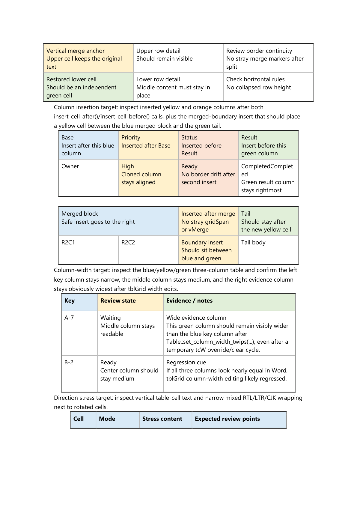
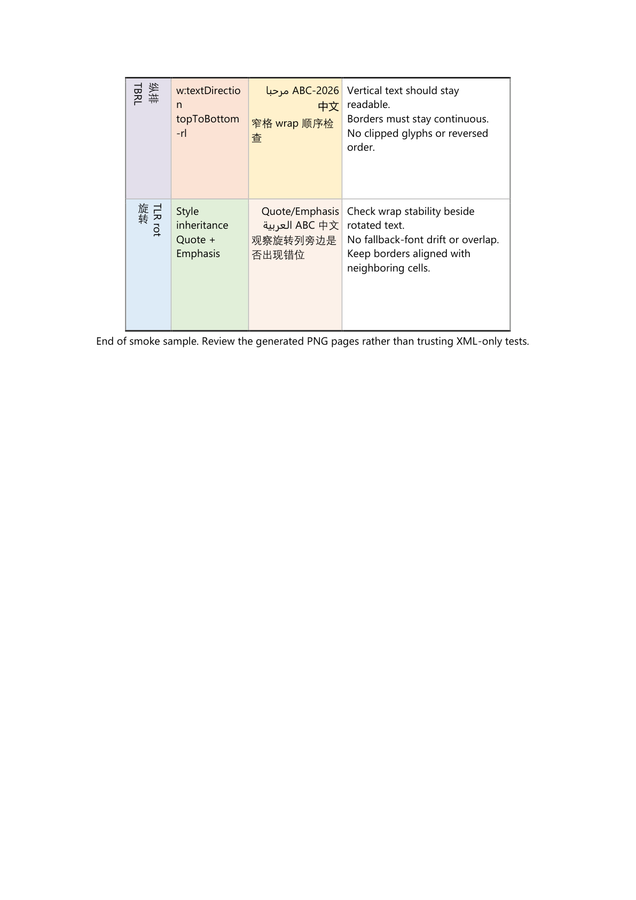

# FeatherDoc

[](https://github.com/wuxianggujun/FeatherDoc/actions/workflows/windows-msvc.yml)

[English](README.md) | 简体中文

FeatherDoc 是一个面向现代 C++ 的 Microsoft Word `.docx` 读写与编辑库。

它当前重点关注：

- 现代 CMake / C++20 工程化集成
- 对 MSVC 友好的构建与测试链路
- 段落、Run、表格、图片、列表、样式引用等轻量级编辑 API
- 更稳的 `open()` / `save()` 行为与更明确的错误诊断
- 基于真实 Microsoft Word 渲染结果的可视化验证

> 完整 API 细节、更多样例和边界说明目前仍以
> [README.md](README.md) 与 `docs/index.rst` 为准；
> 本文件提供中文入口、构建方式、验证流程和项目级说明。

## 亮点

- CMake 3.20+
- C++20
- 默认支持 MSVC / Windows 构建
- 已提供 `featherdoc_cli`
- 支持基于固定网格表格的 merge / unmerge / 列宽编辑验证
- 提供 Word 截图级 smoke / release gate / review task 打包脚本

## 快速构建

```bash
cmake -S . -B build
cmake --build build
```

顶层构建默认开启 `BUILD_CLI`，除非显式传入 `-DBUILD_CLI=OFF`，
否则会同时构建 `featherdoc_cli`。

## MSVC 构建

请先打开 `x64` 的 Visual Studio Developer Command Prompt，或者先执行：

```bat
VsDevCmd.bat -arch=x64 -host_arch=x64
```

然后运行：

```bat
cmake -S . -B build-msvc-nmake -G "NMake Makefiles" -DCMAKE_BUILD_TYPE=Release -DBUILD_TESTING=ON -DBUILD_SAMPLES=ON -DBUILD_CLI=ON
cmake --build build-msvc-nmake
ctest --test-dir build-msvc-nmake --output-on-failure --timeout 60
```

## 发布前总检查

Windows 上如果需要一次性跑完整的发布前检查，直接执行：

```powershell
pwsh -ExecutionPolicy Bypass -File .\scripts\run_release_candidate_checks.ps1
```

这个总控脚本会串联：

- MSVC build / test
- `install + find_package` smoke
- Word visual release gate

其中可视化阶段故意保留在本地 Windows 环境，因为最终渲染依赖真实
`Microsoft Word`，不适合普通云端 CI runner。

脚本结束后，输出根目录会生成 `START_HERE.md`，`report/` 目录里会同时生成
`ARTIFACT_GUIDE.md`、
`REVIEWER_CHECKLIST.md`、`release_handoff.md`、`release_body.zh-CN.md` 和
`release_summary.zh-CN.md`。如果后面又补写了截图级 visual verdict，优先执行
下面这条最短同步命令，把 task 结论一次性回灌到 gate summary、
release `summary.json`、`START_HERE.md` 和整套 release note bundle，而不用
重跑整条 preflight：

```powershell
pwsh -ExecutionPolicy Bypass -File .\scripts\sync_latest_visual_review_verdict.ps1
```

如果你需要手动覆盖脚本自动推断出来的 gate / release 路径，再改用
`sync_visual_review_verdict.ps1` 的显式参数版。

其中 `START_HERE.md` 是本地 summary 输出的首个入口，
`ARTIFACT_GUIDE.md` 负责索引这套产物里的入口，
`REVIEWER_CHECKLIST.md` 负责三步评审流，`release_body.zh-CN.md` 是可直接
改写的中文 release body 草稿，`release_summary.zh-CN.md` 则适合作为
GitHub Release 首屏摘要。如果 `summary.json` 已经带上最终 verdict，只是
后面又改了 release 文案，也可以继续用更窄的
`write_release_note_bundle.ps1` 单独重刷 bundle。
GitHub Release 首屏短摘要；后两者都会优先从 `CHANGELOG.md` 的
`Unreleased` 区块自动抽取“核心变化”要点。

## Word 可视化验证

如果只想跑基础 Word 冒烟检查：

```powershell
powershell -ExecutionPolicy Bypass -File .\scripts\run_word_visual_smoke.ps1
```

它会：

1. 生成或接收目标 `.docx`
2. 通过 Word 导出 PDF
3. 渲染每一页 PNG
4. 生成 `contact_sheet.png`、`summary.json`、`review_checklist.md`
5. 预留 `review_result.json` 和 `final_review.md` 给人工或 AI 回写结论

如果只想检查 fixed-grid merge / unmerge 四件套：

```powershell
powershell -ExecutionPolicy Bypass -File .\scripts\run_fixed_grid_merge_unmerge_regression.ps1
```

如果希望在生成证据后，立刻打包成 AI 可消费的 review task：

```powershell
powershell -ExecutionPolicy Bypass -File .\scripts\run_fixed_grid_merge_unmerge_regression.ps1 `
    -PrepareReviewTask `
    -ReviewMode review-only
```

这个 fixed-grid 回归会覆盖：

- `merge_right()`
- `merge_down()`
- `unmerge_right()`
- `unmerge_down()`

并输出聚合 contact sheet、manifest、checklist 和最终审查骨架。

如果要把“文档 smoke + fixed-grid quartet + task 打包”一起串起来，
可以执行：

```powershell
powershell -ExecutionPolicy Bypass -File .\scripts\run_word_visual_release_gate.ps1
```

## AI Review Task 打包

如果你已经有一个目标 `.docx`，想把它变成稳定的 AI 复核任务包：

```powershell
powershell -ExecutionPolicy Bypass -File .\scripts\prepare_word_review_task.ps1 `
    -DocxPath C:\path\to\target.docx `
    -Mode review-only
```

对于 fixed-grid regression bundle：

```powershell
powershell -ExecutionPolicy Bypass -File .\scripts\prepare_word_review_task.ps1 `
    -FixedGridRegressionRoot .\output\fixed-grid-merge-unmerge-regression `
    -Mode review-only
```

任务目录会带上：

- `task_prompt.md`
- `task_manifest.json`
- `evidence/`
- `report/`
- `repair/`

并维护 `output/word-visual-smoke/tasks/` 下的 latest pointer，
方便自动化消费最新任务。

## 渲染示例

下面这些图都来自当前验证流程实际产出的 Word 渲染证据，
直接保存在仓库里，能比旧 sample 截图更直观地展示这个库当前的能力覆盖、
版式质量，以及截图级 review 面。

<p align="center">
  
</p>
<p align="center">
  <sub>上图：当前 6 页 Word visual smoke 联系图，覆盖表格、分页、合并/拆分、文字方向、fixed-grid 列宽编辑以及 RTL/LTR/CJK 混排检查。</sub>
</p>
<p align="center">
  
  
  
</p>
<p align="center">
  <sub>下排从左到右：fixed-grid 宽度与列编辑检查页、fixed-grid merge/unmerge 四件套聚合图，以及纵排文字与混合方向文本检查页。中间这张图覆盖 <code>merge_right()</code>、<code>merge_down()</code>、<code>unmerge_right()</code> 和 <code>unmerge_down()</code>，都已经过真实 Microsoft Word 渲染并完成截图级人工签收。</sub>
</p>

如果你只想重跑中间这组 fixed-grid 四件套，并顺手生成一个可直接复核的
review task，可以先执行：

```powershell
powershell -ExecutionPolicy Bypass -File .\scripts\run_fixed_grid_merge_unmerge_regression.ps1 `
    -PrepareReviewTask `
    -ReviewMode review-only
```

如果想直接把这组展示图追溯回复现命令，或者继续接到 review task，
建议先看 [VISUAL_VALIDATION_QUICKSTART.md](VISUAL_VALIDATION_QUICKSTART.md)，
再继续查看 [VISUAL_VALIDATION.md](VISUAL_VALIDATION.md) 与
[VISUAL_VALIDATION.zh-CN.md](VISUAL_VALIDATION.zh-CN.md)。

如果只是想在新的可视化验证完成后，直接刷新仓库里的展示 PNG：

```powershell
powershell -ExecutionPolicy Bypass -File .\scripts\run_word_visual_release_gate.ps1 `
    -RefreshReadmeAssets
```

如果只是想利用已经生成好的 task 重新覆盖展示图，也可以单独执行：

```powershell
powershell -ExecutionPolicy Bypass -File .\scripts\refresh_readme_visual_assets.ps1
```

如果 document task 和 fixed-grid task 的截图结论都已经签收完成，也可以再把
最终 verdict 同步回 gate summary：

```powershell
powershell -ExecutionPolicy Bypass -File .\scripts\sync_latest_visual_review_verdict.ps1
```

如果你需要手动覆盖推断出来的 gate / release 路径，再继续使用显式命令：

```powershell
powershell -ExecutionPolicy Bypass -File .\scripts\sync_visual_review_verdict.ps1 `
    -GateSummaryJson .\output\word-visual-release-gate\report\gate_summary.json
```

## CLI

`featherdoc_cli` 目前主要覆盖分节感知的页眉 / 页脚检查与编辑流程。

```bash
featherdoc_cli inspect-sections input.docx
featherdoc_cli inspect-sections input.docx --json
featherdoc_cli inspect-header-parts input.docx --json
featherdoc_cli inspect-footer-parts input.docx
featherdoc_cli insert-section input.docx 1 --no-inherit --output inserted.docx --json
featherdoc_cli copy-section-layout input.docx 0 2 --output copied.docx
featherdoc_cli move-section input.docx 2 0 --output reordered.docx
featherdoc_cli remove-section input.docx 3 --output trimmed.docx
featherdoc_cli assign-section-header input.docx 2 0 --kind even --output shared-header.docx --json
featherdoc_cli assign-section-footer input.docx 2 1 --output shared-footer.docx --json
```

更完整的命令列表与字段说明请看 [README.md](README.md) 里的 `CLI` 章节。

## 安装

```bash
cmake --install build --prefix install
```

安装产物中的 `share/FeatherDoc` 现在会携带项目级元数据、可视化验证预览图、
复现说明、发布说明模板和法律文件，包括：

- `CHANGELOG.md`
- `README.md`
- `README.zh-CN.md`
- `RELEASE_ARTIFACT_TEMPLATE.md`
- `RELEASE_ARTIFACT_TEMPLATE.zh-CN.md`
- `VISUAL_VALIDATION_QUICKSTART.md`
- `VISUAL_VALIDATION_QUICKSTART.zh-CN.md`
- `VISUAL_VALIDATION.md`
- `VISUAL_VALIDATION.zh-CN.md`
- `visual-validation/`
- `LICENSE`
- `LICENSE.upstream-mit`
- `NOTICE`
- `LEGAL.md`

其中 `VISUAL_VALIDATION_QUICKSTART*.md` 是安装包里最短的
“截图 -> 命令 -> review task” 入口；
`VISUAL_VALIDATION*.md` 则会把附带的预览 PNG 继续映射回源码仓库里的复现脚本
和后续 review task 包装命令。
`RELEASE_ARTIFACT_TEMPLATE*.md` 则负责把安装包入口、preflight 结果和截图证据
整理成一份可直接复制的发布说明骨架。

如果你只想先拿到一组能直接复制执行的命令，可以先用：

```powershell
pwsh -ExecutionPolicy Bypass -File <repo-root>\scripts\run_word_visual_release_gate.ps1
pwsh -ExecutionPolicy Bypass -File <repo-root>\scripts\run_release_candidate_checks.ps1
pwsh -ExecutionPolicy Bypass -File <repo-root>\scripts\open_latest_word_review_task.ps1
pwsh -ExecutionPolicy Bypass -File <repo-root>\scripts\open_latest_fixed_grid_review_task.ps1 -PrintPrompt
pwsh -ExecutionPolicy Bypass -File <repo-root>\scripts\sync_latest_visual_review_verdict.ps1
```

如果要从一个全新的外部 CMake consumer 验证 `find_package` 路径：

```powershell
pwsh -ExecutionPolicy Bypass -File .\scripts\run_install_find_package_smoke.ps1 `
    -BuildDir build-msvc-nmake `
    -InstallDir build-msvc-install `
    -ConsumerBuildDir build-msvc-install-consumer `
    -Generator "NMake Makefiles" `
    -Config Release
```

这条路径和当前 Windows CI 里的 `install + find_package` smoke 保持一致。

同一个工作流现在还会额外上传一个 `windows-msvc-release-metadata` artifact，
里面包含 `build-msvc-install/share/FeatherDoc/**`、artifact 根级的
`RELEASE_METADATA_START_HERE.md`，以及
`output/release-candidate-checks-ci/START_HERE.md` / `report/**`，其中也包括
生成出来的 `ARTIFACT_GUIDE.md`、`REVIEWER_CHECKLIST.md`、
`release_handoff.md`、`release_body.zh-CN.md` 和
`release_summary.zh-CN.md`。拿到这个 artifact 后，建议先看
`RELEASE_METADATA_START_HERE.md`，再进入 `START_HERE.md`、
`ARTIFACT_GUIDE.md`，最后按 `REVIEWER_CHECKLIST.md` 走三步评审流。
不过云端 artifact 会故意把 visual gate 保持为 `skipped`，最终截图级 Word
结论仍然要靠本地 Windows preflight 补齐。

## 从 CMake 使用

```cmake
list(APPEND CMAKE_PREFIX_PATH "/path/to/FeatherDoc/install")
find_package(FeatherDoc CONFIG REQUIRED)

add_executable(my_app main.cpp)
target_link_libraries(my_app PRIVATE FeatherDoc::FeatherDoc)
```

导出的包配置还会暴露：

- `FeatherDoc_VERSION`
- `FeatherDoc_DESCRIPTION`
- `FeatherDoc_PACKAGE_DATA_DIR`

## 快速示例

```cpp
#include <featherdoc.hpp>
#include <iostream>

int main() {
    featherdoc::Document doc("file.docx");
    if (const auto error = doc.open()) {
        const auto& error_info = doc.last_error();
        std::cerr << error.message();
        if (!error_info.detail.empty()) {
            std::cerr << ": " << error_info.detail;
        }
        std::cerr << '\n';
        return 1;
    }

    for (auto paragraph : doc.paragraphs()) {
        std::string text;
        for (auto run : paragraph.runs()) {
            text += run.get_text();
        }
        std::cout << text << '\n';
    }

    return 0;
}
```

补充说明：

- `Run` 代表的是 WordprocessingML 的文本运行块，不等于“整行文本”。
- 如果一个视觉上的自然行被拆成多个 run，需要先把 `run.get_text()` 拼起来。
- 表格内文本需要通过 `doc.tables() -> rows() -> cells() -> paragraphs()` 访问。

完整 API、更多可运行 sample 和复杂表格/模板/图片流程，请参考
[README.md](README.md) 与 `docs/index.rst`。

## 当前能力范围

当前 FeatherDoc 已经具备以下高价值能力：

- 读写已有 `.docx`
- 段落与 Run 的增删改
- 表格创建、插行、插列、删行、删列、合并、拆分、列宽与 fixed-grid 编辑
- 书签填充、模板表格扩展、条件块显隐
- 内联图片与浮动图片
- 页眉、页脚、分节复制/插入/移动/删除
- 列表与基础样式引用编辑

同时也仍有一些明确边界：

- 不支持加密或受密码保护的 `.docx`
- 还没有高层的公式（OMML）typed API
- 暂无高层的自定义表格样式定义编辑
- 暂无完整的样式目录检查 / 继承感知样式管理 API

更详细的限制列表请看 [README.md](README.md) 中的
`Current Limitations` 章节。

## 文档入口

仓库里当前有几类文档：

- 英文总 README：[README.md](README.md)
- 中文 README：[README.zh-CN.md](README.zh-CN.md)
- Sphinx 文档入口：`docs/index.rst`
- 项目定位：`docs/project_identity_zh.rst`
- 项目审计记录：`docs/project_audit_zh.rst`
- 版本与发布策略：`docs/release_policy_zh.rst`
- Word 可视化工作流：`docs/automation/word_visual_workflow_zh.rst`
- 许可说明：`docs/licensing_zh.rst`
- 仓库法律说明：`LEGAL.md`

## 项目方向

FeatherDoc 现在应被视为一个持续演进的独立分支，而不是对历史上游项目的被动镜像。

- 现代 C++ 与更清晰的 API 语义优先
- MSVC 可构建性是正式支持目标
- 错误诊断、open/save 行为和核心路径性能是一等公民
- 文档、仓库元数据、许可与验证流程都按当前项目方向维护

## 赞助

如果这个项目对你的工作有帮助，可以通过下列收款码支持持续维护。

<p align="center">
  
  
</p>
<p align="center">
  <sub>左：支付宝；右：微信赞赏。</sub>
</p>

## 许可

这个 fork 的 fork-specific 修改部分应描述为 source-available，
而不是传统意义上的 open source。

- FeatherDoc fork-specific 修改遵循 `LICENSE` 中的非商业 source-available 条款
- 继承自上游 DuckX 的部分仍保留 `LICENSE.upstream-mit`
- 第三方依赖继续遵循各自原始许可证
- 中文阅读指引见 `docs/licensing_zh.rst`
- 仓库级法律摘要见 `LEGAL.md` 和 `NOTICE`
